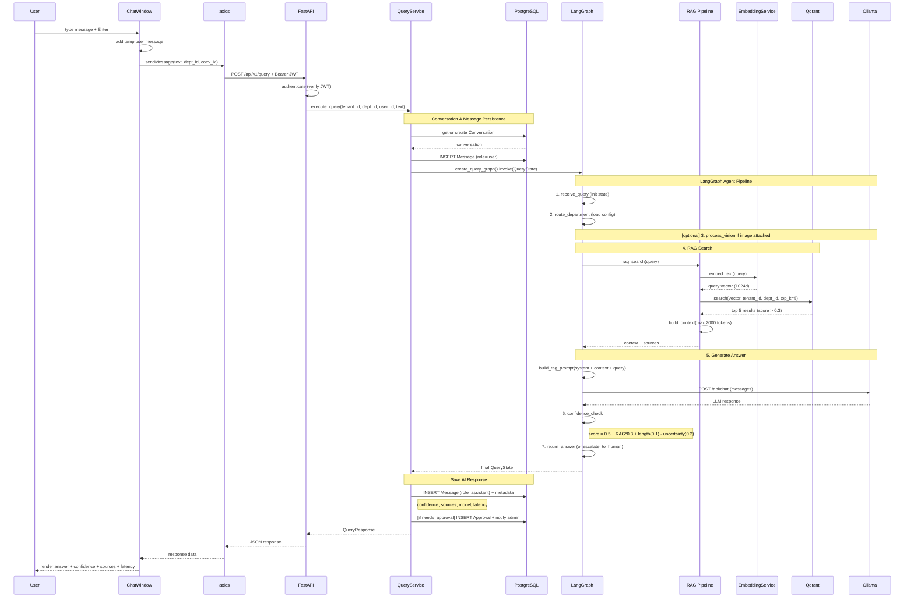
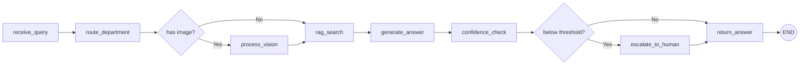
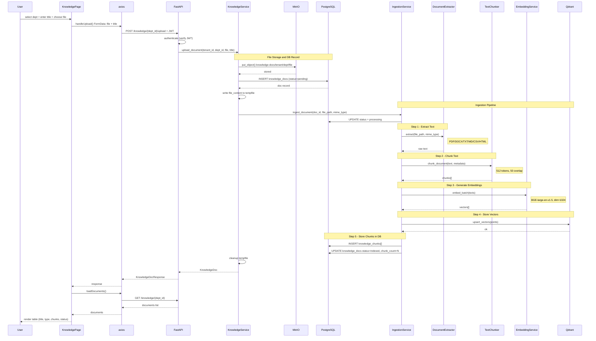
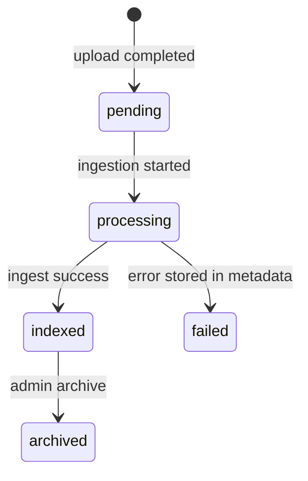

# Architecture & Flow Documentation

## Table of Contents

- [System Overview](#system-overview)
- [Chat Flow](#chat-flow)
- [Knowledge Upload Flow](#knowledge-upload-flow)
- [Tech Stack](#tech-stack)

---

## System Overview

```
┌─────────────────────────────────────────────────────────────────────┐
│                        FRONTEND (Next.js)                          │
│  ┌──────────┐  ┌──────────┐  ┌───────────┐  ┌──────────────────┐  │
│  │   Chat   │  │Knowledge │  │ Executive │  │    Settings      │  │
│  │   Page   │  │   Page   │  │ Dashboard │  │  (White-label)   │  │
│  └────┬─────┘  └────┬─────┘  └───────────┘  └──────────────────┘  │
│       │              │                                              │
│       └──────┬───────┘                                              │
│              │  axios (api.ts)                                       │
│              │  Authorization: Bearer <JWT>                          │
└──────────────┼──────────────────────────────────────────────────────┘
               │
               ▼  HTTP REST (/api/v1/*)
┌──────────────────────────────────────────────────────────────────────┐
│                     BACKEND (FastAPI)                                │
│                                                                      │
│  ┌─────────┐  ┌────────────┐  ┌───────────────┐  ┌──────────────┐  │
│  │  Auth   │  │   Query    │  │  Knowledge    │  │Conversations │  │
│  │Endpoint │  │  Endpoint  │  │  Endpoint     │  │  Endpoint    │  │
│  └────┬────┘  └─────┬──────┘  └──────┬────────┘  └──────────────┘  │
│       │             │                │                               │
│       │      ┌──────▼───────┐  ┌─────▼──────────┐                   │
│       │      │ QueryService │  │KnowledgeService│                   │
│       │      └──────┬───────┘  └─────┬──────────┘                   │
│       │             │                │                               │
│       │      ┌──────▼───────┐  ┌─────▼──────────┐                   │
│       │      │  LangGraph   │  │   Ingestion    │                   │
│       │      │  (Agent)     │  │   Pipeline     │                   │
│       │      └──────────────┘  └────────────────┘                   │
└───────┼─────────────┼──────────────────┼────────────────────────────┘
        │             │                  │
        ▼             ▼                  ▼
   ┌─────────┐  ┌──────────┐  ┌───────────────┐  ┌────────┐  ┌───────┐
   │Keycloak │  │  Ollama   │  │    Qdrant     │  │ MinIO  │  │ Redis │
   │  :8081  │  │  :11434   │  │    :6333      │  │ :9000  │  │ :6379 │
   │  (Auth) │  │  (LLM)   │  │(Vector Store) │  │(Files) │  │(Cache)│
   └─────────┘  └──────────┘  └───────────────┘  └────────┘  └───────┘
                                       │
                               ┌───────┴────────┐
                               │   PostgreSQL   │
                               │     :5432      │
                               │  (Main DB)     │
                               └────────────────┘
```

---

## Chat Flow

เมื่อ user พิมพ์ข้อความในหน้า Chat แล้วกด Enter ระบบจะทำงานตาม flow ด้านล่าง:

### Sequence Diagram



### Step-by-Step

#### 1. Frontend: User ส่งข้อความ
**Files:** `frontend/src/components/chat/ChatWindow.tsx`, `ChatInput.tsx`

- User พิมพ์ข้อความ (รองรับ image แนบด้วย)
- `ChatInput` จับ Enter → เรียก `sendMessage(text)`
- `ChatWindow` สร้าง temporary user message แสดงก่อน

#### 2. Frontend: POST /api/v1/query
**File:** `frontend/src/lib/api.ts`

```
POST /api/v1/query
{
  "text": "วิธีแก้ VPN connect ไม่ได้",
  "department_id": "uuid",
  "conversation_id": "uuid | null"
}
```

- axios interceptor แนบ `Authorization: Bearer <JWT>` อัตโนมัติ

#### 3. Backend: Query Endpoint รับ request
**File:** `backend/app/api/v1/endpoints/query.py`

- Validate JWT token → ได้ `current_user` (tenant_id, user_id)
- สร้าง `QueryService` แล้วเรียก `execute_query()`

#### 4. Backend: QueryService จัดการ orchestration
**File:** `backend/app/services/query_service.py`

- **Conversation:** ถ้าไม่มี conversation_id → สร้าง conversation ใหม่ (title = 100 ตัวอักษรแรกของ query)
- **Save user message:** บันทึก message ลง DB (role=user, status=completed)
- **Invoke LangGraph:** สร้าง `QueryState` แล้วเรียก `create_query_graph().invoke()`

#### 5. Backend: LangGraph Agent ทำงาน
**File:** `backend/app/agents/graph.py`

Graph ประกอบด้วย nodes ที่ทำงานตามลำดับ:



| Node | หน้าที่ |
|------|---------|
| `receive_query` | Initialize state |
| `route_department` | โหลด department config (system_prompt, confidence_threshold) |
| `process_vision` | (conditional) วิเคราะห์ screenshot ถ้ามี image แนบ |
| `rag_search` | ค้นหา knowledge base ที่เกี่ยวข้อง (ดู RAG Pipeline ด้านล่าง) |
| `generate_answer` | สร้างคำตอบจาก LLM + context |
| `confidence_check` | คำนวณ confidence score |
| `escalate_to_human` | (conditional) ถ้า confidence < threshold → ส่ง approval |
| `return_answer` | ส่ง final state กลับ |

#### 6. RAG Pipeline (ภายใน rag_search node)
**Files:** `backend/app/services/rag/retriever.py`, `embeddings.py`, `vector_store.py`

```
Query text
    │
    ▼
┌────────────────────┐
│  EmbeddingService  │  ใช้ model: BAAI/bge-large-en-v1.5
│  embed_text()      │  แปลง query → vector 1024 มิติ
└────────┬───────────┘
         │
         ▼
┌────────────────────┐
│    VectorStore     │  ค้นหาใน Qdrant
│    search()        │  filter: tenant_id + department_id
│                    │  return: top 5 results
└────────┬───────────┘
         │
         ▼
┌────────────────────┐
│   RAGRetriever     │  กรอง score > 0.3
│   build_context()  │  สร้าง context string (max 2000 tokens)
└────────┬───────────┘
         │
         ▼
    Context + Sources
```

#### 7. LLM Generation (ภายใน generate_answer node)
**Files:** `backend/app/services/llm/ollama_client.py`, `prompt_templates.py`

```
┌─ build_rag_prompt() ─────────────────────────────┐
│                                                    │
│  System: "{department_system_prompt}"              │
│                                                    │
│  System: "Use the following context to answer:     │
│           [Source 1: title (score)]                 │
│           chunk content...                         │
│           ---                                      │
│           [Source 2: title (score)]                 │
│           chunk content..."                        │
│                                                    │
│  User: "{original query}"                          │
│                                                    │
└──────────────────────┬─────────────────────────────┘
                       │
                       ▼
              ┌────────────────┐
              │  OllamaClient  │  POST /api/chat
              │  chat()        │  model: llama3.2:3b
              │                │  timeout: 120s
              └────────┬───────┘
                       │
                       ▼
                 LLM Response
```

#### 8. Confidence Check & Approval
**File:** `backend/app/agents/graph.py` (confidence_check node)

```
confidence = 0.5 (base)
           + max(rag_scores) * 0.3    ← RAG ค้นเจอดี = +score
           + 0.1                       ← ถ้าคำตอบ > 100 ตัวอักษร
           - 0.2                       ← ถ้ามีคำว่า "I'm not sure", "I don't know"

ถ้า confidence < department.confidence_threshold:
    → needs_approval = true
    → สร้าง Approval record
    → NotificationService แจ้ง admin (in-app + email)
```

#### 9. Response กลับไป Frontend

```json
{
  "answer": "คำตอบจาก AI...",
  "sources": [
    {
      "title": "VPN Troubleshooting Guide",
      "chunk": "เนื้อหาที่เกี่ยวข้อง...",
      "score": 0.92,
      "document_id": "uuid"
    }
  ],
  "confidence": 0.85,
  "model_used": "llama3.2:3b",
  "tokens_input": 450,
  "tokens_output": 275,
  "latency_ms": 3200.0,
  "conversation_id": "uuid",
  "message_id": 123,
  "needs_approval": false
}
```

Frontend แสดง: ข้อความตอบ + confidence badge + sources + latency

---

## Knowledge Upload Flow

เมื่อ user upload เอกสารในหน้า Knowledge ระบบจะทำการ ingest เข้า vector store

### Sequence Diagram



### Step-by-Step

#### 1. Frontend: User เลือกไฟล์แล้ว Upload
**File:** `frontend/src/app/(dashboard)/knowledge/page.tsx`

- User เลือก department, กรอก title, เลือกไฟล์ (.pdf, .docx, .txt, .md, .csv, .html)
- `handleUpload()` สร้าง `FormData` (file + title) แล้ว `api.post()`

#### 2. Backend: Upload Endpoint รับไฟล์
**File:** `backend/app/api/v1/endpoints/knowledge.py`

```
POST /api/v1/knowledge/{dept_id}/upload
Content-Type: multipart/form-data

- file: UploadFile
- title: str (Form)
```

- อ่าน file content → ส่งต่อให้ `KnowledgeService.upload_document()`

#### 3. Backend: KnowledgeService จัดเก็บไฟล์
**File:** `backend/app/services/knowledge_service.py`

| ขั้นตอน | รายละเอียด |
|---------|------------|
| **Store file** | Upload ไป MinIO: `knowledge-docs/tenant-{id}/dept-{id}/{filename}` |
| **Detect type** | จาก extension → source_type (pdf, docx, txt, md, csv, html) |
| **Create DB record** | INSERT `knowledge_docs` (status=`pending`) |
| **Write temp file** | เขียน content ลง tempfile สำหรับ extraction |
| **Trigger ingestion** | เรียก `IngestionService.ingest_document()` |
| **Cleanup** | ลบ tempfile |

#### 4. Backend: Ingestion Pipeline
**File:** `backend/app/services/rag/ingestion.py`

Pipeline 6 ขั้นตอน:

```
         ┌─────────────┐
         │  Document   │
         │  (tempfile)  │
         └──────┬──────┘
                │
    ┌───────────▼───────────┐
    │  1. EXTRACT TEXT      │  DocumentExtractor
    │                       │  - PDF  → PyPDF2
    │  extractor.py         │  - DOCX → python-docx
    │                       │  - TXT/MD → read UTF-8
    │                       │  - CSV  → csv.reader
    │                       │  - HTML → BeautifulSoup
    └───────────┬───────────┘
                │ raw text
    ┌───────────▼───────────┐
    │  2. CHUNK TEXT         │  TextChunker
    │                       │  - chunk_size: 512 tokens
    │  chunker.py           │  - overlap: 50 tokens
    │                       │  - recursive character split
    │                       │  - separators: ¶ > \n > . > , > space
    └───────────┬───────────┘
                │ list[{content, chunk_index, token_count, metadata}]
    ┌───────────▼───────────┐
    │  3. EMBED CHUNKS      │  EmbeddingService
    │                       │  - model: BAAI/bge-large-en-v1.5
    │  embeddings.py        │  - dimension: 1024
    │                       │  - batch_size: 32
    │                       │  - fallback: random vectors (dev)
    └───────────┬───────────┘
                │ list[vector_1024d]
    ┌───────────▼───────────┐
    │  4. STORE VECTORS     │  VectorStore → Qdrant
    │                       │  - collection: knowledge_vectors
    │  vector_store.py      │  - distance: COSINE
    │                       │  - payload: tenant_id, department_id,
    │                       │    document_id, chunk_index, content, title
    │                       │  - batch: 100 points/upsert
    └───────────┬───────────┘
                │
    ┌───────────▼───────────┐
    │  5. STORE CHUNKS      │  PostgreSQL → knowledge_chunks
    │                       │  - document_id, chunk_index, content
    │  ingestion.py         │  - qdrant_point_id (link to vector)
    │                       │  - token_count, metadata
    └───────────┬───────────┘
                │
    ┌───────────▼───────────┐
    │  6. UPDATE STATUS     │  knowledge_docs
    │                       │  - status: "pending" → "indexed"
    │                       │  - chunk_count: N
    └───────────────────────┘
```

#### 5. Status Transitions



#### 6. Frontend: แสดงผลในตาราง

| Column | Source |
|--------|--------|
| Title | `doc.title` |
| Type | `doc.source_type` (pdf, docx, txt, ...) |
| Chunks | `doc.chunk_count` |
| Status | `doc.status` (pending/processing/indexed/failed) |
| Date | `doc.created_at` |
| Action | Delete button (soft delete + cleanup vectors) |

---

## Tech Stack

| Layer | Technology | Port | Purpose |
|-------|-----------|------|---------|
| Frontend | Next.js + TypeScript | 3000 | UI |
| Backend | FastAPI (async) | 8000 | REST API |
| Auth | Keycloak | 8081 | SSO / JWT |
| Database | PostgreSQL 15 | 5432 | Main data store |
| Vector DB | Qdrant v1.7 | 6333 | Semantic search |
| Object Storage | MinIO | 9000 | File uploads |
| Cache | Redis 7.2 | 6379 | Rate limiting |
| LLM | Ollama (llama3.2:3b) | 11434 | Text generation |
| Embeddings | BGE-large-en-v1.5 | in-process | Text → Vector |
| Agent Framework | LangGraph | in-process | Query orchestration |
