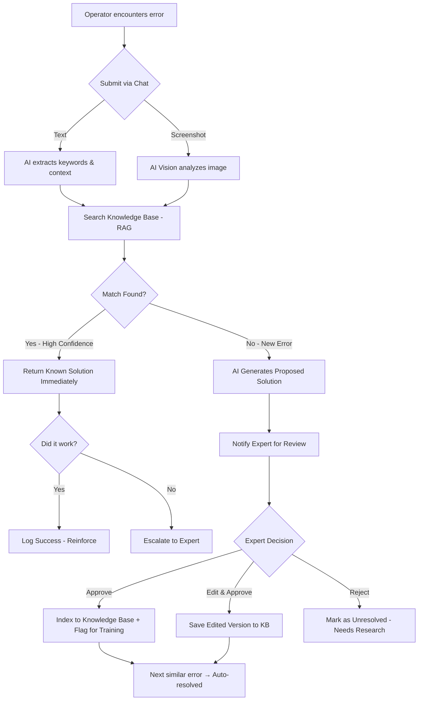
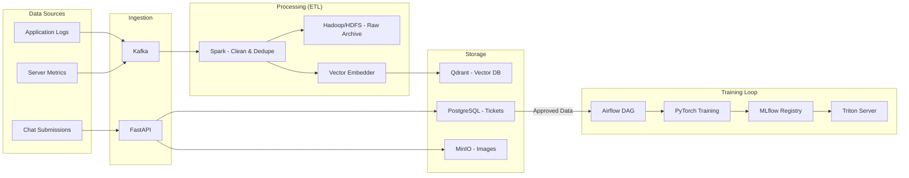

# Business Requirements Document (BRD)

**Project Name**: The Expert — AI-Powered Troubleshooting System
**Version**: 1.0
**Date**: 2026-02-12
**Status**: Draft
**Author**: Architecture Team
**Confidentiality**: Internal — For Stakeholder Review Only

---

## Table of Contents

1. [Executive Summary](#1-executive-summary)
2. [Business Objectives](#2-business-objectives)
3. [Problem Statement](#3-problem-statement)
4. [Scope](#4-scope)
5. [Key Business Requirements](#5-key-business-requirements)
6. [Stakeholders](#6-stakeholders)
7. [Business Process Flow](#7-business-process-flow)
8. [Revenue & Business Model](#8-revenue--business-model)
9. [Risk Analysis](#9-risk-analysis)
10. [Success Metrics (KPIs)](#10-success-metrics-kpis)
11. [Assumptions & Constraints](#11-assumptions--constraints)
12. [Glossary](#12-glossary)

---

## 1. Executive Summary

"The Expert" is an enterprise-grade, AI-driven troubleshooting platform designed to support Operations teams across organizations. The platform leverages **Generative AI**, **Computer Vision**, **Custom Model Training**, and **Historical Knowledge Retrieval (RAG)** to instantly analyze error logs & screenshots, suggesting solutions based on a combination of past solved tickets and AI reasoning.

The system features a **"Human-in-the-loop"** mechanism where Operations experts validate AI-proposed solutions for new/unknown errors. Once approved, these solutions are automatically indexed and become part of the system's knowledge base — enabling continuous self-improvement over time.

The platform is designed as a **Multi-Tenant SaaS** product that can be sold to multiple organizations. Each organization's data is strictly isolated, and the system supports **On-Premise**, **Cloud**, and **Hybrid (BYOD)** deployment models to cater to regulated industries and enterprise clients with strict data sovereignty requirements.

---

## 2. Business Objectives

| # | Objective | Target |
| :--- | :--- | :--- |
| **BO-01** | **Reduce MTTR (Mean Time To Resolution)** | Cut average troubleshooting time by **50%** within 6 months of adoption. |
| **BO-02** | **Capture Tribal Knowledge** | Systematically collect and index human-validated solutions into a searchable knowledge base. Reduce dependency on "key person" knowledge. |
| **BO-03** | **Scalable Revenue Model** | Launch the platform as a Global SaaS product with tiered subscription pricing. |
| **BO-04** | **Data Sovereignty Compliance** | Support regulated industries (Banking, Healthcare, Government) via On-Premise and Edge Agent deployments. |
| **BO-05** | **Continuous AI Improvement** | Achieve a self-improving system where every resolved ticket enhances the AI's accuracy. Target: **>85% automation rate** within 12 months. |
| **BO-06** | **Custom Model per Tenant** | Allow enterprise clients to fine-tune AI models on their specific domain data for maximum accuracy. |

---

## 3. Problem Statement

### Current Pain Points

| # | Problem | Impact |
| :--- | :--- | :--- |
| **P-01** | **Repetitive Troubleshooting**: Operations teams solve the same errors repeatedly across shifts. | Wasted man-hours, inconsistent resolution quality. |
| **P-02** | **Tribal Knowledge Loss**: Solutions live in individuals' heads, chat logs, or scattered documents. | When experts leave, knowledge is lost. New hires struggle. |
| **P-03** | **Slow Escalation**: When a new error appears, it takes hours/days to escalate, research, and resolve. | High MTTR, customer dissatisfaction, SLA breaches. |
| **P-04** | **No Visual Analysis**: Existing ticketing systems cannot "see" error screenshots. Operators must manually type error details. | Slow input, missing context, human error in transcription. |
| **P-05** | **No Cross-Organization Learning**: Each company's operations team operates in a silo. | Industry-wide common errors are re-solved independently by every company. |

### Desired Future State

A single platform where:

- An operator can **paste a screenshot or type an error message** and get an instant, accurate solution.
- The system **learns from every resolved ticket**, becoming smarter over time.
- **New errors** are automatically escalated to experts, whose solutions are captured and indexed.
- The platform can be **sold to multiple organizations** with strict data isolation.

---

## 4. Scope

### 4.1 In Scope

| Area | Description |
| :--- | :--- |
| **AI Core** | Multimodal analysis (Text + Image), RAG-based knowledge retrieval, Custom Model Training pipeline (Fine-tuning with LoRA). |
| **Agent Orchestration** | LangGraph-based Agentic workflow with sub-agents (CrewAI for research, AutoGen for code analysis, LangChain for utilities). |
| **MLOps Pipeline** | Training pipeline (PyTorch/HF), Model Registry (MLflow), Model Serving (Nvidia Triton), Experiment Tracking (W&B/TensorBoard). |
| **Data Pipeline** | Log ingestion (Kafka), ETL processing (Spark), Workflow orchestration (Airflow), Raw storage (Hadoop/HDFS/MinIO). |
| **Platform** | Web Chat Interface (Next.js), Admin Dashboard for Solution Approval, Super Admin Dashboard for Tenant Management. |
| **Infrastructure** | Multi-tenant Architecture, SSO (Keycloak), Containerization (Docker/K8s), Observability (Grafana/Langfuse). |
| **Deployment Models** | Cloud SaaS, On-Premise (Air-gapped), Hybrid (BYOD — Bring Your Own Database). |

### 4.2 Out of Scope

| Area | Reason |
| :--- | :--- |
| Hardware procurement (GPUs/Servers) | Client responsibility for On-Premise deployments. |
| Legacy OS support (Windows Server 2008 and older) | Docker/K8s containers require modern OS. |
| Native Mobile App (iOS/Android) | Phase 2 consideration. Web UI is responsive and mobile-friendly. |
| Real-time Video Streaming Analysis | Phase 3 consideration. Current scope is static images and text. |

---

## 5. Key Business Requirements

### 5.1 Functional Requirements

| ID | Requirement | Priority | Rationale |
| :--- | :--- | :--- | :--- |
| **REQ-B-01** | The system MUST accept both **text descriptions** and **error screenshots** (images) as input via a chat interface. | **Must Have** | Core functionality — reduces manual data entry. |
| **REQ-B-02** | The system MUST automatically search historical knowledge base for matching solutions before generating new ones. | **Must Have** | Prioritizes proven solutions over AI guesses. |
| **REQ-B-03** | Known cases (previously approved solutions with high confidence) MUST be returned **immediately without requiring approval**. | **Must Have** | Speed is critical for operations. |
| **REQ-B-04** | Unknown/new errors MUST trigger a **Human-in-the-loop** workflow where an expert reviews the AI's proposed solution. | **Must Have** | Ensures quality control and builds trust. |
| **REQ-B-05** | Once an expert **approves** a solution, it MUST be automatically indexed into the knowledge base for future use. | **Must Have** | Continuous learning loop. |
| **REQ-B-06** | The system MUST support **custom model fine-tuning** on tenant-specific data. | **Should Have** | Allows domain-specific accuracy for enterprise clients. |
| **REQ-B-07** | The system MUST allow administrators to **select between different AI models** (Free/Open Source, Paid/Cloud API, Custom/Fine-tuned). | **Should Have** | Budget flexibility for different clients. |
| **REQ-B-08** | The system SHOULD support **white-labeling** (custom logo, colors) per tenant. | **Nice to Have** | Enhances enterprise adoption. |

### 5.2 Non-Functional Requirements

| ID | Requirement | Priority | Detail |
| :--- | :--- | :--- | :--- |
| **REQ-B-09** | **Data Isolation**: Tenant data MUST be strictly isolated. | **Must Have** | Row Level Security (RLS) in PostgreSQL + Qdrant payload filtering. |
| **REQ-B-10** | **Scalability**: System MUST handle concurrent users across multiple tenants without degradation. | **Must Have** | Redis Queue + Load Balancing + K8s auto-scaling. |
| **REQ-B-11** | **Data Sovereignty (BYOD)**: System MUST support deployments where raw data never leaves the client's premise. | **Must Have** | Edge Agent (Docker container on client's server). |
| **REQ-B-12** | **Availability**: SaaS tier MUST maintain **99.9% uptime**. | **Must Have** | Multi-zone deployment + health checks. |
| **REQ-B-13** | **Security**: All data MUST be encrypted in transit (TLS 1.3) and at rest (AES-256). | **Must Have** | Compliance with ISO 27001, SOC 2. |
| **REQ-B-14** | **Audit Trail**: Every interaction (question, answer, approval, rejection) MUST be logged for compliance. | **Must Have** | ELK/Loki centralized logging. |
| **REQ-B-15** | **Performance**: AI response time for known cases MUST be under **3 seconds**. | **Should Have** | Triton Server + Redis cache. |

---

## 6. Stakeholders

| Role | Name / Team | Responsibility | Interest Level |
| :--- | :--- | :--- | :--- |
| **Executive Sponsor** | CTO / VP Engineering | Budget approval, strategic alignment | High |
| **Product Owner** | Product Manager | Feature prioritization, roadmap | High |
| **Operations Manager** | Ops Lead | End-user team management, KPI tracking | High |
| **Support Engineer** | Operations Team | Primary user — submits errors, executes fixes | High |
| **Expert / Approver** | Senior Engineer / SME | Reviews AI proposals, approves solutions | High |
| **Data Scientist** | ML/AI Team | Model training, fine-tuning, evaluation | Medium |
| **DevOps Engineer** | Platform Team | Infrastructure, deployment, monitoring | Medium |
| **SaaS Administrator** | Platform Team | Tenant management, billing, global settings | Medium |
| **Security Officer** | InfoSec Team | Compliance review, audit | Medium |
| **End Customer (Tenant)** | External Organizations | Uses the system, pays subscription | High |

---

## 7. Business Process Flow

### 7.1 Troubleshooting Workflow

### 7.2 Data Pipeline Workflow

---

## 8. Revenue & Business Model

### 8.1 Subscription Tiers

| Tier | Target Audience | Features | Pricing Model |
| :--- | :--- | :--- | :--- |
| **Free / Community** | Small teams (<5 users) | Basic Chat + RAG (no custom model). Limited to 50 queries/day. | Free |
| **Professional** | Mid-size companies (5-50 users) | Full Chat + RAG + Image Analysis. 500 queries/day. Dashboard & Analytics. | Monthly per user |
| **Enterprise** | Large organizations (50+ users) | Everything in Pro + Custom Model Fine-tuning + BYOD + SSO + White-label + Dedicated Support. | Annual contract (custom pricing) |
| **On-Premise License** | Regulated industries | Full system deployed on client's infrastructure. | One-time license + annual maintenance |

### 8.2 Revenue Streams

* **Subscription Revenue**: Monthly/Annual SaaS subscriptions.
- **Professional Services**: Custom model training, integration consulting, onboarding.
- **Usage-Based Add-ons**: Extra AI queries beyond tier limits, additional storage, premium model access (GPT-4o).

---

## 9. Risk Analysis

| # | Risk | Likelihood | Impact | Mitigation |
| :--- | :--- | :--- | :--- | :--- |
| **R-01** | AI provides incorrect solution → User follows it → System damage. | Medium | High | Human-in-the-loop for new cases. Confidence score display. Disclaimer on AI responses. |
| **R-02** | Data breach between tenants in SaaS mode. | Low | Critical | Row Level Security (RLS), penetration testing, SOC 2 compliance. |
| **R-03** | GPU hardware unavailable/expensive for On-Premise clients. | Medium | Medium | Provide cloud API fallback option. Support CPU-only mode with smaller models. |
| **R-04** | Low adoption by Operations team (resistance to change). | Medium | High | Gamification (leaderboard), intuitive UI, training program, executive sponsorship. |
| **R-05** | Model hallucination — AI generates plausible but incorrect root cause. | Medium | High | RAG cross-validation (check model output against historical data). Confidence thresholds. |
| **R-06** | Scaling issues under high concurrent load. | Low | Medium | Kafka buffering, K8s auto-scaling, Redis caching, load testing before launch. |

---

## 10. Success Metrics (KPIs)

| KPI | Measurement | Target (6 Months) | Target (12 Months) |
| :--- | :--- | :--- | :--- |
| **Automation Rate** | % of tickets resolved by AI without human escalation | 50% | 85% |
| **MTTR Reduction** | Average time from error submission to resolution | -30% | -50% |
| **Approval Rate** | % of AI-proposed solutions accepted by experts | 70% | 90% |
| **Knowledge Base Growth** | Number of indexed solutions | 500+ | 5,000+ |
| **User Adoption** | Monthly Active Users (MAU) | 100+ | 1,000+ |
| **System Uptime** | Availability percentage (SaaS) | 99.5% | 99.9% |
| **Customer Satisfaction** | NPS Score from Operations teams | 40+ | 60+ |
| **Revenue** | ARR (Annual Recurring Revenue) | Break-even | 2x investment |

---

## 11. Assumptions & Constraints

### Assumptions

* Operations teams have access to a modern web browser (Chrome, Firefox, Edge).
- Client organizations will provide historical error data for initial knowledge base seeding.
- GPU hardware (e.g., Nvidia A100/H100 or equivalent) is available for On-Premise custom model training.
- AI model accuracy will improve proportionally with the volume of approved training data.

### Constraints

* **Budget**: Initial development budget is fixed. MVP must be delivered within agreed timeline.
- **Compliance**: Must adhere to data privacy regulations (GDPR, PDPA, HIPAA depending on region).
- **Technology**: Must use open-source tools where possible to minimize licensing costs for On-Premise deployments.
- **Team**: Limited ML engineering resources may delay custom model training features.

---

## 12. Glossary

| Term | Definition |
| :--- | :--- |
| **MTTR** | Mean Time To Resolution — Average time to resolve an issue from submission to fix. |
| **RAG** | Retrieval-Augmented Generation — AI technique that searches a knowledge base before generating a response. |
| **RLS** | Row Level Security — Database feature that restricts which rows a user can access based on policies. |
| **LoRA** | Low-Rank Adaptation — Efficient fine-tuning technique that trains small "adapter" layers instead of the full model. |
| **BYOD** | Bring Your Own Database — Deployment model where the client's data stays on their infrastructure. |
| **Human-in-the-loop** | Process where a human expert reviews and validates AI decisions before they become permanent. |
| **Tenant** | An organization (customer) using the SaaS platform with isolated data. |
| **Edge Agent** | A Docker container deployed on the client's server that processes data locally. |
| **Vector DB** | A database optimized for storing and searching high-dimensional vectors (embeddings). |
| **SLA** | Service Level Agreement — Contractual guarantee of system uptime and performance. |

---

## Document Revision History

| Version | Date | Author | Changes |
| :--- | :--- | :--- | :--- |
| 1.0 | 2026-02-12 | Architecture Team | Initial draft — Full BRD covering all agreed requirements. |
