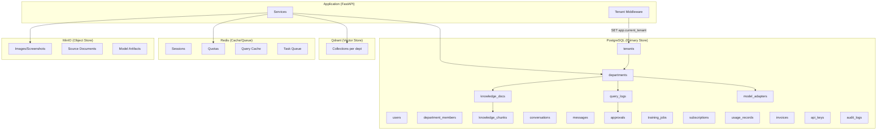
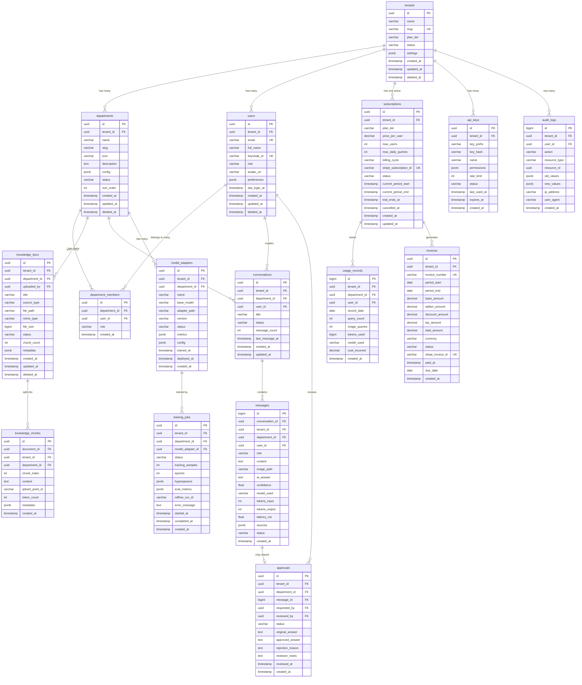
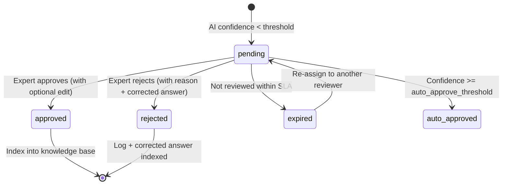

# Database Design Document

**Project Name**: The Expert — Universal Enterprise AI Platform
**Version**: 1.0
**Date**: 2026-02-12
**Database Engine**: PostgreSQL 16+ with Row-Level Security (RLS)
**Vector Database**: Qdrant 1.7+
**Cache / Queue**: Redis 7.2+
**Object Storage**: MinIO (S3-compatible)

---

## Table of Contents

1. [Architecture Overview](#1-architecture-overview)
2. [Entity Relationship Diagram](#2-entity-relationship-diagram)
3. [Core Tables — Tenant & Organization](#3-core-tables--tenant--organization)
4. [Department & Access Control](#4-department--access-control)
5. [Knowledge Base & Documents](#5-knowledge-base--documents)
6. [Query & Conversation](#6-query--conversation)
7. [Human-in-the-Loop (Approvals)](#7-human-in-the-loop-approvals)
8. [AI / ML Model Management](#8-ai--ml-model-management)
9. [Billing & Subscription](#9-billing--subscription)
10. [Audit & Compliance](#10-audit--compliance)
11. [Row-Level Security (RLS) Policies](#11-row-level-security-rls-policies)
12. [Vector Database (Qdrant) Schema](#12-vector-database-qdrant-schema)
13. [Redis Key Schema](#13-redis-key-schema)
14. [MinIO Bucket Structure](#14-minio-bucket-structure)
15. [Indexes & Performance](#15-indexes--performance)
16. [Migration Strategy](#16-migration-strategy)

---

## 1. Architecture Overview

### Data Layer Overview



### Key Design Decisions

| Decision | Rationale |
| :--- | :--- |
| **PostgreSQL RLS** | Strongest tenant isolation without separate DBs. Zero data leakage. |
| **UUID primary keys** | Globally unique. Safe for distributed systems. No ID collision. |
| **JSONB for flexible config** | Departments & models have varying configs. JSONB avoids schema rigidity. |
| **Separate chunks table** | Knowledge docs → chunks → vectors. Enables re-chunking without re-upload. |
| **Conversations + Messages** | Supports multi-turn chat history. Each message links to a conversation. |
| **Soft deletes** | `deleted_at TIMESTAMP NULL` on key tables. Enables recovery + audit compliance. |
| **Qdrant for vectors** | PostgreSQL pgvector is OK for small scale; Qdrant is purpose-built for production ANN search with filtering. |

---

## 2. Entity Relationship Diagram



---

## 3. Core Tables — Tenant & Organization

### 3.1 `tenants`

```sql
CREATE TABLE tenants (
    id              UUID PRIMARY KEY DEFAULT gen_random_uuid(),
    name            VARCHAR(255) NOT NULL,
    slug            VARCHAR(100) UNIQUE NOT NULL,
    plan_tier       VARCHAR(50) NOT NULL DEFAULT 'free'
                        CHECK (plan_tier IN ('free', 'professional', 'enterprise', 'onpremise')),
    status          VARCHAR(20) NOT NULL DEFAULT 'active'
                        CHECK (status IN ('active', 'trial', 'suspended', 'cancelled')),
    settings        JSONB NOT NULL DEFAULT '{}'::jsonb,
    -- Settings JSON structure:
    -- {
    --   "logo_url": "https://...",
    --   "primary_color": "#3B82F6",
    --   "secondary_color": "#1E40AF",
    --   "custom_domain": "support.acme.com",
    --   "timezone": "Asia/Bangkok",
    --   "language": "th",
    --   "max_departments": 10,
    --   "features_enabled": ["vision", "hitl", "custom_models"]
    -- }
    created_at      TIMESTAMP WITH TIME ZONE NOT NULL DEFAULT NOW(),
    updated_at      TIMESTAMP WITH TIME ZONE NOT NULL DEFAULT NOW(),
    deleted_at      TIMESTAMP WITH TIME ZONE
);

-- Indexes
CREATE INDEX idx_tenants_slug ON tenants(slug) WHERE deleted_at IS NULL;
CREATE INDEX idx_tenants_status ON tenants(status) WHERE deleted_at IS NULL;
CREATE INDEX idx_tenants_plan_tier ON tenants(plan_tier) WHERE deleted_at IS NULL;

-- Trigger: auto-update updated_at
CREATE OR REPLACE FUNCTION update_updated_at()
RETURNS TRIGGER AS $$
BEGIN
    NEW.updated_at = NOW();
    RETURN NEW;
END;
$$ LANGUAGE plpgsql;

CREATE TRIGGER trigger_tenants_updated_at
    BEFORE UPDATE ON tenants
    FOR EACH ROW EXECUTE FUNCTION update_updated_at();
```

### 3.2 `users`

```sql
CREATE TABLE users (
    id              UUID PRIMARY KEY DEFAULT gen_random_uuid(),
    tenant_id       UUID NOT NULL REFERENCES tenants(id) ON DELETE CASCADE,
    email           VARCHAR(255) NOT NULL,
    full_name       VARCHAR(255) NOT NULL,
    keycloak_id     VARCHAR(255) UNIQUE,
    role            VARCHAR(50) NOT NULL DEFAULT 'member'
                        CHECK (role IN ('owner', 'admin', 'member', 'viewer')),
    avatar_url      VARCHAR(500),
    preferences     JSONB NOT NULL DEFAULT '{}'::jsonb,
    -- Preferences JSON:
    -- {
    --   "theme": "dark",
    --   "language": "th",
    --   "notifications": {"email": true, "in_app": true},
    --   "default_department": "it_ops"
    -- }
    last_login_at   TIMESTAMP WITH TIME ZONE,
    created_at      TIMESTAMP WITH TIME ZONE NOT NULL DEFAULT NOW(),
    updated_at      TIMESTAMP WITH TIME ZONE NOT NULL DEFAULT NOW(),
    deleted_at      TIMESTAMP WITH TIME ZONE,

    UNIQUE(tenant_id, email)
);

-- Indexes
CREATE INDEX idx_users_tenant ON users(tenant_id) WHERE deleted_at IS NULL;
CREATE INDEX idx_users_email ON users(email) WHERE deleted_at IS NULL;
CREATE INDEX idx_users_keycloak ON users(keycloak_id) WHERE keycloak_id IS NOT NULL;

CREATE TRIGGER trigger_users_updated_at
    BEFORE UPDATE ON users
    FOR EACH ROW EXECUTE FUNCTION update_updated_at();
```

---

## 4. Department & Access Control

### 4.1 `departments`

```sql
CREATE TABLE departments (
    id              UUID PRIMARY KEY DEFAULT gen_random_uuid(),
    tenant_id       UUID NOT NULL REFERENCES tenants(id) ON DELETE CASCADE,
    name            VARCHAR(255) NOT NULL,
    slug            VARCHAR(100) NOT NULL,
    icon            VARCHAR(10) DEFAULT '📁',  -- Emoji or icon class
    description     TEXT,
    config          JSONB NOT NULL DEFAULT '{}'::jsonb,
    -- Config JSON structure:
    -- {
    --   "knowledge": {
    --     "qdrant_collection": "tenant_xxx_hr",
    --     "embedding_model": "bge-large-en-v1.5",
    --     "chunk_size": 512,
    --     "chunk_overlap": 50
    --   },
    --   "model": {
    --     "base_model": "meta-llama/Llama-3-8b",
    --     "lora_adapter": "adapters/hr_xxx_v3",
    --     "system_prompt": "You are an HR expert...",
    --     "temperature": 0.3,
    --     "max_tokens": 1024
    --   },
    --   "approval": {
    --     "required_for": "new_answers",
    --     "auto_approve_confidence": 0.95,
    --     "approver_role": "approver"
    --   },
    --   "access_control": {
    --     "allowed_roles": ["staff", "manager"],
    --     "restricted_fields": ["salary"]
    --   }
    -- }
    status          VARCHAR(20) NOT NULL DEFAULT 'active'
                        CHECK (status IN ('active', 'archived', 'setup')),
    sort_order      INT NOT NULL DEFAULT 0,
    created_at      TIMESTAMP WITH TIME ZONE NOT NULL DEFAULT NOW(),
    updated_at      TIMESTAMP WITH TIME ZONE NOT NULL DEFAULT NOW(),
    deleted_at      TIMESTAMP WITH TIME ZONE,

    UNIQUE(tenant_id, slug)
);

-- Indexes
CREATE INDEX idx_departments_tenant ON departments(tenant_id) WHERE deleted_at IS NULL;
CREATE INDEX idx_departments_status ON departments(tenant_id, status) WHERE deleted_at IS NULL;

CREATE TRIGGER trigger_departments_updated_at
    BEFORE UPDATE ON departments
    FOR EACH ROW EXECUTE FUNCTION update_updated_at();
```

### 4.2 `department_members`

```sql
CREATE TABLE department_members (
    id              UUID PRIMARY KEY DEFAULT gen_random_uuid(),
    department_id   UUID NOT NULL REFERENCES departments(id) ON DELETE CASCADE,
    user_id         UUID NOT NULL REFERENCES users(id) ON DELETE CASCADE,
    tenant_id       UUID NOT NULL REFERENCES tenants(id) ON DELETE CASCADE,
    role            VARCHAR(50) NOT NULL DEFAULT 'member'
                        CHECK (role IN ('lead', 'approver', 'member', 'viewer')),
    created_at      TIMESTAMP WITH TIME ZONE NOT NULL DEFAULT NOW(),

    UNIQUE(department_id, user_id)
);

-- Indexes
CREATE INDEX idx_dept_members_dept ON department_members(department_id);
CREATE INDEX idx_dept_members_user ON department_members(user_id);
CREATE INDEX idx_dept_members_tenant ON department_members(tenant_id);
```

---

## 5. Knowledge Base & Documents

### 5.1 `knowledge_docs`

```sql
CREATE TABLE knowledge_docs (
    id              UUID PRIMARY KEY DEFAULT gen_random_uuid(),
    tenant_id       UUID NOT NULL REFERENCES tenants(id) ON DELETE CASCADE,
    department_id   UUID NOT NULL REFERENCES departments(id) ON DELETE CASCADE,
    uploaded_by     UUID REFERENCES users(id) ON DELETE SET NULL,
    title           VARCHAR(500) NOT NULL,
    source_type     VARCHAR(50) NOT NULL
                        CHECK (source_type IN ('pdf', 'docx', 'txt', 'md', 'html', 'csv', 'url', 'manual')),
    file_path       VARCHAR(1000),          -- MinIO path
    mime_type       VARCHAR(100),
    file_size       BIGINT DEFAULT 0,       -- bytes
    status          VARCHAR(20) NOT NULL DEFAULT 'pending'
                        CHECK (status IN ('pending', 'processing', 'indexed', 'failed', 'archived')),
    chunk_count     INT DEFAULT 0,
    metadata        JSONB NOT NULL DEFAULT '{}'::jsonb,
    -- Metadata JSON:
    -- {
    --   "original_filename": "server_runbook_v3.pdf",
    --   "language": "en",
    --   "page_count": 42,
    --   "word_count": 15000,
    --   "tags": ["server", "linux", "networking"],
    --   "error_message": null
    -- }
    created_at      TIMESTAMP WITH TIME ZONE NOT NULL DEFAULT NOW(),
    updated_at      TIMESTAMP WITH TIME ZONE NOT NULL DEFAULT NOW(),
    deleted_at      TIMESTAMP WITH TIME ZONE
);

-- Indexes
CREATE INDEX idx_knowledge_docs_tenant_dept ON knowledge_docs(tenant_id, department_id) WHERE deleted_at IS NULL;
CREATE INDEX idx_knowledge_docs_status ON knowledge_docs(status) WHERE deleted_at IS NULL;

CREATE TRIGGER trigger_knowledge_docs_updated_at
    BEFORE UPDATE ON knowledge_docs
    FOR EACH ROW EXECUTE FUNCTION update_updated_at();
```

### 5.2 `knowledge_chunks`

```sql
CREATE TABLE knowledge_chunks (
    id              UUID PRIMARY KEY DEFAULT gen_random_uuid(),
    document_id     UUID NOT NULL REFERENCES knowledge_docs(id) ON DELETE CASCADE,
    tenant_id       UUID NOT NULL REFERENCES tenants(id) ON DELETE CASCADE,
    department_id   UUID NOT NULL REFERENCES departments(id) ON DELETE CASCADE,
    chunk_index     INT NOT NULL,           -- Position in document (0-based)
    content         TEXT NOT NULL,           -- Actual text content
    qdrant_point_id VARCHAR(100),           -- Reference to Qdrant vector
    token_count     INT NOT NULL DEFAULT 0,
    metadata        JSONB NOT NULL DEFAULT '{}'::jsonb,
    -- Metadata JSON:
    -- {
    --   "page_number": 5,
    --   "section_title": "Troubleshooting Network Issues",
    --   "heading_hierarchy": ["Chapter 3", "Section 3.2", "Network"]
    -- }
    created_at      TIMESTAMP WITH TIME ZONE NOT NULL DEFAULT NOW(),

    UNIQUE(document_id, chunk_index)
);

-- Indexes
CREATE INDEX idx_chunks_document ON knowledge_chunks(document_id);
CREATE INDEX idx_chunks_tenant_dept ON knowledge_chunks(tenant_id, department_id);
CREATE INDEX idx_chunks_qdrant ON knowledge_chunks(qdrant_point_id) WHERE qdrant_point_id IS NOT NULL;
```

---

## 6. Query & Conversation

### 6.1 `conversations`

```sql
CREATE TABLE conversations (
    id              UUID PRIMARY KEY DEFAULT gen_random_uuid(),
    tenant_id       UUID NOT NULL REFERENCES tenants(id) ON DELETE CASCADE,
    department_id   UUID NOT NULL REFERENCES departments(id) ON DELETE CASCADE,
    user_id         UUID NOT NULL REFERENCES users(id) ON DELETE SET NULL,
    title           VARCHAR(500),           -- Auto-generated or user-set
    status          VARCHAR(20) NOT NULL DEFAULT 'active'
                        CHECK (status IN ('active', 'archived', 'deleted')),
    message_count   INT NOT NULL DEFAULT 0,
    last_message_at TIMESTAMP WITH TIME ZONE,
    created_at      TIMESTAMP WITH TIME ZONE NOT NULL DEFAULT NOW(),
    updated_at      TIMESTAMP WITH TIME ZONE NOT NULL DEFAULT NOW()
);

-- Indexes
CREATE INDEX idx_conversations_tenant_dept ON conversations(tenant_id, department_id);
CREATE INDEX idx_conversations_user ON conversations(user_id);
CREATE INDEX idx_conversations_last_msg ON conversations(tenant_id, last_message_at DESC);
```

### 6.2 `messages`

```sql
CREATE TABLE messages (
    id              BIGSERIAL PRIMARY KEY,
    conversation_id UUID NOT NULL REFERENCES conversations(id) ON DELETE CASCADE,
    tenant_id       UUID NOT NULL REFERENCES tenants(id) ON DELETE CASCADE,
    department_id   UUID NOT NULL REFERENCES departments(id) ON DELETE CASCADE,
    user_id         UUID REFERENCES users(id) ON DELETE SET NULL,
    role            VARCHAR(20) NOT NULL
                        CHECK (role IN ('user', 'assistant', 'system')),
    content         TEXT NOT NULL,          -- User's question or AI's answer
    image_path      VARCHAR(1000),          -- MinIO path for screenshot
    ai_answer       TEXT,                   -- Full AI response (if role=user, this stores the response)
    confidence      FLOAT CHECK (confidence >= 0 AND confidence <= 1),
    model_used      VARCHAR(200),           -- e.g. "llama3-8b-it-ops-v3"
    tokens_input    INT DEFAULT 0,
    tokens_output   INT DEFAULT 0,
    latency_ms      FLOAT,                 -- Total response time
    sources         JSONB DEFAULT '[]'::jsonb,
    -- Sources JSON:
    -- [
    --   {"doc_id": "xxx", "title": "Runbook", "chunk_id": "yyy", "relevance": 0.95},
    --   {"doc_id": "zzz", "title": "FAQ", "chunk_id": "www", "relevance": 0.87}
    -- ]
    status          VARCHAR(20) NOT NULL DEFAULT 'completed'
                        CHECK (status IN ('completed', 'pending_approval', 'approved', 'rejected', 'error')),
    created_at      TIMESTAMP WITH TIME ZONE NOT NULL DEFAULT NOW()
);

-- Indexes
CREATE INDEX idx_messages_conversation ON messages(conversation_id, created_at);
CREATE INDEX idx_messages_tenant_dept ON messages(tenant_id, department_id);
CREATE INDEX idx_messages_status ON messages(status) WHERE status = 'pending_approval';
CREATE INDEX idx_messages_created ON messages(tenant_id, created_at DESC);

-- Partitioning (for high-volume deployments)
-- Consider partitioning by tenant_id or by month for tables with millions of rows
-- CREATE TABLE messages_y2026m01 PARTITION OF messages
--     FOR VALUES FROM ('2026-01-01') TO ('2026-02-01');
```

---

## 7. Human-in-the-Loop (Approvals)

### 7.1 `approvals`

```sql
CREATE TABLE approvals (
    id              UUID PRIMARY KEY DEFAULT gen_random_uuid(),
    tenant_id       UUID NOT NULL REFERENCES tenants(id) ON DELETE CASCADE,
    department_id   UUID NOT NULL REFERENCES departments(id) ON DELETE CASCADE,
    message_id      BIGINT NOT NULL REFERENCES messages(id) ON DELETE CASCADE,
    requested_by    UUID REFERENCES users(id) ON DELETE SET NULL,      -- System or user who triggered
    reviewed_by     UUID REFERENCES users(id) ON DELETE SET NULL,      -- Expert who reviewed
    status          VARCHAR(20) NOT NULL DEFAULT 'pending'
                        CHECK (status IN ('pending', 'approved', 'rejected', 'expired', 'auto_approved')),
    original_answer TEXT NOT NULL,           -- AI's original response
    approved_answer TEXT,                    -- Final approved (may be edited)
    rejection_reason TEXT,
    reviewer_notes  TEXT,                    -- Internal notes from reviewer
    priority        VARCHAR(10) DEFAULT 'normal'
                        CHECK (priority IN ('urgent', 'high', 'normal', 'low')),
    expires_at      TIMESTAMP WITH TIME ZONE,  -- Auto-expire if not reviewed
    reviewed_at     TIMESTAMP WITH TIME ZONE,
    created_at      TIMESTAMP WITH TIME ZONE NOT NULL DEFAULT NOW()
);

-- Indexes
CREATE INDEX idx_approvals_pending ON approvals(tenant_id, department_id, status)
    WHERE status = 'pending';
CREATE INDEX idx_approvals_reviewer ON approvals(reviewed_by) WHERE reviewed_by IS NOT NULL;
CREATE INDEX idx_approvals_message ON approvals(message_id);
CREATE INDEX idx_approvals_created ON approvals(tenant_id, created_at DESC);
```

### 7.2 Approval Workflow



---

## 8. AI / ML Model Management

### 8.1 `model_adapters`

```sql
CREATE TABLE model_adapters (
    id              UUID PRIMARY KEY DEFAULT gen_random_uuid(),
    tenant_id       UUID NOT NULL REFERENCES tenants(id) ON DELETE CASCADE,
    department_id   UUID NOT NULL REFERENCES departments(id) ON DELETE CASCADE,
    name            VARCHAR(255) NOT NULL,     -- e.g. "it-ops-adapter-v3"
    base_model      VARCHAR(255) NOT NULL,     -- e.g. "meta-llama/Llama-3-8b-Instruct"
    adapter_path    VARCHAR(1000),             -- MinIO or local path to LoRA weights
    version         VARCHAR(50) NOT NULL,      -- Semver: "1.0.0", "1.1.0"
    status          VARCHAR(20) NOT NULL DEFAULT 'draft'
                        CHECK (status IN ('draft', 'training', 'evaluating', 'staging', 'production', 'retired')),
    metrics         JSONB DEFAULT '{}'::jsonb,
    -- Metrics JSON:
    -- {
    --   "bleu": 0.72,
    --   "rouge_l": 0.81,
    --   "f1": 0.85,
    --   "eval_loss": 0.34,
    --   "training_samples": 5000,
    --   "training_epochs": 3,
    --   "training_time_minutes": 45
    -- }
    config          JSONB DEFAULT '{}'::jsonb,
    -- Config JSON:
    -- {
    --   "lora_r": 16,
    --   "lora_alpha": 32,
    --   "lora_dropout": 0.05,
    --   "target_modules": ["q_proj", "v_proj", "k_proj", "o_proj"],
    --   "learning_rate": 2e-4,
    --   "batch_size": 8,
    --   "quantization": "int8"
    -- }
    trained_at      TIMESTAMP WITH TIME ZONE,
    deployed_at     TIMESTAMP WITH TIME ZONE,
    created_at      TIMESTAMP WITH TIME ZONE NOT NULL DEFAULT NOW(),

    UNIQUE(tenant_id, department_id, version)
);

-- Indexes
CREATE INDEX idx_model_adapters_tenant_dept ON model_adapters(tenant_id, department_id);
CREATE INDEX idx_model_adapters_status ON model_adapters(status) WHERE status = 'production';
```

### 8.2 `training_jobs`

```sql
CREATE TABLE training_jobs (
    id              UUID PRIMARY KEY DEFAULT gen_random_uuid(),
    tenant_id       UUID NOT NULL REFERENCES tenants(id) ON DELETE CASCADE,
    department_id   UUID NOT NULL REFERENCES departments(id) ON DELETE CASCADE,
    model_adapter_id UUID REFERENCES model_adapters(id) ON DELETE SET NULL,
    status          VARCHAR(20) NOT NULL DEFAULT 'queued'
                        CHECK (status IN ('queued', 'preparing', 'training', 'evaluating',
                                          'completed', 'failed', 'cancelled')),
    training_samples INT DEFAULT 0,
    epochs          INT DEFAULT 3,
    hyperparams     JSONB DEFAULT '{}'::jsonb,
    eval_metrics    JSONB DEFAULT '{}'::jsonb,
    mlflow_run_id   VARCHAR(255),
    error_message   TEXT,
    progress_pct    INT DEFAULT 0 CHECK (progress_pct >= 0 AND progress_pct <= 100),
    started_at      TIMESTAMP WITH TIME ZONE,
    completed_at    TIMESTAMP WITH TIME ZONE,
    created_at      TIMESTAMP WITH TIME ZONE NOT NULL DEFAULT NOW()
);

-- Indexes
CREATE INDEX idx_training_jobs_tenant ON training_jobs(tenant_id);
CREATE INDEX idx_training_jobs_status ON training_jobs(status) WHERE status IN ('queued', 'training');
```

---

## 9. Billing & Subscription

### 9.1 `subscriptions`

```sql
CREATE TABLE subscriptions (
    id                      UUID PRIMARY KEY DEFAULT gen_random_uuid(),
    tenant_id               UUID NOT NULL REFERENCES tenants(id) ON DELETE CASCADE,
    plan_tier               VARCHAR(50) NOT NULL
                                CHECK (plan_tier IN ('free', 'professional', 'enterprise', 'onpremise')),
    price_per_user          DECIMAL(10,2) NOT NULL DEFAULT 0,
    max_users               INT,               -- NULL = unlimited
    max_daily_queries       INT,               -- NULL = unlimited
    max_departments         INT DEFAULT 1,
    billing_cycle           VARCHAR(20) NOT NULL DEFAULT 'monthly'
                                CHECK (billing_cycle IN ('monthly', 'annual', 'custom')),
    stripe_subscription_id  VARCHAR(255) UNIQUE,
    stripe_customer_id      VARCHAR(255),
    status                  VARCHAR(20) NOT NULL DEFAULT 'active'
                                CHECK (status IN ('active', 'trialing', 'past_due', 'cancelled', 'paused')),
    current_period_start    TIMESTAMP WITH TIME ZONE,
    current_period_end      TIMESTAMP WITH TIME ZONE,
    trial_ends_at           TIMESTAMP WITH TIME ZONE,
    cancelled_at            TIMESTAMP WITH TIME ZONE,
    created_at              TIMESTAMP WITH TIME ZONE NOT NULL DEFAULT NOW(),
    updated_at              TIMESTAMP WITH TIME ZONE NOT NULL DEFAULT NOW()
);

-- Indexes
CREATE INDEX idx_subscriptions_tenant ON subscriptions(tenant_id);
CREATE INDEX idx_subscriptions_stripe ON subscriptions(stripe_subscription_id)
    WHERE stripe_subscription_id IS NOT NULL;
CREATE INDEX idx_subscriptions_status ON subscriptions(status) WHERE status = 'active';

CREATE TRIGGER trigger_subscriptions_updated_at
    BEFORE UPDATE ON subscriptions
    FOR EACH ROW EXECUTE FUNCTION update_updated_at();
```

### 9.2 `usage_records`

```sql
CREATE TABLE usage_records (
    id              BIGSERIAL PRIMARY KEY,
    tenant_id       UUID NOT NULL REFERENCES tenants(id) ON DELETE CASCADE,
    department_id   UUID REFERENCES departments(id) ON DELETE SET NULL,
    user_id         UUID REFERENCES users(id) ON DELETE SET NULL,
    record_date     DATE NOT NULL,
    query_count     INT NOT NULL DEFAULT 0,
    image_queries   INT NOT NULL DEFAULT 0,
    tokens_used     BIGINT NOT NULL DEFAULT 0,
    model_used      VARCHAR(200),
    cost_incurred   DECIMAL(10,4) NOT NULL DEFAULT 0,
    created_at      TIMESTAMP WITH TIME ZONE NOT NULL DEFAULT NOW(),

    UNIQUE(tenant_id, user_id, record_date, model_used)
);

-- Indexes
CREATE INDEX idx_usage_tenant_date ON usage_records(tenant_id, record_date);
CREATE INDEX idx_usage_dept_date ON usage_records(department_id, record_date);

-- Partitioning by month (recommended for high volume)
-- CREATE TABLE usage_records_y2026m02 PARTITION OF usage_records
--     FOR VALUES FROM ('2026-02-01') TO ('2026-03-01');
```

### 9.3 `invoices`

```sql
CREATE TABLE invoices (
    id                  UUID PRIMARY KEY DEFAULT gen_random_uuid(),
    tenant_id           UUID NOT NULL REFERENCES tenants(id) ON DELETE CASCADE,
    invoice_number      VARCHAR(50) UNIQUE NOT NULL,  -- INV-2026-0001
    period_start        DATE NOT NULL,
    period_end          DATE NOT NULL,
    base_amount         DECIMAL(10,2) NOT NULL DEFAULT 0,
    addon_amount        DECIMAL(10,2) NOT NULL DEFAULT 0,
    discount_amount     DECIMAL(10,2) NOT NULL DEFAULT 0,
    tax_amount          DECIMAL(10,2) NOT NULL DEFAULT 0,
    total_amount        DECIMAL(10,2) NOT NULL,
    currency            VARCHAR(3) NOT NULL DEFAULT 'USD',
    status              VARCHAR(20) NOT NULL DEFAULT 'draft'
                            CHECK (status IN ('draft', 'pending', 'paid', 'overdue', 'cancelled', 'refunded')),
    stripe_invoice_id   VARCHAR(255) UNIQUE,
    paid_at             TIMESTAMP WITH TIME ZONE,
    due_date            DATE NOT NULL,
    line_items          JSONB DEFAULT '[]'::jsonb,
    -- Line Items JSON:
    -- [
    --   {"description": "Professional Plan x 10 users", "quantity": 10, "unit_price": 29.00, "amount": 290.00},
    --   {"description": "Extra queries (150 over limit)", "quantity": 150, "unit_price": 0.05, "amount": 7.50}
    -- ]
    created_at          TIMESTAMP WITH TIME ZONE NOT NULL DEFAULT NOW()
);

-- Indexes
CREATE INDEX idx_invoices_tenant ON invoices(tenant_id);
CREATE INDEX idx_invoices_status ON invoices(status) WHERE status IN ('pending', 'overdue');
CREATE INDEX idx_invoices_due ON invoices(due_date) WHERE status = 'pending';
```

### 9.4 `api_keys`

```sql
CREATE TABLE api_keys (
    id              UUID PRIMARY KEY DEFAULT gen_random_uuid(),
    tenant_id       UUID NOT NULL REFERENCES tenants(id) ON DELETE CASCADE,
    key_prefix      VARCHAR(10) NOT NULL,      -- First 8 chars for identification: "exp_ab12..."
    key_hash        VARCHAR(255) NOT NULL,     -- bcrypt/argon2 hash of full key
    name            VARCHAR(100) NOT NULL,     -- User-friendly name
    permissions     JSONB NOT NULL DEFAULT '["read", "query"]'::jsonb,
    rate_limit      INT NOT NULL DEFAULT 100,  -- Requests per minute
    status          VARCHAR(20) NOT NULL DEFAULT 'active'
                        CHECK (status IN ('active', 'revoked', 'expired')),
    last_used_at    TIMESTAMP WITH TIME ZONE,
    expires_at      TIMESTAMP WITH TIME ZONE,
    created_at      TIMESTAMP WITH TIME ZONE NOT NULL DEFAULT NOW()
);

-- Indexes
CREATE INDEX idx_api_keys_tenant ON api_keys(tenant_id) WHERE status = 'active';
CREATE INDEX idx_api_keys_prefix ON api_keys(key_prefix);
```

---

## 10. Audit & Compliance

### 10.1 `audit_logs`

```sql
CREATE TABLE audit_logs (
    id              BIGSERIAL PRIMARY KEY,
    tenant_id       UUID NOT NULL REFERENCES tenants(id) ON DELETE CASCADE,
    user_id         UUID REFERENCES users(id) ON DELETE SET NULL,
    action          VARCHAR(100) NOT NULL,
    -- Actions: 'user.login', 'user.logout', 'query.created', 'approval.approved',
    --          'knowledge.uploaded', 'department.created', 'settings.changed',
    --          'model.deployed', 'api_key.created', 'subscription.upgraded'
    resource_type   VARCHAR(100) NOT NULL,
    -- Types: 'user', 'department', 'knowledge_doc', 'query', 'approval',
    --         'model_adapter', 'subscription', 'api_key', 'settings'
    resource_id     UUID,
    old_values      JSONB,                  -- Previous state (for updates/deletes)
    new_values      JSONB,                  -- New state (for creates/updates)
    ip_address      INET,
    user_agent      TEXT,
    created_at      TIMESTAMP WITH TIME ZONE NOT NULL DEFAULT NOW()
);

-- Indexes (optimized for compliance queries)
CREATE INDEX idx_audit_tenant_date ON audit_logs(tenant_id, created_at DESC);
CREATE INDEX idx_audit_user ON audit_logs(user_id, created_at DESC) WHERE user_id IS NOT NULL;
CREATE INDEX idx_audit_action ON audit_logs(action);
CREATE INDEX idx_audit_resource ON audit_logs(resource_type, resource_id);

-- IMPORTANT: This table should be APPEND-ONLY
-- No UPDATE or DELETE should ever be allowed on this table
REVOKE UPDATE, DELETE ON audit_logs FROM app_user;
```

---

## 11. Row-Level Security (RLS) Policies

### 11.1 Setup

```sql
-- Application role (used by FastAPI)
CREATE ROLE app_user;
GRANT CONNECT ON DATABASE the_expert TO app_user;
GRANT USAGE ON SCHEMA public TO app_user;
GRANT SELECT, INSERT, UPDATE, DELETE ON ALL TABLES IN SCHEMA public TO app_user;
GRANT USAGE ON ALL SEQUENCES IN SCHEMA public TO app_user;

-- The middleware sets these before every query:
-- SET LOCAL app.current_tenant = '{tenant_uuid}';
-- SET LOCAL app.current_user = '{user_uuid}';
```

### 11.2 RLS Policies (Applied to all tenant-scoped tables)

```sql
-- Enable RLS
ALTER TABLE users ENABLE ROW LEVEL SECURITY;
ALTER TABLE departments ENABLE ROW LEVEL SECURITY;
ALTER TABLE department_members ENABLE ROW LEVEL SECURITY;
ALTER TABLE knowledge_docs ENABLE ROW LEVEL SECURITY;
ALTER TABLE knowledge_chunks ENABLE ROW LEVEL SECURITY;
ALTER TABLE conversations ENABLE ROW LEVEL SECURITY;
ALTER TABLE messages ENABLE ROW LEVEL SECURITY;
ALTER TABLE approvals ENABLE ROW LEVEL SECURITY;
ALTER TABLE model_adapters ENABLE ROW LEVEL SECURITY;
ALTER TABLE training_jobs ENABLE ROW LEVEL SECURITY;
ALTER TABLE subscriptions ENABLE ROW LEVEL SECURITY;
ALTER TABLE usage_records ENABLE ROW LEVEL SECURITY;
ALTER TABLE invoices ENABLE ROW LEVEL SECURITY;
ALTER TABLE api_keys ENABLE ROW LEVEL SECURITY;
ALTER TABLE audit_logs ENABLE ROW LEVEL SECURITY;

-- Tenant isolation policy (applied to ALL tables above)
-- Example for departments:
CREATE POLICY tenant_read ON departments
    FOR SELECT
    USING (tenant_id = current_setting('app.current_tenant')::uuid);

CREATE POLICY tenant_insert ON departments
    FOR INSERT
    WITH CHECK (tenant_id = current_setting('app.current_tenant')::uuid);

CREATE POLICY tenant_update ON departments
    FOR UPDATE
    USING (tenant_id = current_setting('app.current_tenant')::uuid);

CREATE POLICY tenant_delete ON departments
    FOR DELETE
    USING (tenant_id = current_setting('app.current_tenant')::uuid);

-- Repeat for ALL tenant-scoped tables...
-- (Use a script or migration to apply uniformly)

-- Department-level access for messages (users only see their departments)
CREATE POLICY dept_access ON messages
    FOR SELECT
    USING (
        tenant_id = current_setting('app.current_tenant')::uuid
        AND (
            -- Admins/owners see all
            EXISTS (
                SELECT 1 FROM users
                WHERE id = current_setting('app.current_user')::uuid
                AND role IN ('owner', 'admin')
            )
            OR
            -- Members see only their departments
            department_id IN (
                SELECT department_id FROM department_members
                WHERE user_id = current_setting('app.current_user')::uuid
            )
        )
    );
```

### 11.3 FastAPI Middleware Implementation

```python
# app/core/middleware.py
from fastapi import Request
from sqlalchemy.ext.asyncio import AsyncSession

class TenantMiddleware:
    """Sets PostgreSQL RLS session variables from JWT claims."""

    async def set_tenant_context(self, session: AsyncSession, request: Request):
        tenant_id = request.state.tenant_id  # Extracted from JWT
        user_id = request.state.user_id      # Extracted from JWT

        await session.execute(
            text("SET LOCAL app.current_tenant = :tenant_id"),
            {"tenant_id": str(tenant_id)}
        )
        await session.execute(
            text("SET LOCAL app.current_user = :user_id"),
            {"user_id": str(user_id)}
        )
        # Now all queries are automatically filtered by RLS
```

---

## 12. Vector Database (Qdrant) Schema

### 12.1 Collection Strategy

```
Option A: One collection per department per tenant (recommended for <1000 tenants)
    Collection name: "tenant_{tenant_id}_{dept_slug}"
    Example: "tenant_acme_it_ops", "tenant_acme_hr"

Option B: Shared collection with payload filtering (recommended for >1000 tenants)
    Collection name: "knowledge_vectors"
    Payload filter: {"tenant_id": "xxx", "department_id": "yyy"}
```

### 12.2 Vector Point Schema

```json
{
  "id": "chunk-uuid-here",
  "vector": [0.123, -0.456, ...],  // 1024-dim (BGE-large)
  "payload": {
    "tenant_id": "tenant-uuid",
    "department_id": "dept-uuid",
    "document_id": "doc-uuid",
    "chunk_index": 3,
    "content": "The server requires at least 8GB RAM...",
    "title": "Server Requirements Guide",
    "source_type": "pdf",
    "page_number": 5,
    "section": "Hardware Requirements",
    "tags": ["server", "hardware", "requirements"],
    "created_at": "2026-02-12T10:00:00Z"
  }
}
```

### 12.3 Qdrant Collection Config

```python
from qdrant_client import QdrantClient
from qdrant_client.models import VectorParams, Distance, PayloadSchemaType

client = QdrantClient(host="qdrant", port=6333)

# Create collection for a department
client.create_collection(
    collection_name=f"tenant_{tenant_id}_{dept_slug}",
    vectors_config=VectorParams(
        size=1024,              # BGE-large dimension
        distance=Distance.COSINE,
    ),
)

# Create payload indexes for filtering
client.create_payload_index(
    collection_name=f"tenant_{tenant_id}_{dept_slug}",
    field_name="document_id",
    field_schema=PayloadSchemaType.KEYWORD,
)
client.create_payload_index(
    collection_name=f"tenant_{tenant_id}_{dept_slug}",
    field_name="tags",
    field_schema=PayloadSchemaType.KEYWORD,
)
```

---

## 13. Redis Key Schema

### Key Naming Convention

```
Format: {scope}:{tenant_id}:{resource}:{identifier}

Examples:
├── session:{tenant_id}:{user_id}                 → User session data (JSON)
├── quota:{tenant_id}:{date}                       → Daily query count (INT)
├── quota:{tenant_id}:{dept_id}:{date}             → Per-dept daily count (INT)
├── cache:query:{tenant_id}:{query_hash}           → Cached query result (JSON, TTL: 1hr)
├── cache:rag:{tenant_id}:{dept_id}:{query_hash}   → Cached RAG results (JSON, TTL: 30min)
├── rate:{tenant_id}:{api_key_prefix}:{minute}     → API rate limiter (INT, TTL: 60s)
├── lock:training:{tenant_id}:{dept_id}            → Training job lock (String, TTL: 4hr)
├── ws:online:{tenant_id}                          → Set of online user IDs (SET)
└── notification:{tenant_id}:{user_id}             → Pending notifications (LIST)
```

---

## 14. MinIO Bucket Structure

```
Bucket: the-expert-storage
├── {tenant_id}/
│   ├── images/
│   │   ├── {dept_id}/
│   │   │   ├── {year}/{month}/
│   │   │   │   ├── {message_id}_original.png
│   │   │   │   └── {message_id}_thumb.jpg
│   ├── documents/
│   │   ├── {dept_id}/
│   │   │   ├── {doc_id}/
│   │   │   │   ├── original.pdf
│   │   │   │   └── extracted.txt
│   ├── models/
│   │   ├── {dept_id}/
│   │   │   ├── {adapter_id}/
│   │   │   │   ├── adapter_model.safetensors
│   │   │   │   ├── adapter_config.json
│   │   │   │   └── tokenizer_config.json
│   └── exports/
│       ├── {export_id}.zip
│       └── {export_id}.csv

Bucket Policy: Tenant-scoped (each tenant can only access their prefix)
```

---

## 15. Indexes & Performance

### 15.1 Index Summary

| Table | Index | Type | Purpose |
| :--- | :--- | :--- | :--- |
| `tenants` | `idx_tenants_slug` | B-tree (partial) | Lookup by slug (login) |
| `users` | `idx_users_tenant` | B-tree (partial) | List users per tenant |
| `users` | `idx_users_email` | B-tree (partial) | Email lookup |
| `departments` | `idx_departments_tenant` | B-tree (partial) | List departments |
| `messages` | `idx_messages_conversation` | B-tree (composite) | Chat history |
| `messages` | `idx_messages_created` | B-tree (composite, DESC) | Recent queries |
| `messages` | `idx_messages_status` | B-tree (partial) | Pending approvals |
| `approvals` | `idx_approvals_pending` | B-tree (partial) | Approval queue |
| `usage_records` | `idx_usage_tenant_date` | B-tree (composite) | Billing aggregation |
| `audit_logs` | `idx_audit_tenant_date` | B-tree (composite, DESC) | Compliance queries |

### 15.2 Query Performance Targets

| Query | Target | Strategy |
| :--- | :--- | :--- |
| User login (tenant + email lookup) | < 5ms | Indexed `(tenant_id, email)` |
| List departments | < 10ms | Indexed `tenant_id` + RLS |
| Chat history (last 50 messages) | < 20ms | Indexed `(conversation_id, created_at)` |
| RAG vector search | < 100ms | Qdrant ANN + payload filter |
| Approval queue (pending items) | < 15ms | Partial index on `status='pending'` |
| Usage aggregation (monthly billing) | < 500ms | Indexed `(tenant_id, record_date)` |
| Audit log search (90 days) | < 200ms | Indexed `(tenant_id, created_at DESC)` |

### 15.3 Partitioning Strategy (High Volume)

| Table | Partition Key | Strategy | When |
| :--- | :--- | :--- | :--- |
| `messages` | `created_at` (monthly) | Range partition | > 10M rows |
| `usage_records` | `record_date` (monthly) | Range partition | > 5M rows |
| `audit_logs` | `created_at` (monthly) | Range partition | > 20M rows |
| `query_logs` (deprecated) | — | Archive to HDFS | > 50M rows |

---

## 16. Migration Strategy

### 16.1 Alembic Setup

```
backend/
├── alembic/
│   ├── alembic.ini
│   ├── env.py
│   └── versions/
│       ├── 001_initial_schema.py
│       ├── 002_add_departments.py
│       ├── 003_add_knowledge_chunks.py
│       ├── 004_add_conversations_messages.py
│       ├── 005_add_billing_tables.py
│       ├── 006_add_audit_logs.py
│       ├── 007_enable_rls_all_tables.py
│       └── ...
```

### 16.2 Migration Commands

```bash
# Create a new migration
alembic revision --autogenerate -m "add_departments_table"

# Run all pending migrations
alembic upgrade head

# Rollback one migration
alembic downgrade -1

# Show migration history
alembic history --verbose
```

### 16.3 Seed Data

```sql
-- Default tenant for development
INSERT INTO tenants (id, name, slug, plan_tier, status, settings)
VALUES (
    '00000000-0000-0000-0000-000000000001',
    'Demo Corp',
    'demo-corp',
    'enterprise',
    'active',
    '{"timezone": "Asia/Bangkok", "language": "th", "max_departments": 10}'::jsonb
);

-- Default departments
INSERT INTO departments (tenant_id, name, slug, icon, description, sort_order)
VALUES
    ('00000000-0000-0000-0000-000000000001', 'IT Operations', 'it-ops', '🖥️', 'Server, Network, Code troubleshooting', 1),
    ('00000000-0000-0000-0000-000000000001', 'HR & People', 'hr', '👥', 'Policies, Benefits, Onboarding', 2),
    ('00000000-0000-0000-0000-000000000001', 'Legal', 'legal', '⚖️', 'Contracts, Compliance, NDA', 3),
    ('00000000-0000-0000-0000-000000000001', 'Sales', 'sales', '📈', 'Products, Pricing, Battlecards', 4);

-- Default admin user
INSERT INTO users (tenant_id, email, full_name, role)
VALUES (
    '00000000-0000-0000-0000-000000000001',
    'admin@demo-corp.com',
    'Admin User',
    'owner'
);
```

---

## Related Documents

- [Implementation Plan](./implementation_plan.md) — Full architecture & tech stack
- [Tasks](./tasks.md) — Sprint-level task breakdown
- [Proposal](./proposal.md) — Business proposal & financials
- [BRD](./brd.md) — Business Requirements
- [PRD](./prd.md) — Product Requirements
- [Subscription Plan](./subscription_plan.md) — Pricing & billing details
