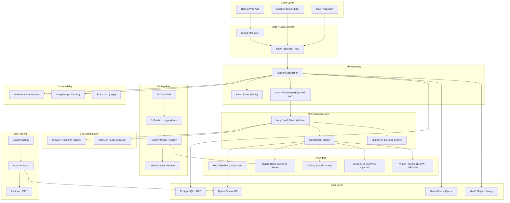
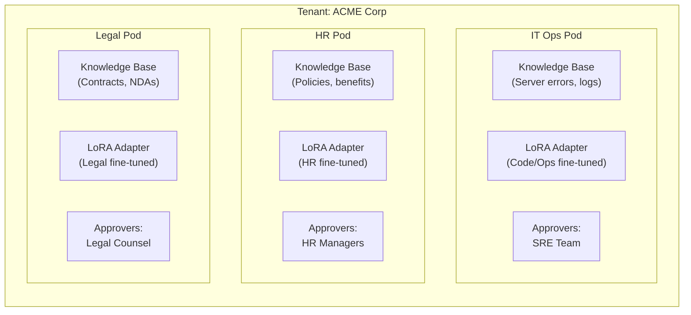
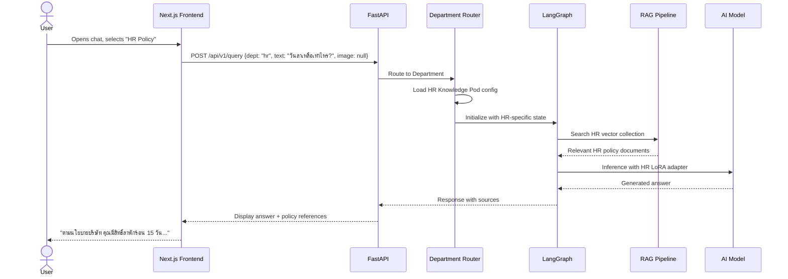
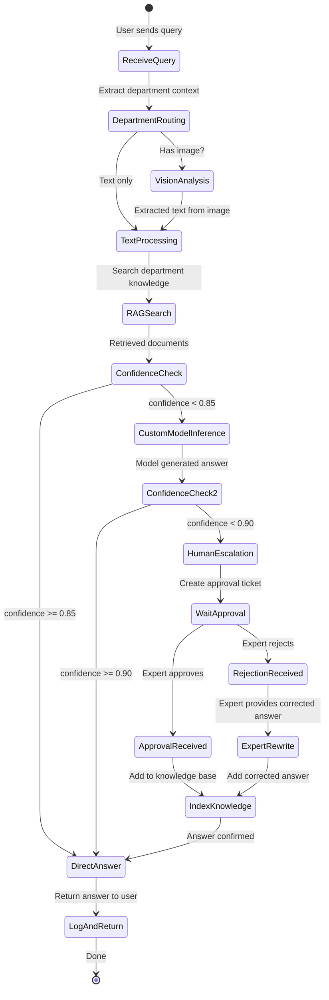
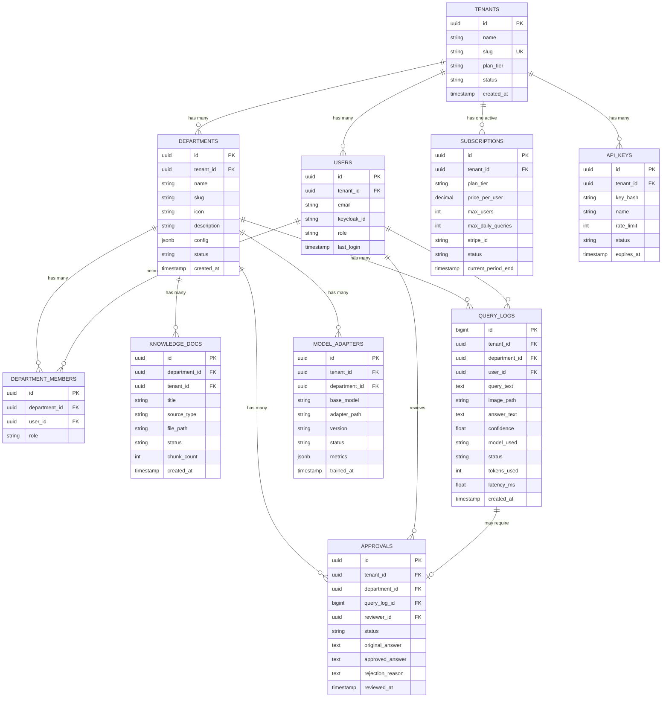
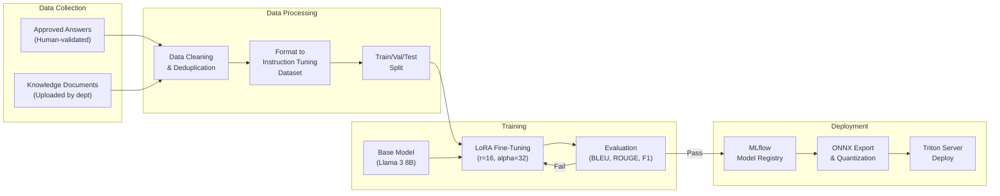
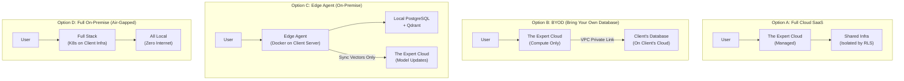
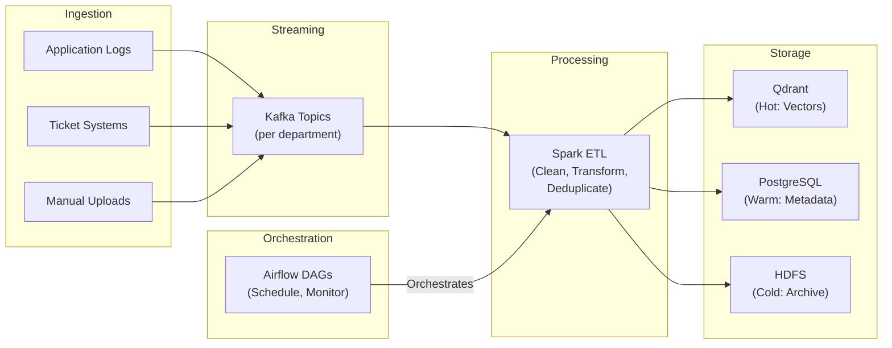

# Implementation Plan

**Project Name**: The Expert — Universal Enterprise AI Platform
**Version**: 1.0
**Date**: 2026-02-12
**Author**: Architecture Team

---

## Table of Contents

1. [Architecture Overview](#1-architecture-overview)
2. [Technology Stack](#2-technology-stack)
3. [Multi-Department Architecture (Category System)](#3-multi-department-architecture)
4. [System Components & Design](#4-system-components--design)
5. [Database Schema](#5-database-schema)
6. [AI / ML Pipeline](#6-ai--ml-pipeline)
7. [Multi-Tenancy & Data Isolation](#7-multi-tenancy--data-isolation)
8. [BYOD / Hybrid Deployment](#8-byod--hybrid-deployment)
9. [Big Data Integration](#9-big-data-integration)
10. [Security & Compliance](#10-security--compliance)
11. [API Design](#11-api-design)
12. [Deployment Architecture](#12-deployment-architecture)
13. [Monitoring & Observability](#13-monitoring--observability)
14. [Phase-by-Phase Implementation](#14-phase-by-phase-implementation)

---

## 1. Architecture Overview

### High-Level System Diagram



### Design Principles

| Principle | How We Apply It |
| :--- | :--- |
| **Modularity** | Each department = pluggable module. Add new domains without touching core. |
| **Data Isolation** | Row-Level Security (RLS) + Qdrant payload filtering + MinIO bucket separation. |
| **AI-First** | Custom model priority. RAG as secondary knowledge layer. |
| **Open Source** | 100% OSS stack. Zero license cost. Full data sovereignty. |
| **Cloud-Agnostic** | Docker/K8s. Runs on AWS, GCP, Azure, or bare metal. |
| **Horizontal Scale** | Stateless API → Redis Queue → K8s HPA auto-scaling. |

---

## 2. Technology Stack

### Complete Stack Map

| Layer | Technology | Version | Role | License |
| :--- | :--- | :--- | :--- | :--- |
| **Frontend** | Next.js 14+ | 14.x | SSR Web Application | MIT |
| | React 18+ | 18.x | Component Framework | MIT |
| | Tailwind CSS | 3.x | Utility Styling | MIT |
| | ShadCN/UI | latest | Component Library | MIT |
| **Backend** | FastAPI | 0.100+ | REST+WebSocket API Server | MIT |
| | Pydantic v2 | 2.x | Data Validation/Serialization | MIT |
| | Uvicorn | 0.27+ | ASGI Server | BSD |
| | Celery | 5.3+ | Async Task Queue | BSD |
| **Agent Framework** | LangGraph | 0.1+ | Primary Orchestrator (State Machine) | MIT |
| | LangChain | 0.2+ | RAG Pipeline, Embeddings, Tools | MIT |
| | CrewAI | 0.1+ | Multi-Agent Research Tasks | MIT |
| | AutoGen | 0.2+ | Code Analysis Sub-Agent | MIT |
| **AI Inference** | Nvidia Triton | 24.x | Model Serving (Production, GPU) | BSD |
| | Ollama | 0.1+ | Local Model Serving (Dev/Small) | MIT |
| | vLLM | 0.3+ | High-Throughput LLM Serving | Apache-2.0 |
| **Models** | Llama 3 (8B/70B) | 3.x | Primary LLM (Fine-tuned) | Llama License |
| | LLaVA / Llama 3.2 Vision | 1.6+ | Vision/Screenshot Analysis | Apache-2.0 |
| | BGE / E5 | latest | Embedding Model | MIT |
| **Training** | PyTorch | 2.2+ | Training Framework | BSD |
| | HuggingFace Transformers | 4.38+ | Model Loading & Fine-Tuning | Apache-2.0 |
| | PEFT (LoRA) | 0.8+ | Parameter-Efficient Fine-Tuning | Apache-2.0 |
| | ONNX Runtime | 1.17+ | Model Optimization & Export | MIT |
| **MLOps** | MLflow | 2.10+ | Experiment Tracking & Model Registry | Apache-2.0 |
| | Weights & Biases | latest | Training Visualization (optional) | Proprietary* |
| | Airflow | 2.8+ | Workflow/Pipeline Orchestration | Apache-2.0 |
| **Database** | PostgreSQL | 16+ | Primary Relational DB (RLS) | PostgreSQL |
| | Qdrant | 1.7+ | Vector Database (Semantic Search) | Apache-2.0 |
| | Redis | 7.2+ | Cache, Rate Limiting, Session, Queue | BSD |
| | MinIO | latest | S3-compatible Object Storage | AGPL/Commercial |
| **Data Pipeline** | Apache Kafka | 3.7+ | Event Streaming / Ingestion | Apache-2.0 |
| | Apache Spark | 3.5+ | ETL / Batch Processing | Apache-2.0 |
| | Hadoop HDFS | 3.3+ | Archival Storage | Apache-2.0 |
| **Security** | Keycloak | 23+ | SSO, OIDC, SAML, LDAP, Multi-Realm | Apache-2.0 |
| | HashiCorp Vault | 1.15+ | Secret Management | MPL-2.0 |
| **Observability** | Grafana | 10+ | Dashboards & Visualization | AGPL |
| | Prometheus | 2.50+ | Metrics Collection | Apache-2.0 |
| | Langfuse | 2.x | LLM Tracing & Evaluation | MIT |
| | Loki | 2.9+ | Log Aggregation | AGPL |
| **Infrastructure** | Docker | 25+ | Containerization | Apache-2.0 |
| | Kubernetes | 1.29+ | Container Orchestration | Apache-2.0 |
| | Helm | 3.14+ | K8s Package Management | Apache-2.0 |
| | Terraform | 1.7+ | Infrastructure as Code | MPL-2.0 |

> **Total Software License Cost: $0** (all open-source or free-tier)

---

## 3. Multi-Department Architecture

### 3.1 Category / Department Concept

The platform is **domain-agnostic**. Each "category" (or department) is a self-contained **Knowledge Pod** consisting of:



### 3.2 Department Routing Flow



### 3.3 Department Configuration (YAML)

Each department is defined by a config file:

```yaml
# config/departments/hr.yaml
department:
  id: "hr"
  name: "HR & People Operations"
  icon: "👥"
  description: "Human Resources policies, benefits, onboarding"

knowledge:
  qdrant_collection: "tenant_{tenant_id}_hr"
  embedding_model: "bge-large-en-v1.5"
  chunk_size: 512
  chunk_overlap: 50

model:
  base_model: "meta-llama/Llama-3-8b"
  lora_adapter: "adapters/hr_{tenant_id}_v{version}"
  system_prompt: |
    You are an HR policy expert. Answer questions based on company policies.
    Always cite the specific policy document and section.
    If unsure, escalate to HR Manager for review.
  temperature: 0.3
  max_tokens: 1024

approval:
  required_for: "new_answers"
  approver_role: "hr_manager"
  auto_approve_confidence: 0.95

access_control:
  allowed_roles: ["hr_staff", "employee", "manager"]
  restricted_fields: ["salary", "disciplinary"]
  restricted_roles_for_fields: ["hr_director"]
```

### 3.4 Example Department Modules

| Module | Input Types | Knowledge Sources | Custom Model Focus | Approvers |
| :--- | :--- | :--- | :--- | :--- |
| **IT Ops** | Screenshots, logs, error text | Server manuals, runbooks, ticket history | Code/infrastructure troubleshooting | SRE / DevOps leads |
| **HR** | Text, policy docs, forms | Employee handbook, benefits guide, labor law | Policy Q&A, leave calculation | HR managers |
| **Legal** | Contracts (PDF), NDA text | Contract templates, compliance docs | Clause extraction, risk identification | Legal counsel |
| **Sales** | Product sheets, competitor docs | Product catalog, pricing matrix, battlecards | Product comparison, objection handling | Sales directors |
| **Finance** | Invoices, reports | Accounting policies, tax regulations | Expense categorization, budget queries | Finance managers |
| **Customer Support** | Chat logs, tickets | FAQ, troubleshooting guides | Customer inquiry routing | Support leads |

---

## 4. System Components & Design

### 4.1 Frontend (Next.js)

```
src/
├── app/
│   ├── (auth)/
│   │   ├── login/page.tsx
│   │   └── callback/page.tsx
│   ├── (dashboard)/
│   │   ├── layout.tsx              # Sidebar + Department selector
│   │   ├── page.tsx                # Dashboard home
│   │   ├── chat/
│   │   │   └── [departmentId]/
│   │   │       └── page.tsx        # Chat interface per department
│   │   ├── knowledge/
│   │   │   └── [departmentId]/
│   │   │       └── page.tsx        # Knowledge base management
│   │   ├── approvals/
│   │   │   └── page.tsx            # Human-in-the-loop queue
│   │   ├── analytics/
│   │   │   └── page.tsx            # Usage & performance
│   │   └── settings/
│   │       ├── departments/
│   │       │   └── page.tsx        # Create/manage departments
│   │       ├── users/
│   │       │   └── page.tsx        # User management
│   │       ├── models/
│   │       │   └── page.tsx        # AI model management
│   │       └── billing/
│   │           └── page.tsx        # Subscription & usage
│   └── api/                        # Next.js API routes (BFF)
├── components/
│   ├── chat/
│   │   ├── ChatWindow.tsx
│   │   ├── MessageBubble.tsx
│   │   ├── ImageUpload.tsx
│   │   └── DepartmentSelector.tsx  # Category picker
│   ├── knowledge/
│   │   ├── DocumentUploader.tsx
│   │   └── KnowledgeTable.tsx
│   ├── approvals/
│   │   ├── ApprovalCard.tsx
│   │   └── ApprovalQueue.tsx
│   └── ui/                         # ShadCN components
├── lib/
│   ├── api-client.ts               # FastAPI client
│   ├── auth.ts                     # Keycloak OIDC
│   └── websocket.ts                # Real-time chat
└── styles/
    └── globals.css
```

### 4.2 Backend (FastAPI)

```
app/
├── main.py                         # FastAPI app + lifespan events
├── config.py                       # Settings (Pydantic BaseSettings)
├── dependencies.py                 # DI: DB sessions, auth, tenant context
│
├── api/
│   ├── v1/
│   │   ├── __init__.py
│   │   ├── router.py               # API router registry
│   │   ├── auth.py                 # Login / Token endpoints
│   │   ├── query.py                # POST /query (main AI endpoint)
│   │   ├── departments.py          # CRUD departments
│   │   ├── knowledge.py            # Upload/manage knowledge docs
│   │   ├── approvals.py            # HITL approval endpoints
│   │   ├── analytics.py            # Usage metrics
│   │   ├── users.py                # User management
│   │   └── billing.py              # Subscription & quota
│   └── websocket.py                # WS /ws/chat/{dept_id}
│
├── core/
│   ├── security.py                 # JWT validation, RBAC
│   ├── middleware.py                # Tenant context, rate limiting, logging
│   ├── exceptions.py               # Custom exception handlers
│   └── events.py                   # Startup/shutdown hooks
│
├── services/
│   ├── query_service.py            # Orchestrates query flow
│   ├── department_service.py       # Department CRUD + config loader
│   ├── knowledge_service.py        # Document ingestion → chunking → embedding
│   ├── approval_service.py         # HITL workflow management
│   ├── model_service.py            # LoRA adapter management
│   ├── billing_service.py          # Quota checks, usage tracking
│   └── analytics_service.py        # Metrics aggregation
│
├── agents/
│   ├── orchestrator.py             # LangGraph state machine
│   ├── department_router.py        # Routes query to correct department
│   ├── rag_agent.py                # RAG retrieval + reranking
│   ├── vision_agent.py             # Screenshot/image analysis
│   ├── crew_agents.py              # CrewAI multi-agent tasks
│   └── autogen_agents.py           # AutoGen code analysis
│
├── models/
│   ├── db/                         # SQLAlchemy ORM models
│   │   ├── tenant.py
│   │   ├── user.py
│   │   ├── department.py
│   │   ├── query_log.py
│   │   ├── knowledge_doc.py
│   │   ├── approval.py
│   │   └── billing.py
│   └── schemas/                    # Pydantic request/response schemas
│       ├── query.py
│       ├── department.py
│       ├── knowledge.py
│       └── common.py
│
├── db/
│   ├── session.py                  # SQLAlchemy async engine
│   ├── migrations/                 # Alembic migrations
│   └── seed.py                     # Default data seeder
│
└── integrations/
    ├── qdrant_client.py            # Vector DB operations
    ├── minio_client.py             # Object storage operations
    ├── redis_client.py             # Cache & rate limiter
    ├── keycloak_client.py          # SSO administration
    ├── kafka_producer.py           # Event publishing
    ├── triton_client.py            # Model inference client
    └── stripe_client.py            # Payment processing
```

### 4.3 LangGraph Orchestrator (State Machine)



---

## 5. Database Schema

### 5.1 Entity Relationship Diagram



### 5.2 Key SQL (PostgreSQL with RLS)

```sql
-- Enable RLS on all tenant-scoped tables
ALTER TABLE departments ENABLE ROW LEVEL SECURITY;
ALTER TABLE users ENABLE ROW LEVEL SECURITY;
ALTER TABLE knowledge_docs ENABLE ROW LEVEL SECURITY;
ALTER TABLE query_logs ENABLE ROW LEVEL SECURITY;
ALTER TABLE approvals ENABLE ROW LEVEL SECURITY;

-- RLS Policy: Tenant isolation
CREATE POLICY tenant_isolation ON departments
    USING (tenant_id = current_setting('app.current_tenant')::uuid);

CREATE POLICY tenant_isolation ON query_logs
    USING (tenant_id = current_setting('app.current_tenant')::uuid);

-- Department-level access (within tenant)
CREATE POLICY department_access ON query_logs
    USING (
        department_id IN (
            SELECT department_id FROM department_members
            WHERE user_id = current_setting('app.current_user')::uuid
        )
    );
```

---

## 6. AI / ML Pipeline

### 6.1 Model Training Pipeline



### 6.2 Training Data Format

```json
{
  "instruction": "ระบบแจ้ง ORA-01555 snapshot too old เมื่อรัน batch job ตอนตี 3",
  "input": "Database: Oracle 19c, Tablespace: USERS, Undo: 30 min retention",
  "output": "สาเหตุ: Undo retention ไม่เพียงพอสำหรับ long-running query...\n\nวิธีแก้:\n1. ALTER SYSTEM SET undo_retention=3600;\n2. ALTER TABLESPACE undotbs1 RETENTION GUARANTEE;\n3. ตรวจสอบ batch job ที่รันนานกว่า 30 นาที...",
  "department": "it_ops",
  "tenant_id": "acme-corp",
  "confidence": 0.95,
  "approved_by": "senior_dba_01"
}
```

### 6.3 LoRA Adapter Strategy (Per Department)

| Department | Base Model | LoRA Config | Training Data | Retrain Schedule |
| :--- | :--- | :--- | :--- | :--- |
| IT Ops | Llama-3-8B-Instruct | r=16, alpha=32, dropout=0.05 | Approved tickets + runbooks | Weekly (if >50 new approvals) |
| HR | Llama-3-8B-Instruct | r=8, alpha=16, dropout=0.1 | Policy docs + approved Q&A | Monthly |
| Legal | Llama-3-8B-Instruct | r=16, alpha=32, dropout=0.05 | Contract templates + case law | Monthly |
| Sales | Llama-3-8B-Instruct | r=8, alpha=16, dropout=0.1 | Product docs + battlecards | Bi-weekly |

---

## 7. Multi-Tenancy & Data Isolation

### Isolation Layers

```
┌──────────────────────────────────────────────────┐
│              Application Layer                    │
│  ┌──────────────────────────────────────────┐    │
│  │ JWT Token → Extract tenant_id + user_id  │    │
│  │ SET app.current_tenant = '{tenant_id}'   │    │
│  └──────────────────────────────────────────┘    │
├──────────────────────────────────────────────────┤
│              PostgreSQL (RLS)                     │
│  Every query auto-filtered by tenant_id          │
│  + department_id for department-level access      │
├──────────────────────────────────────────────────┤
│              Qdrant (Payload Filtering)           │
│  Collection: "knowledge_vectors"                  │
│  Filter: {"tenant_id": "X", "dept_id": "Y"}     │
├──────────────────────────────────────────────────┤
│              MinIO (Bucket Isolation)             │
│  Bucket: tenant-{id}/dept-{id}/images/           │
│  Policy: tenant-scoped read/write                │
├──────────────────────────────────────────────────┤
│              Keycloak (Realm Isolation)           │
│  Realm per tenant (SSO, roles, groups)            │
│  Role: it_user, hr_manager, legal_counsel, admin │
├──────────────────────────────────────────────────┤
│              Redis (Key Prefix)                   │
│  Key: "tenant:{id}:dept:{id}:quota:{date}"       │
│  Key: "tenant:{id}:session:{user_id}"            │
└──────────────────────────────────────────────────┘
```

---

## 8. BYOD / Hybrid Deployment

### Deployment Models



---

## 9. Big Data Integration

### Data Flow Architecture



---

## 10. Security & Compliance

| Layer | Implementation |
| :--- | :--- |
| **Authentication** | Keycloak OIDC/SAML. MFA support. SSO for Enterprise. |
| **Authorization** | RBAC per department. JWT claims include `tenant_id`, `dept_roles[]`. |
| **Encryption at Rest** | AES-256 for PostgreSQL (TDE), MinIO (SSE-S3). |
| **Encryption in Transit** | TLS 1.3 everywhere. mTLS between internal services. |
| **API Key Management** | Hashed storage. Scoped permissions. Expiration dates. |
| **Audit Trail** | Every query, approval, and config change logged immutably. |
| **Data Retention** | Configurable per tenant/department. Auto-purge with GDPR support. |
| **Vulnerability Scanning** | Trivy (containers), Snyk (dependencies), OWASP ZAP (API). |
| **Secret Management** | HashiCorp Vault for DB credentials, API keys, encryption keys. |

---

## 11. API Design

### Core Endpoints

| Method | Endpoint | Description | Auth |
| :--- | :--- | :--- | :--- |
| `POST` | `/api/v1/query` | Submit a query (text + optional image) | JWT |
| `GET` | `/api/v1/departments` | List available departments | JWT |
| `POST` | `/api/v1/departments` | Create a new department | Admin |
| `GET` | `/api/v1/knowledge/{dept_id}` | List knowledge documents | JWT |
| `POST` | `/api/v1/knowledge/{dept_id}/upload` | Upload document to knowledge base | JWT |
| `GET` | `/api/v1/approvals` | List pending approvals | Approver |
| `POST` | `/api/v1/approvals/{id}/approve` | Approve an answer | Approver |
| `POST` | `/api/v1/approvals/{id}/reject` | Reject with reason | Approver |
| `GET` | `/api/v1/analytics/usage` | Usage statistics | Admin |
| `GET` | `/api/v1/analytics/ai-performance` | AI accuracy metrics | Admin |
| `WS` | `/ws/chat/{dept_id}` | Real-time chat (streaming) | JWT |

### Example: Query Request

```json
POST /api/v1/query
Authorization: Bearer <jwt_token>
Content-Type: multipart/form-data

{
  "department_id": "it_ops",
  "query_text": "Server web-prod-03 showing OOM killer messages",
  "image": <binary_screenshot>,
  "context": {
    "hostname": "web-prod-03",
    "environment": "production"
  }
}
```

### Example: Query Response

```json
{
  "query_id": "q-2026-0212-001",
  "department": "it_ops",
  "answer": "Based on the OOM killer logs, the Java heap is configured at 2GB...",
  "confidence": 0.92,
  "sources": [
    {"title": "OOM Killer Runbook", "relevance": 0.95, "doc_id": "kb-123"},
    {"title": "JVM Tuning Guide", "relevance": 0.87, "doc_id": "kb-456"}
  ],
  "model_used": "llama3-8b-it-ops-v3",
  "requires_approval": false,
  "latency_ms": 1250
}
```

---

## 12. Deployment Architecture

### Production Kubernetes Layout

```yaml
# Namespace structure
namespaces:
  - the-expert-core        # API, LangGraph, Workers
  - the-expert-ai          # Triton, Ollama, vLLM
  - the-expert-data        # PostgreSQL, Qdrant, Redis, MinIO
  - the-expert-pipeline    # Kafka, Spark, Airflow
  - the-expert-monitoring  # Grafana, Prometheus, Langfuse, Loki
  - the-expert-auth        # Keycloak

# Resource allocation (Production)
resources:
  api-server:
    replicas: 3
    cpu: "2"
    memory: "4Gi"
    hpa: {min: 3, max: 20, target_cpu: 70%}

  triton-server:
    replicas: 2
    cpu: "4"
    memory: "16Gi"
    gpu: "1 x A100"

  qdrant:
    replicas: 3  # Clustered
    cpu: "4"
    memory: "32Gi"
    storage: "100Gi SSD"

  postgresql:
    replicas: 3  # Primary + 2 Read Replicas
    cpu: "4"
    memory: "16Gi"
    storage: "500Gi SSD"
```

---

## 13. Monitoring & Observability

| Tool | Monitors | Alerts |
| :--- | :--- | :--- |
| **Prometheus + Grafana** | API latency, CPU, memory, request rates | P95 latency > 3s, error rate > 1% |
| **Langfuse** | LLM traces, token usage, model accuracy, cost per query | Confidence drop > 10%, cost spike |
| **Loki** | Application logs (structured JSON) | Error log spike, auth failures |
| **Custom Dashboard** | Per-department usage, approval rates, MTTR trends | Approval queue > 50 items |

---

## 14. Phase-by-Phase Implementation

> **Detailed task breakdown → See [tasks.md](./tasks.md)**

| Phase | Timeline | Deliverables | Success Criteria |
| :--- | :--- | :--- | :--- |
| **Phase 1: MVP** | Month 1-3 | Core chat (1 dept: IT), RAG, Auth, basic UI | 3 pilot customers using daily |
| **Phase 2: Enterprise** | Month 4-6 | Multi-department, Custom Models, HITL, SSO, Analytics | 10 paying tenants |
| **Phase 3: Scale** | Month 7-9 | Big Data pipeline, Billing, BYOD, White-label | 50 tenants, SOC2 audit started |
| **Phase 4: Global** | Month 10-12 | Marketplace, Advanced Analytics, Multi-region | Break-even, 100+ tenants |

---

## Related Documents

- [Proposal](./proposal.md) — Business proposal & market analysis
- [BRD](./brd.md) — Business Requirements
- [PRD](./prd.md) — Product Requirements
- [Tasks](./tasks.md) — Detailed task breakdown
- [Subscription Plan](./subscription_plan.md) — Pricing & billing details
