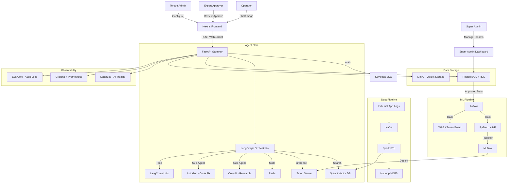
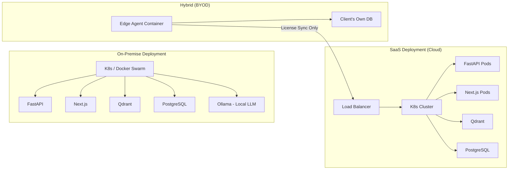
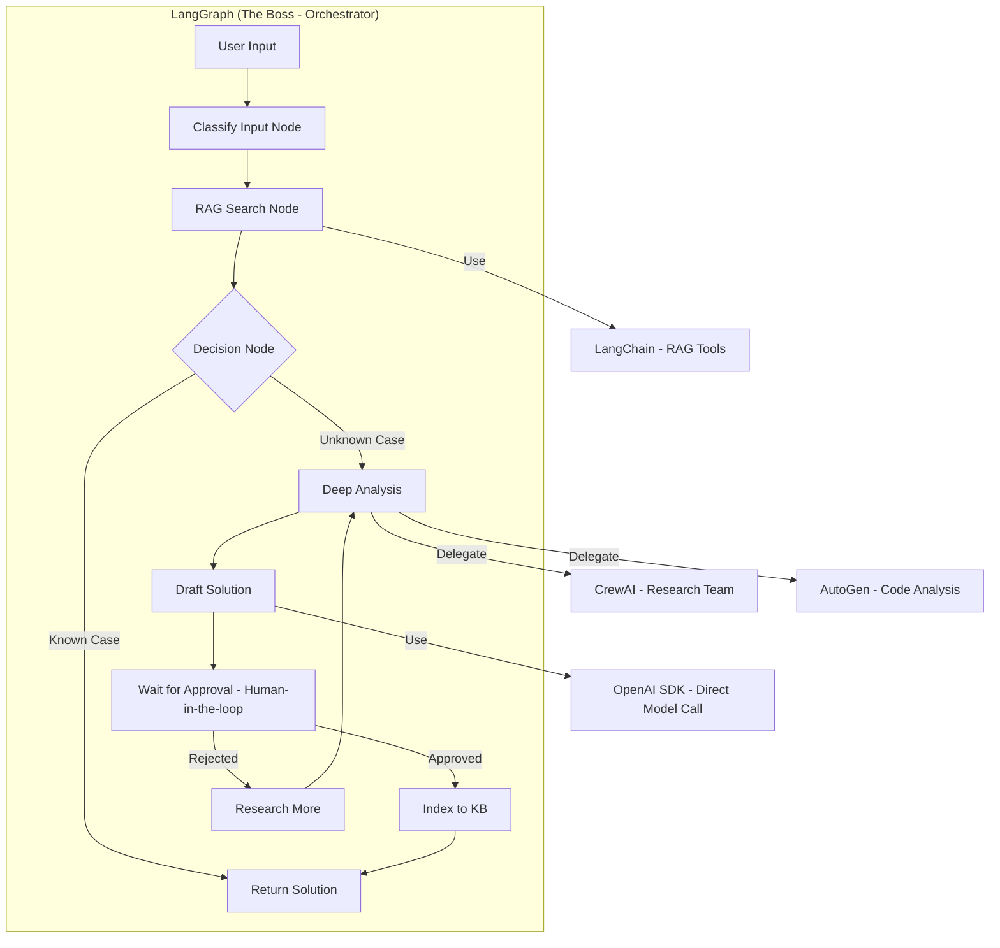
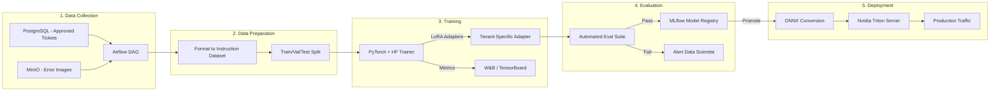

# Product Requirements Document (PRD)

**Project Name**: The Expert — AI-Powered Troubleshooting System
**Version**: 1.0
**Date**: 2026-02-12
**Status**: Draft
**Author**: Architecture Team
**Confidentiality**: Internal — For Engineering & Product Team

---

## Table of Contents

1. [Product Overview](#1-product-overview)
2. [User Personas](#2-user-personas)
3. [User Stories & Acceptance Criteria](#3-user-stories--acceptance-criteria)
4. [Functional Requirements (Detailed)](#4-functional-requirements-detailed)
5. [Technical Architecture](#5-technical-architecture)
6. [Tech Stack Decision Matrix](#6-tech-stack-decision-matrix)
7. [Agent Framework Integration](#7-agent-framework-integration)
8. [MLOps Pipeline (Custom Model Training)](#8-mlops-pipeline-custom-model-training)
9. [Big Data & ETL Integration](#9-big-data--etl-integration)
10. [Multi-Tenancy & SaaS](#10-multi-tenancy--saas)
11. [Bring Your Own Database (BYOD)](#11-bring-your-own-database-byod)
12. [On-Premise vs Cloud Cost Breakdown](#12-on-premise-vs-cloud-cost-breakdown)
13. [UI/UX Requirements](#13-uiux-requirements)
14. [API Specification](#14-api-specification)
15. [Security & Compliance](#15-security--compliance)
16. [Release Plan & Milestones](#16-release-plan--milestones)

---

## 1. Product Overview

"The Expert" is an intelligent agent that lives inside a **chat interface**. It functions as a **Tier 1 Support Engineer** that never sleeps, knows every error ever solved by the company, and can even "see" (Computer Vision) errors from screenshots.

It orchestrates a suite of underlying technologies — **RAG (Retrieval-Augmented Generation)**, **Custom Fine-tuned Models**, **Big Data Pipelines**, and **Human Expert Validation** — to deliver precise, contextual solutions.

### Core Value Proposition

* **For Operators**: "Paste a screenshot or describe the error → Get an answer in seconds."
* **For Experts**: "Only review genuinely new problems. Everything else is automated."
* **For Management**: "Every resolved ticket makes the system smarter. Knowledge never leaves."
* **For SaaS Customers**: "Enterprise-grade AI troubleshooting, deployable anywhere (Cloud/On-Prem/Hybrid)."

---

## 2. User Personas

### 2.1 Operator (Primary User)

* **Role**: Support Engineer / DevOps / SRE
* **Goal**: Resolve errors as fast as possible with minimal manual research.
* **Pain Point**: Spending 30+ minutes searching Confluence, Slack, and asking colleagues for solutions to errors that have been solved before.
* **Interaction**: Submits error via Chat (text/image) → Receives solution → Confirms if it worked.

### 2.2 Expert (Approver)

* **Role**: Senior Engineer / Subject Matter Expert (SME)
* **Goal**: Ensure AI-proposed solutions for new errors are accurate before they enter the knowledge base.
* **Pain Point**: Being interrupted by junior engineers for the same questions repeatedly.
* **Interaction**: Receives notifications for new errors → Reviews AI analysis → Approves/Edits/Rejects.

### 2.3 Tenant Admin

* **Role**: IT Manager / Team Lead at a client organization.
* **Goal**: Configure the system for their organization (users, models, integrations).
* **Pain Point**: Generic AI tools don't understand their specific infrastructure.
* **Interaction**: Manages users → Configures model preferences → Views analytics dashboard.

### 2.4 Super Admin (Platform Owner)

* **Role**: Platform operations team (YOUR team).
* **Goal**: Manage all tenants, billing, global settings, and platform health.
* **Pain Point**: Needs visibility into usage across all organizations.
* **Interaction**: Creates/suspends tenants → Monitors usage → Manages billing → Views global dashboard.

---

## 3. User Stories & Acceptance Criteria

### 3.1 Operator Stories

| ID | User Story | Acceptance Criteria |
| :--- | :--- | :--- |
| **US-01** | As an Operator, I want to **paste a screenshot** of an error into the chat so that the AI can analyze it visually. | • Image upload via drag-drop, paste (Ctrl+V), and file picker. <br> • Supported formats: PNG, JPG, WEBP, GIF. <br> • Max file size: 10MB. |
| **US-02** | As an Operator, I want to **type an error message** or paste a log snippet so that the AI can analyze it textually. | • Text input supports multi-line (code blocks). <br> • AI extracts error codes, stack traces, and keywords automatically. |
| **US-03** | As an Operator, I want to receive **instant solutions** for known errors so that I don't have to wait. | • Known cases (>80% confidence) return solution in <3 seconds. <br> • No approval required for known cases. |
| **US-04** | As an Operator, I want to confirm whether a solution **worked or not** so that the system can learn. | • After each solution, system asks "Did this solve your problem? [Yes] [No]". <br> • "Yes" reinforces the solution. "No" triggers escalation. |
| **US-05** | As an Operator, I want to **search past solutions** by keyword so that I can find answers proactively. | • Search bar in the dashboard. <br> • Results ranked by relevance (semantic search). |

### 3.2 Expert Stories

| ID | User Story | Acceptance Criteria |
| :--- | :--- | :--- |
| **US-06** | As an Expert, I want to receive **notifications** when AI encounters a new error so that I can review it promptly. | • Notification via Dashboard badge, Email, and/or Webhook. <br> • Configurable notification preferences. |
| **US-07** | As an Expert, I want to see the **AI's analysis** (root cause + proposed solution) alongside the original error so that I can evaluate it efficiently. | • Split view: Left = Original Error (image/text), Right = AI Analysis. <br> • AI confidence score displayed. |
| **US-08** | As an Expert, I want to **approve, edit, or reject** AI solutions so that only accurate solutions enter the knowledge base. | • [Approve] → Indexed immediately. <br> • [Edit] → Inline editor, then save. <br> • [Reject] → Mark as "Unresolved", optionally add notes. |
| **US-09** | As an Expert, I want to **tag solutions** with categories (e.g., "Network", "Database", "Auth") so that they are easier to find later. | • Tag autocomplete from existing tags. <br> • Custom tag creation. |

### 3.3 Admin Stories

| ID | User Story | Acceptance Criteria |
| :--- | :--- | :--- |
| **US-10** | As a Tenant Admin, I want to **choose which AI model** to use (Free/Paid/Custom) so that I can control costs. | • Settings page with model picker. <br> • Options: Ollama (Free), Gemini Flash (Low Cost), GPT-4o (Premium), Custom (Fine-tuned). |
| **US-11** | As a Tenant Admin, I want to **manage users** in my organization (invite, remove, assign roles). | • User CRUD with role assignment (Operator, Expert, Admin). <br> • SSO integration (Keycloak). |
| **US-12** | As a Super Admin, I want to **create and suspend tenants** so that I can manage the SaaS platform. | • Tenant CRUD dashboard. <br> • Billing status indicator. <br> • Usage metrics per tenant. |

---

## 4. Functional Requirements (Detailed)

### 4.1 Core Troubleshooting (The Chat)

| ID | Requirement | Detail |
| :--- | :--- | :--- |
| **FR-01** | **Multimodal Input** | User can paste images (clipboard), upload files, or type text. System accepts both simultaneously (e.g., image + description). |
| **FR-02** | **Input Validation** | AI (LangGraph) classifies input: "Is this an error report?" vs "General question" vs "Irrelevant". Routes accordingly. |
| **FR-03** | **Image Analysis** | Vision model (Llama3-Vision / GPT-4o-Vision) extracts text (OCR), identifies error patterns, and reads UI elements from screenshots. |
| **FR-04** | **RAG Search** | System automatically queries Qdrant for semantic matches. Filter by `tenant_id`. Threshold: >80% similarity = Known Case. |
| **FR-05** | **Custom Model Inference** | If no RAG match, system queries Triton Server running the tenant's fine-tuned Llama 3 model (LoRA adapter). |
| **FR-06** | **Cross-Validation** | Agent compares RAG results with Custom Model output. If they agree → High confidence → Answer directly. If they conflict → Escalate. |
| **FR-07** | **Response Generation** | AI combines RAG context + Model prediction to formulate a **step-by-step fix** with commands, config changes, and expected outcomes. |
| **FR-08** | **Context Memory** | Chat maintains conversation history within a session. User can ask follow-up questions about the same error. |
| **FR-09** | **Multi-language** | System supports Thai (primary) and English. AI responses respect the user's language preference. |

### 4.2 Human-in-the-Loop (The Approval)

| ID | Requirement | Detail |
| :--- | :--- | :--- |
| **FR-10** | **Confidence Threshold** | If AI confidence < configurable threshold (default: 80%), trigger escalation to Expert. |
| **FR-11** | **Wait State** | AI replies to user: "I have a proposed solution. Sending for expert review." State is persisted in LangGraph. |
| **FR-12** | **Expert Notification** | Expert receives notification with: Error Image, Error Text, AI Root Cause Analysis, AI Proposed Solution. |
| **FR-13** | **Expert Actions** | `[Approve]` → Solution indexed to Qdrant + PostgreSQL. `[Edit]` → Inline edit, then approve. `[Reject]` → Flagged as unresolved. |
| **FR-14** | **Auto-Indexing** | On approval, the Q&A pair is immediately: (1) Embedded and saved to Vector DB, (2) Flagged as training data for next Fine-tune cycle. |
| **FR-15** | **Feedback to User** | After expert approval, user is notified: "Expert has verified the solution. Here's the answer." Or via status check. |

### 4.3 Knowledge Management

| ID | Requirement | Detail |
| :--- | :--- | :--- |
| **FR-16** | **Knowledge Base Browser** | Searchable directory of all approved solutions. Filterable by category, date, severity. |
| **FR-17** | **Solution Versioning** | If the same error gets a better solution later, the old solution is archived (not deleted). Version history is maintained. |
| **FR-18** | **Bulk Import** | Admin can upload CSV/JSON of existing solutions to seed the knowledge base during onboarding. |
| **FR-19** | **Export** | Admin can export the knowledge base as CSV for backup or migration purposes. |

### 4.4 Analytics & Reporting

| ID | Requirement | Detail |
| :--- | :--- | :--- |
| **FR-20** | **Dashboard Metrics** | Top 10 Errors This Week, AI Accuracy Trend, MTTR Trend, Automation Rate. |
| **FR-21** | **Usage Reports** | Per-user and per-team usage statistics. Query volume, resolution rate. |
| **FR-22** | **AI Performance** | Model accuracy over time, confidence distribution, escalation rate. |

---

## 5. Technical Architecture

### 5.1 System Context Diagram



### 5.2 Deployment Architecture



---

## 6. Tech Stack Decision Matrix

| Category | Technology | Why this? (Rationale) | Pros | Cons | Best For | Cost |
| :--- | :--- | :--- | :--- | :--- | :--- | :--- |
| **Agent Orchestrator** | **LangGraph** (The "Boss") | Manages State & Human-in-the-loop natively. Supports cyclic workflows. | • State Persistence <br> • Human-in-the-loop <br> • Scalable Graph | • Steeper learning curve | Complex Agent workflows | **Free** (Open Source) |
| **Backend API** | **FastAPI** | High-performance Python. Native Async for AI streaming. | • Auto OpenAPI docs <br> • Very fast <br> • Pydantic typing | • Python ecosystem size | AI Microservices | **Free** (Open Source) |
| **Frontend** | **Next.js** (React) | Industry standard for Enterprise SPA/SSR. | • Huge ecosystem <br> • Component reuse <br> • Self-hostable | • Higher memory usage | Interactive Dashboards | **Free** (Open Source) |
| **Vector DB** | **Qdrant** | Dedicated Vector Engine in Rust. | • Metadata filtering <br> • Rust performance <br> • Docker ready | • Extra DB to manage | Production Vector Search | **Free** (Open Source) |
| **LLM Serving** | **Ollama** / **vLLM** | Run open-source models on-premise. | • No API cost <br> • Data privacy <br> • Easy setup | • Requires GPU hardware | On-Premise / Privacy | **Free** (Open Source) |
| **Model Serving** | **Nvidia Triton** | Universal serving for TF/PyTorch/ONNX/TensorRT. | • Multi-model <br> • Dynamic batching <br> • Extreme performance | • Complex config | Production Model Serving | **Free** (Open Source) |
| **Auth/SSO** | **Keycloak** | Enterprise Identity & Access Management. | • OIDC/SAML/LDAP <br> • Multi-realm for tenants <br> • Free | • Heavy (Java) | Corporate SSO | **Free** (Open Source) |
| **Object Storage** | **MinIO** | S3-compatible on-premise storage. | • AWS S3 API <br> • High performance | • Disk provisioning | Storing Screenshots | **Free** (Open Source) |
| **Database** | **PostgreSQL 16** | Battle-tested RDBMS with RLS. | • Row Level Security <br> • JSON support <br> • Massive ecosystem | • Schema management | Multi-tenant Data | **Free** (Open Source) |
| **Queue** | **Redis** | In-memory store for task queue & caching. | • Sub-ms latency <br> • Pub/Sub <br> • Rate limiting | • Memory cost at scale | Async Tasks & Cache | **Free** (Open Source) |
| **Observability** | **Langfuse** | Open-source LLM tracing & evaluation. | • Self-hosted <br> • Visualizes AI decisions <br> • Cost tracking | • Newer tool, smaller community | Debugging AI Logic | **Free** (Open Source, Self-hosted) |
| **Monitoring** | **Prometheus + Grafana** | Industry standard infra monitoring. | • Rich dashboards <br> • Alerting <br> • K8s native | • Alert fatigue if misconfigured | System Health | **Free** (Open Source) |
| **ML Experiment** | **W&B / TensorBoard** | Training visualization & comparison. | • Rich charts <br> • Team collaboration | • W&B cloud is paid | Training Analysis | **Free** (TensorBoard) / **Paid** (W&B Teams) |
| **Model Registry** | **MLflow** | Model versioning & lifecycle management. | • Model Store <br> • Version control <br> • REST API | • UI is basic | Model Lifecycle | **Free** (Open Source) |
| **Data Streaming** | **Kafka** | High-throughput event streaming. | • Millions of events/sec <br> • Durable <br> • Ecosystem | • Operational complexity | Log Ingestion at Scale | **Free** (Open Source) |
| **Data Processing** | **Apache Spark** | Distributed data processing. | • TB-scale ETL <br> • ML integration <br> • Batch + Stream | • JVM memory tuning | Heavy Data Processing | **Free** (Open Source) |
| **Data Warehouse** | **Hadoop/HDFS** | Long-term raw data archival. | • Petabyte scale <br> • Fault tolerant | • Complexity <br> • Declining usage vs cloud | Raw Log Archive | **Free** (Open Source) |
| **Workflow** | **Apache Airflow** | DAG-based pipeline orchestration. | • Scheduling <br> • DAG visualization <br> • Huge ecosystem | • Scheduler bottleneck at scale | ML Pipelines | **Free** (Open Source) |
| **Training** | **PyTorch + Hugging Face** | Deep learning framework + model hub. | • Largest model library <br> • LoRA/QLoRA <br> • Active community | • GPU memory management | Custom Model Fine-tuning | **Free** (Open Source) |
| **Optimization** | **ONNX** | Model format conversion for performance. | • Cross-framework <br> • TensorRT acceleration | • Not all ops supported | Model Inference Speed | **Free** (Open Source) |

---

## 7. Agent Framework Integration

### Architecture: "Boss + Crew" Pattern



| Framework | Role | When It's Called | Example Task |
| :--- | :--- | :--- | :--- |
| **LangGraph** | **Main Orchestrator (Boss)** | Always running. | Manages the entire State Machine, decides which sub-agent to call, handles the Human-in-the-loop pause/resume. |
| **CrewAI** | **Research Team (Sub-Agent)** | When deep multi-step research is needed. | "Error XYZ is new. CrewAI: Agent 1 searches Stack Overflow, Agent 2 searches internal docs, Agent 3 summarizes findings." |
| **AutoGen** | **Coding Team (Sub-Agent)** | When code analysis or auto-fix is needed. | "Parse this stack trace, identify the faulty function, suggest a code fix, and verify it compiles." |
| **LangChain** | **Base Toolset** | Used by all agents for standard operations. | RAG retrieval chains, document splitters, prompt templates, output parsers. |
| **OpenAI Agent SDK** | **Direct Model Access** | When calling specific paid/cloud models directly. | Direct GPT-4o call for complex reasoning that local models can't handle. |

---

## 8. MLOps Pipeline (Custom Model Training)

### 8.1 Training Pipeline Flow



### 8.2 Model Strategy per Tenant

| Strategy | Description | Use Case |
| :--- | :--- | :--- |
| **Shared Base Model** | All tenants use the same pre-trained Llama 3. No fine-tuning. | Free tier / Community plan. |
| **LoRA Adapter per Tenant** | Base Llama 3 + Tenant-specific LoRA adapter loaded at runtime. | Enterprise plan. Maximum cost efficiency. |
| **Dedicated Fine-tuned Model** | Fully fine-tuned model for a specific tenant. Deployed as a separate Triton instance. | On-Premise license. Maximum performance. |

---

## 9. Big Data & ETL Integration

| Tool | Role in System | Architecture Layer | Trigger |
| :--- | :--- | :--- | :--- |
| **Kafka** | **Log Buffer**: Receives millions of log events/sec from client applications. | Ingestion | Continuous streaming. |
| **Spark** | **ETL Engine**: Cleans, deduplicates, anonymizes (PII removal), and formats data. | Processing | Nightly batch / triggered by Airflow. |
| **Airflow** | **Pipeline Conductor**: Orchestrates the entire flow from data cleaning to model retraining. | Orchestration | Scheduled (daily/weekly) or manual trigger. |
| **Hadoop/HDFS** | **Raw Archive**: Stores unprocessed logs for audit compliance and future re-analysis. | Storage (Bronze Layer) | Continuous write from Spark. |

### Sample Airflow DAG

```python
# dag_weekly_retrain.py (Conceptual)
from airflow import DAG
from airflow.operators.python import PythonOperator
from airflow.providers.apache.spark.operators.spark_submit import SparkSubmitOperator

with DAG("weekly_model_retrain", schedule="@weekly") as dag:
    
    # Step 1: Spark cleans new approved tickets
    clean_data = SparkSubmitOperator(
        task_id="spark_clean_approved_tickets",
        application="/opt/spark/jobs/clean_tickets.py",
    )
    
    # Step 2: Generate embeddings & update Vector DB
    update_vectors = PythonOperator(
        task_id="update_qdrant_vectors",
        python_callable=embed_and_upsert_to_qdrant,
    )
    
    # Step 3: Fine-tune model with new data
    train_model = PythonOperator(
        task_id="finetune_llama3_lora",
        python_callable=run_lora_training,
    )
    
    # Step 4: Evaluate model performance
    evaluate = PythonOperator(
        task_id="evaluate_model",
        python_callable=run_eval_suite,
    )
    
    # Step 5: Deploy to Triton if eval passes
    deploy = PythonOperator(
        task_id="deploy_to_triton",
        python_callable=deploy_onnx_to_triton,
    )
    
    clean_data >> update_vectors >> train_model >> evaluate >> deploy
```

---

## 10. Multi-Tenancy & SaaS

### 10.1 Data Isolation Strategy

| Layer | Isolation Method | Detail |
| :--- | :--- | :--- |
| **PostgreSQL** | **Row Level Security (RLS)** | `CREATE POLICY tenant_isolation ON tickets USING (tenant_id = current_setting('app.tenant_id'))`. Every query is automatically filtered. |
| **Qdrant** | **Payload Filter** | Every vector search includes `filter: { must: [{ key: "tenant_id", match: { value: "org_xxx" } }] }`. |
| **MinIO** | **Bucket per Tenant** | Each tenant has a dedicated bucket: `tenant-org_xxx-images/`. |
| **Keycloak** | **Realm per Tenant** | Or: single realm with `org_id` custom attribute on each user. |
| **Triton** | **LoRA Adapter per Tenant** | Base model shared. Adapter loaded dynamically based on `tenant_id` in the request header. |

### 10.2 Platform Management

| Feature | Detail |
| :--- | :--- |
| **Super Admin Dashboard** | "God Mode" view to: Create/suspend tenants, view global usage, manage billing, push system updates. |
| **Tenant Onboarding Wizard** | Automated: Create Keycloak realm → Create DB schema → Create Qdrant collection → Create MinIO bucket. |
| **White-labeling** | CSS variables per tenant: `--primary-color`, `--logo-url`, `--company-name`. |
| **Billing & Quotas** | Redis-based rate limiting per tier. API key issuance per tenant for integrations. |

---

## 11. Bring Your Own Database (BYOD)

### 11.1 Deployment Models

| Model | How It Works | Data Location | Best For |
| :--- | :--- | :--- | :--- |
| **A. Standard SaaS** | All data in our central PostgreSQL/Qdrant. | Our Cloud | Startups, small teams. |
| **B. Private Link (VPC)** | We connect to Client's DB via AWS PrivateLink / VPN Site-to-Site. | Client's Cloud | Mid-enterprise, cloud-first. |
| **C. Edge Agent** | Docker container ("Edge Brain") on Client's Server. Connects to their local DB. Sends only anonymized vectors/usage to our cloud. | Client's On-Premise | Regulated industries (Banking, Gov, Healthcare). |

### 11.2 Technical Implementation

```python
# config.py (Conceptual)
class TenantConfig:
    deploy_mode: str  # "saas" | "private_link" | "edge"
    db_url: str       # Points to our DB or client's DB
    vector_url: str   # Points to our Qdrant or client's Qdrant
    storage_url: str  # Points to our MinIO or client's S3
    model_id: str     # Which model/adapter to use
    
# At runtime:
tenant = get_tenant_config(request.headers["X-Tenant-ID"])
db = connect(tenant.db_url)  # Dynamically routes to correct DB
```

---

## 12. On-Premise vs Cloud Cost Breakdown

| Component | **On-Premise** | **Cost** | **Cloud Alternative** | **Cost** |
| :--- | :--- | :--- | :--- | :--- |
| **AI Model** | Ollama / vLLM (Llama 3 / Mistral) | **Free** *(Requires GPU)* | OpenAI / Gemini API | **Pay-per-token** |
| **Model Serving** | Nvidia Triton | **Free** | AWS SageMaker Endpoint | **Per-hour** |
| **Vector DB** | Qdrant (Docker) | **Free** | Qdrant Cloud / Pinecone | **Monthly** |
| **Object Storage** | MinIO | **Free** | AWS S3 / GCS | **Storage Cost** |
| **Auth/SSO** | Keycloak | **Free** | Auth0 / Okta | **Per User/Month** |
| **Database** | PostgreSQL | **Free** | Amazon Aurora / CloudSQL | **Per-hour** |
| **Streaming** | Kafka (Self-managed) | **Free** | Confluent Cloud / MSK | **Per-hour + throughput** |
| **ETL** | Spark (Self-managed) | **Free** | AWS EMR / Databricks | **Per-hour** |
| **Orchestration** | Airflow (Docker) | **Free** | Astronomer / MWAA | **Monthly** |
| **Containers** | Docker Swarm / K8s (Self-managed) | **Free** | AWS EKS / GKE | **Cluster Fee** |
| **Monitoring** | Grafana + Prometheus | **Free** | Datadog / New Relic | **Per Host/Month** |
| **AI Tracing** | Langfuse (Self-hosted) | **Free** | LangSmith (Cloud) | **Monthly** |

> **Total On-Premise Software Cost: $0** (Hardware/GPU not included)

---

## 13. UI/UX Requirements

### 13.1 Chat Interface (Operator View)

* **Layout**: Full-screen chat (similar to ChatGPT/Gemini).
* **Input**: Text area + Image upload button + Paste support.
* **Output**: Markdown-rendered responses with syntax highlighting for code.
* **Status Indicators**: "Searching knowledge base…", "Analyzing image…", "Waiting for expert review…".
* **History**: Sidebar with past conversations, searchable.

### 13.2 Expert Dashboard

* **Layout**: Kanban board (Pending / In Review / Approved / Rejected).
* **Card Detail**: Error image, text, AI analysis, proposed solution, confidence score.
* **Actions**: Approve / Edit / Reject with inline editing.
* **Filters**: By severity, category, date range.

### 13.3 Admin Dashboard

* **Tenant Settings**: Model selection, API keys, user management.
* **Analytics**: Charts for Top Errors, AI Accuracy, MTTR Trend, Usage Volume.
* **Knowledge Base**: Browse, search, export, import solutions.

### 13.4 Super Admin Dashboard

* **Tenant Management**: List all tenants, create/suspend, view usage.
* **Billing**: Revenue per tenant, quota usage, overage alerts.
* **System Health**: Grafana embeds for CPU/GPU/Memory/Latency.

---

## 14. API Specification

### 14.1 Core Endpoints

| Method | Endpoint | Description | Auth |
| :--- | :--- | :--- | :--- |
| `POST` | `/api/v1/chat` | Submit a troubleshooting query (text + optional image). | Bearer Token |
| `GET` | `/api/v1/chat/{session_id}` | Get chat history for a session. | Bearer Token |
| `POST` | `/api/v1/chat/{session_id}/feedback` | Submit feedback (worked/didn't work). | Bearer Token |
| `GET` | `/api/v1/tickets/pending` | Get tickets pending expert review. | Bearer Token (Expert) |
| `PATCH` | `/api/v1/tickets/{ticket_id}/approve` | Approve a ticket's solution. | Bearer Token (Expert) |
| `PATCH` | `/api/v1/tickets/{ticket_id}/reject` | Reject a ticket's solution. | Bearer Token (Expert) |
| `GET` | `/api/v1/knowledge/search?q={query}` | Search the knowledge base. | Bearer Token |
| `POST` | `/api/v1/knowledge/import` | Bulk import solutions (CSV/JSON). | Bearer Token (Admin) |
| `GET` | `/api/v1/analytics/dashboard` | Get dashboard metrics. | Bearer Token (Admin) |
| `POST` | `/api/v1/admin/tenants` | Create a new tenant (Super Admin). | Bearer Token (Super Admin) |
| `GET` | `/api/v1/admin/tenants` | List all tenants (Super Admin). | Bearer Token (Super Admin) |
| `PATCH` | `/api/v1/admin/tenants/{tenant_id}` | Update tenant settings (Super Admin). | Bearer Token (Super Admin) |
| `GET` | `/api/v1/settings/models` | Get available AI models. | Bearer Token (Admin) |
| `PUT` | `/api/v1/settings/models` | Set preferred AI model. | Bearer Token (Admin) |

### 14.2 WebSocket

| Endpoint | Description |
| :--- | :--- |
| `ws://host/ws/chat/{session_id}` | Real-time streaming for AI responses (token-by-token). |
| `ws://host/ws/notifications` | Real-time notifications for experts (new pending tickets). |

---

## 15. Security & Compliance

| Area | Requirement | Implementation |
| :--- | :--- | :--- |
| **Authentication** | Multi-Factor Authentication (MFA) | Keycloak MFA policies (TOTP, WebAuthn). |
| **Authorization** | Role-Based Access Control (RBAC) | Roles: Super Admin, Tenant Admin, Expert, Operator. Enforced at API Gateway level. |
| **Data Encryption** | Encrypt at rest and in transit | TLS 1.3 (transit), AES-256 (at rest via PostgreSQL/MinIO encryption). |
| **Data Isolation** | Tenant data must not leak | PostgreSQL RLS + Qdrant payload filter + MinIO bucket policy. |
| **Audit Trail** | Log every action | All interactions logged to ELK/Loki with `tenant_id`, `user_id`, `timestamp`, `action`. |
| **API Security** | Prevent abuse | Rate limiting (Redis), API key validation, CORS policy. |
| **Vulnerability** | Regular scanning | Automated dependency scanning (Snyk/Trivy), container image scanning. |
| **Compliance** | Industry standards | SOC 2 Type II, ISO 27001 (target), GDPR/PDPA ready. |

---

## 16. Release Plan & Milestones

### Phase 1: MVP (Month 1-3)

* ✅ Chat Interface (Text + Image input).
* ✅ RAG-based knowledge retrieval (Qdrant).
* ✅ Human-in-the-loop approval workflow.
* ✅ Basic auth (Keycloak).
* ✅ Single-tenant deployment.

### Phase 2: Enterprise (Month 4-6)

* ✅ Multi-tenancy (RLS + Qdrant filtering).
* ✅ Custom Model Training pipeline (LoRA + MLflow + Triton).
* ✅ Admin Dashboard with analytics.
* ✅ BYOD / Edge Agent support.
* ✅ SSO integration.

### Phase 3: Scale (Month 7-9)

* ✅ Big Data pipeline (Kafka + Spark + Airflow).
* ✅ Advanced multi-agent (CrewAI + AutoGen sub-agents).
* ✅ Super Admin Dashboard + Billing.
* ✅ White-labeling.
* ✅ A/B testing for model rollouts.

### Phase 4: Global Launch (Month 10-12)

* ✅ Multi-region deployment.
* ✅ Marketplace listing.
* ✅ SOC 2 certification.
* ✅ Mobile-responsive optimization.
* ✅ Customer success & onboarding program.

---

## Document Revision History

| Version | Date | Author | Changes |
| :--- | :--- | :--- | :--- |
| 1.0 | 2026-02-12 | Architecture Team | Initial draft — Full PRD covering all agreed requirements, tech stack, and release plan. |
