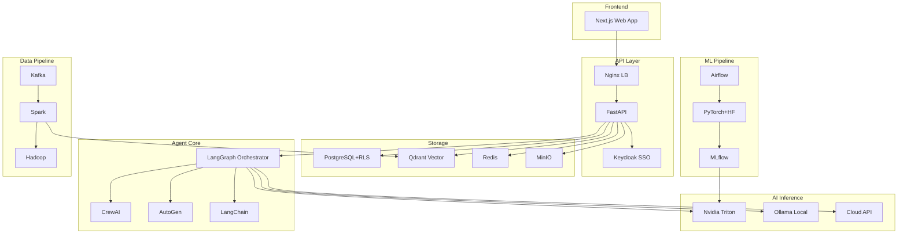

# Project Proposal

**Project Name**: The Expert — AI-Powered Troubleshooting System
**Version**: 1.0
**Date**: 2026-02-12
**Prepared By**: Architecture Team
**Confidentiality**: Confidential — C-Level & Investor Review Only

---

## Table of Contents

1. [Executive Summary](#1-executive-summary)
2. [Problem & Market Opportunity](#2-problem--market-opportunity)
3. [Proposed Solution](#3-proposed-solution)
4. [Unique Value Proposition](#4-unique-value-proposition)
5. [Target Market](#5-target-market)
6. [Product Features by Tier](#6-product-features-by-tier)
7. [Technical Architecture](#7-technical-architecture)
8. [Competitive Analysis](#8-competitive-analysis)
9. [Go-To-Market Strategy](#9-go-to-market-strategy)
10. [Implementation Roadmap](#10-implementation-roadmap)
11. [Team & Resources](#11-team--resources)
12. [Investment & Cost](#12-investment--cost)
13. [Revenue Projections](#13-revenue-projections)
14. [Risk Assessment](#14-risk-assessment)
15. [ROI Analysis](#15-roi-analysis)

---

## 1. Executive Summary

### The One-Liner
>
> "One Platform, Infinite Experts. From IT Support to HR Policy — instant answers for every department."

**"The Expert"** is a **Universal Enterprise AI Platform** that transforms how organizations handle internal knowledge and support. While starting with **IT Troubleshooting**, the platform is designed as a multi-category system where every department (HR, Legal, Finance, Sales) can have its own "AI Expert".

By combining **Domain-Specific RAG**, **Custom AI Models**, and **Department-Level Isolation**, the platform enables an organization to deploy specialized AI agents for every function — all managed under one secure, enterprise-grade roof.

### At a Glance

| Metric | Detail |
| :--- | :--- |
| **Market** | Enterprise Knowledge Management + AIOps + HR Tech |
| **Target** | Large Enterprises (Multi-department adoption) |
| **Business Model** | Platform Fee + Per-Module/Dept Licensing |
| **Development Timeline** | 12 months (Core Platform + IT Module in 3 months) |
| **Break-even** | Month 14 |
| **Initial Investment** | See Section 12 |

---

## 2. Problem & Market Opportunity

### 2.1 Pain Point Matrix

| # | Problem | Who Suffers | Cost of Inaction |
| :--- | :--- | :--- | :--- |
| **P1** | **Repetitive Troubleshooting**: Same errors solved repeatedly across shifts | Operations Engineers | 2-4 hours/day wasted per engineer |
| **P2** | **Tribal Knowledge Loss**: Solutions live in individuals' heads | Entire Organization | One resignation can cripple operations |
| **P3** | **Slow Incident Response**: Manual escalation chains | Customers & SREs | SLA breaches → Revenue loss |
| **P4** | **No Visual Error Analysis**: Can't process screenshots | L1 Support | Errors in transcription, lost context |
| **P5** | **Siloed Knowledge**: Each team has their own wiki | Multi-team Orgs | Duplicate effort across teams |
| **P6** | **New Hire Ramp-up**: 3-6 month shadow training | HR & Engineering | $150,000+ per replacement |

### 2.2 The Cost of Doing Nothing (100-person Ops team)

- **Wasted time**: 100 × 2 hrs/day × $50/hr × 250 days = **$2.5M/year**
- **SLA breaches**: $10,000-$100,000 per incident
- **Knowledge loss**: $150,000+ per senior engineer departure

### 2.3 Market Size

| Market Layer | Size (Annual) |
| :--- | :--- |
| **TAM** (Global ITOM) | **$45.5 Billion** (2025, Gartner) |
| **SAM** (AI-powered IT Support & AIOps) | **$7.2 Billion** (growing 25% YoY) |
| **SOM** (Year 1-3, APAC focus) | **$50-100 Million** |

### 2.4 Market Trends

1. **AIOps Growth**: 40% of enterprises will adopt AIOps by 2027 (Gartner)
2. **GenAI in Enterprise**: 65% of organizations now regularly using GenAI (McKinsey 2025)
3. **Multimodal AI Maturity**: Vision + Language models make "see and diagnose" feasible
4. **Shift-Left Culture**: L1 support resolving issues that previously required L3

---

## 3. Proposed Solution

### 3.2 How It Works (The "Department Router")

```
┌─────────────────────────────────────────────────────┐
│  USER opens "The Expert" Chat                        │
│  ↓                                                   │
│  Selects Context: [ IT Support ] [ HR Policy ] [ Legal ]
│  ↓                                                   │
│  Pastes screenshot (e.g., Error Log or Visa Form)     │
│  ↓                                                   │
│  ┌───────────────────────────────────────┐            │
│  │  AI "Router" activates:                │            │
│  │  • Loads "IT Knowledge Pod" (Model A) │            │
│  │  • OR Loads "HR Handbook" (Model B)   │            │
│  └───────────────────────────────────────┘            │
│  ↓                                                   │
│  Retrieves answer from Department-Specific DB         │
│  ↓                                                   │
│  Answer: "Here is the fix" OR "Here is the policy"    │
└─────────────────────────────────────────────────────┘
```

### 3.3 Core Capabilities

| Capability | Description | Business Impact |
| :--- | :--- | :--- |
| **Department "Knowledge Pods"** | Isolate data by category. HR data never leaks to IT. Legal data stays privileged. | Secure, department-specific AI. |
| **Screenshot Analysis** | AI "reads" error screenshots, tax forms, or contract clauses. | Universal input for any dept. |
| **Instant Knowledge Retrieval** | Searches vector database of past approved solutions/policies. | 50% reduction in query time. |
| **Custom AI Models** | **Train different brains**: One model knows Python (IT), another knows Labor Law (HR). | High accuracy across diverse topics. |
| **Human-in-the-Loop** | IT experts approve IT fixes. HR Managers approve HR answers. | Decentralized quality control. |
| **Multi-Tenant SaaS** | Sell to multiple organizations with strict data isolation. | Scalable revenue model. |
| **Hybrid Deployment** | Cloud, On-Premise, or BYOD — data stays where the client wants. | Unlocks regulated industries. |

### 3.4 Feature Modules (Examples)

1. **IT Ops Module (Default)**: Troubleshooting, Server Logs, Code Errors.
2. **HR Module**: Onboarding, Benefits FAQ, Visa/Tax Documents.
3. **Legal Module**: Contract Review, Compliance Checking, NDA Generation.
4. **Sales Module**: Product Q&A, Competitive Battlecards, Pricing Config.

---

## 4. Unique Value Proposition

| vs. Competitor | What They Do | What We Do Better |
| :--- | :--- | :--- |
| **ChatGPT / Gemini** | Generic answers, no company knowledge | Custom-trained on YOUR errors. Remembers YOUR solutions. |
| **ServiceNow / Jira** | Ticket tracking, no AI diagnosis | AI analyzes, diagnoses, AND suggests fixes |
| **PagerDuty / OpsGenie** | Alerting & on-call routing | Goes beyond alerting — actually SOLVES problems |
| **Internal Wiki** | Static, hard to search, outdated | Dynamic, AI-powered search. Auto-updates. |

### The Moat (Competitive Advantage)

1. **Network Effect**: More users → More tickets → Better AI → More users
2. **Data Moat**: Each tenant's custom training data is unique
3. **Switching Cost**: Longer usage = more institutional memory locked in
4. **Open Source Stack**: No vendor lock-in. Self-host everything.

---

## 5. Target Market

### Primary Segments

| Segment | Size | Tier |
| :--- | :--- | :--- |
| **Tech Companies** | 10,000+ globally | Professional / Enterprise |
| **Financial Institutions** | 5,000+ globally | Enterprise / On-Prem |
| **Telecom Operators** | 500+ globally | Enterprise |
| **Government / Public Sector** | Varies | On-Prem License |
| **Manufacturing (Industry 4.0)** | 10,000+ globally | Enterprise |
| **Healthcare** | 5,000+ globally | Enterprise / On-Prem |
| **MSPs (Managed Service Providers)** | 20,000+ globally | Enterprise (White-label) |

### Ideal Customer Profile (ICP)

- **Company Size**: 200-10,000+ employees
- **Ops Team**: 10-500+ engineers
- **Pain Level**: >5 repeated incidents/week
- **Budget**: IT Ops budget > $500K/year
- **Decision Maker**: VP Engineering / CTO / Head of Operations

---

## 6. Product Features by Tier

| Feature | Free | Professional | Enterprise | On-Premise |
| :---: | :---: | :---: | :---: | :---: |
| Chat Interface | ✅ | ✅ | ✅ | ✅ |
| Text Input | ✅ | ✅ | ✅ | ✅ |
| Image/Screenshot Input | ❌ | ✅ | ✅ | ✅ |
| RAG Knowledge Search | Limited | ✅ | ✅ | ✅ |
| Human-in-the-Loop | ❌ | ✅ | ✅ | ✅ |
| Knowledge Base Mgmt | ❌ | ✅ | ✅ | ✅ |
| Analytics Dashboard | ❌ | Basic | Advanced | Advanced |
| Custom Model Training | ❌ | ❌ | ✅ | ✅ |
| Multi-Agent (CrewAI etc.) | ❌ | ❌ | ✅ | ✅ |
| SSO / Keycloak | ❌ | ❌ | ✅ | ✅ |
| White-labeling | ❌ | ❌ | ✅ | ✅ |
| BYOD / Edge Agent | ❌ | ❌ | ✅ | ✅ |
| Big Data Pipeline | ❌ | ❌ | ✅ | ✅ |
| API Access | ❌ | ✅ | ✅ | ✅ |
| Audit Logs | ❌ | ❌ | ✅ | ✅ |
| SLA Guarantee | ❌ | 99.5% | 99.9% | Self-managed |
| Support | Community | Email | Dedicated CSM | On-site |
| Queries/Day | 50 | 500 | Unlimited | Unlimited |
| Users | 5 | 50 | Unlimited | Unlimited |
| Data Retention | 30 days | 1 year | Unlimited | Unlimited |

---

## 7. Technical Architecture

### System Architecture



### Technology Stack — 100% Open Source

| Layer | Technologies | Cost |
| :--- | :--- | :--- |
| Frontend | Next.js, React, Tailwind CSS | **Free** |
| Backend | FastAPI, Pydantic, WebSocket | **Free** |
| Agent | LangGraph, CrewAI, AutoGen, LangChain | **Free** |
| AI Serving | Nvidia Triton, Ollama, vLLM | **Free** |
| Training | PyTorch, HuggingFace, LoRA, ONNX | **Free** |
| MLOps | MLflow, W&B, TensorBoard, Airflow | **Free** |
| Data | Kafka, Spark, Hadoop | **Free** |
| Storage | PostgreSQL, Qdrant, MinIO, Redis | **Free** |
| Security | Keycloak, TLS, AES-256 | **Free** |
| Observability | Grafana, Prometheus, Langfuse | **Free** |

> **Total Software License: $0**

---

## 8. Competitive Analysis

| Competitor | Type | Pricing | Our Advantage |
| :--- | :--- | :--- | :--- |
| **ServiceNow ITOM** | Enterprise ITSM | $100+/user/mo | We diagnose & solve, not just track |
| **PagerDuty AIOps** | Alerting | $21-49/user/mo | We solve, not just alert |
| **BigPanda** | AIOps | Undisclosed | Custom models + BYOD + Multi-tenant |
| **ChatGPT/Gemini** | General AI | $20-30/user/mo | Company-specific knowledge + approval workflow |
| **Custom Bot** | DIY | $200K+ dev cost | Ready-made SaaS, fraction of cost |

---

## 9. Go-To-Market Strategy

| Phase | Timeline | Activity | Target |
| :--- | :--- | :--- | :--- |
| **Alpha** | Month 1-3 | Internal + 3 pilot customers (Free) | Validate product-market fit |
| **Beta** | Month 4-6 | Open Beta 10-20 companies | Refine UX, prove metrics |
| **Launch** | Month 7-9 | Official launch + marketing push | 15+ paying customers |
| **Scale** | Month 10-12 | Channel partners, APAC expansion | 50+ customers, break-even |

### Marketing Channels

- **Content Marketing** (25%): Blogs, case studies, SEO
- **Developer Community** (20%): Open-source components, GitHub, conferences
- **LinkedIn Outreach** (20%): Target VP Eng / CTO
- **Partnerships** (15%): MSP white-label, cloud marketplaces
- **Events** (10%): AWS re:Invent, KubeCon, webinars
- **Product-Led Growth** (10%): Free tier → Self-serve upgrade

---

## 10. Implementation Roadmap

```
Month:  1    2    3    4    5    6    7    8    9   10   11   12
        ├────┼────┼────┼────┼────┼────┼────┼────┼────┼────┼────┤
Ph 1:   ████████████████
        MVP (Chat + RAG + Auth)

Ph 2:              ████████████████
                   Enterprise (Multi-tenant + Custom Model)

Ph 3:                         ████████████████
                              Scale (Big Data + Billing)

Ph 4:                                       ████████████████
                                            Global Launch
```

---

## 11. Team & Resources

### Core Team (Phase 1-2): 8 people

| Role | Count | Monthly Cost (Est.) |
| :--- | :--- | :--- |
| Tech Lead / Architect | 1 | $8,000-12,000 |
| Backend Engineer (Python) | 2 | $5,000-8,000 each |
| Frontend Engineer (React) | 1 | $5,000-7,000 |
| ML Engineer | 1 | $7,000-10,000 |
| DevOps Engineer | 1 | $5,000-8,000 |
| Product Manager | 1 | $6,000-9,000 |
| QA Engineer | 1 | $4,000-6,000 |
| **Total** | **8** | **$45,000-68,000/mo** |

### Infrastructure

| Resource | Phase 1 | Phase 2 | Phase 3+ |
| :--- | :--- | :--- | :--- |
| GPU Server | 1× A100 or 2× RTX 4090 | 2× A100 | 4× A100/H100 |
| CPU Servers | 2× (16c/64GB) | 4× (32c/128GB) | K8s cluster 8+ |
| Storage | 2TB SSD | 10TB SSD + 50TB HDD | 100TB+ |
| Monthly (cloud) | $2,000-3,000 | $5,000-8,000 | $15,000-25,000 |

---

## 12. Investment & Cost

| Category | Phase 1 (M1-3) | Phase 2 (M4-6) | Phase 3 (M7-9) | Phase 4 (M10-12) | **Total** |
| :--- | :--- | :--- | :--- | :--- | :--- |
| Personnel | $150,000 | $180,000 | $250,000 | $280,000 | **$860,000** |
| Infrastructure | $9,000 | $24,000 | $45,000 | $60,000 | **$138,000** |
| Software/Tools | $3,000 | $5,000 | $8,000 | $10,000 | **$26,000** |
| Marketing | $0 | $5,000 | $30,000 | $50,000 | **$85,000** |
| Legal/Compliance | $0 | $0 | $10,000 | $30,000 | **$40,000** |
| Contingency (15%) | $24,300 | $32,100 | $51,450 | $64,500 | **$172,350** |
| **Total** | **$186,300** | **$246,100** | **$394,450** | **$494,500** | **$1,321,350** |

---

## 13. Revenue Projections

| Month | Pro Tenants | Enterprise Tenants | MRR | Cumulative |
| :--- | :--- | :--- | :--- | :--- |
| M1-3 | 0 | 0 | $0 | $0 |
| M4 | 2 | 0 | $2,900 | $2,900 |
| M5 | 4 | 0 | $5,800 | $8,700 |
| M6 | 6 | 1 | $12,610 | $21,310 |
| M7 | 10 | 2 | $23,220 | $44,530 |
| M8 | 15 | 3 | $36,585 | $81,115 |
| M9 | 20 | 4 | $48,940 | $130,055 |
| M10 | 25 | 6 | $66,550 | $196,605 |
| M11 | 30 | 8 | $82,160 | $278,765 |
| M12 | 35 | 10 | **$100,450** | **$379,215** |

| Year | ARR |
| :--- | :--- |
| Year 1 | ~$379,000 |
| Year 2 | ~$3,000,000 |
| Year 3 | ~$8,000,000 |

---

## 14. Risk Assessment

| Risk | Probability | Impact | Mitigation |
| :--- | :--- | :--- | :--- |
| AI Hallucination | Medium | Critical | Human-in-the-loop, confidence scores |
| Data Breach | Low | Critical | RLS, encryption, SOC 2 |
| Low Adoption | Medium | High | Intuitive UX, executive sponsorship |
| GPU Cost | Medium | Medium | Cloud API fallback, CPU-only mode |
| Competitor Entry | Medium | High | Speed to market, unique features |
| Regulatory Changes | Medium | Medium | Modular compliance, audit trail |

---

## 15. ROI Analysis

### Customer ROI (100-person Ops team)

| Metric | Before | After | Savings |
| :--- | :--- | :--- | :--- |
| Avg Resolution Time | 45 min | 15 min | **67% reduction** |
| Repeated Issues | 60% | 10% | **83% reduction** |
| Annual Wasted Hours | 50,000 hrs | 12,500 hrs | **37,500 hrs saved** |
| Cost Savings | — | — | **$1,875,000/year** |
| Platform Cost | — | — | **$94,800/year** |
| **Net ROI** | — | — | **$1,780,200/year (19x)** |

### Platform Owner ROI

| Metric | Year 1 | Year 2 | Year 3 |
| :--- | :--- | :--- | :--- |
| Investment | $1,321,350 | $800,000 | $600,000 |
| Revenue | $379,215 | $3,000,000 | $8,000,000 |
| Cumulative P/L | -$942,135 | +$1,257,865 | **+$8,657,865** |

> **Payback Period: ~16 months**

---

## Related Documents

- [BRD](./brd.md) | [PRD](./prd.md) | [Subscription Plan](./subscription_plan.md)
