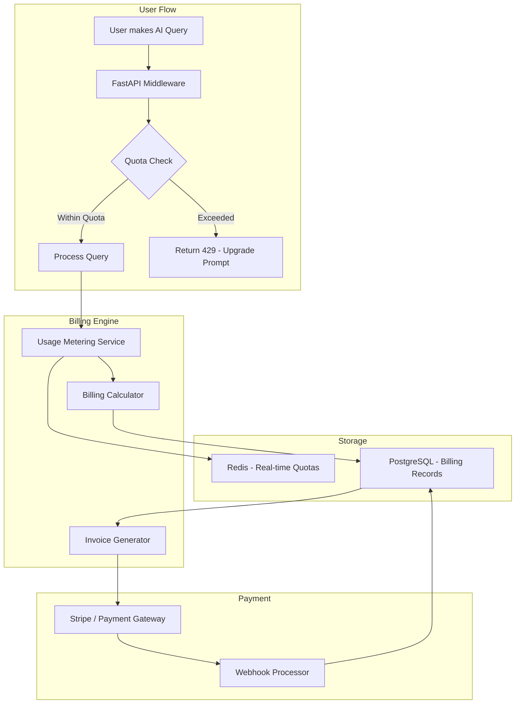

# Subscription & Monetization Plan

**Project Name**: The Expert — AI-Powered Troubleshooting System
**Version**: 1.0
**Date**: 2026-02-12
**Author**: Architecture Team

---

## Table of Contents

1. [Business Model Overview](#1-business-model-overview)
2. [Subscription Tiers (Detailed)](#2-subscription-tiers-detailed)
3. [Pricing Strategy](#3-pricing-strategy)
4. [Usage-Based Add-ons](#4-usage-based-add-ons)
5. [On-Premise Licensing](#5-on-premise-licensing)
6. [Billing Architecture](#6-billing-architecture)
7. [Tenant Lifecycle](#7-tenant-lifecycle)
8. [Rate Limiting & Quota Management](#8-rate-limiting--quota-management)
9. [Payment Integration](#9-payment-integration)
10. [Revenue Optimization Strategies](#10-revenue-optimization-strategies)
11. [Pricing Comparison](#11-pricing-comparison)
12. [Financial Projections](#12-financial-projections)

---

## 1. Business Model Overview

### Revenue Streams

| Stream | Description | % of Revenue (Target Y3) |
| :--- | :--- | :--- |
| **SaaS Subscription** | Monthly/Annual per-user fees (Professional & Enterprise tiers) | **60%** |
| **On-Premise License** | Annual license for self-hosted deployment | **20%** |
| **Professional Services** | Custom model training, onboarding, integration consulting | **10%** |
| **Usage-Based Add-ons** | Extra AI queries, storage, premium models | **7%** |
| **Marketplace Commission** | Third-party integrations & plugins in future marketplace | **3%** |

### Pricing Philosophy

1. **Land & Expand**: Free tier attracts users → Professional converts teams → Enterprise captures organizations.
2. **Value-Based**: Price based on time/money saved, not cost to serve.
3. **Transparent**: No hidden fees. Clear upgrade path.
4. **Fair Usage**: Generous free tier to build community & trust.

---

## 2. Subscription Tiers (Detailed)

### 2.1 Free / Community Tier

| Item | Detail |
| :--- | :--- |
| **Target** | Individual developers, small teams, evaluation |
| **Price** | **$0 forever** |
| **Users** | Up to **5 users** |
| **AI Queries** | **50 queries/day** |
| **Features** | ✅ Chat Interface (text only) <br> ✅ Basic RAG search <br> ✅ Community support (Forum/Discord) |
| **Limitations** | ❌ No image/screenshot input <br> ❌ No Human-in-the-loop <br> ❌ No API access <br> ❌ No SSO <br> ❌ No custom models <br> ❌ 30-day data retention <br> ❌ Default model only (Ollama/Free) |
| **Purpose** | Build community. Drive word-of-mouth. Demonstrate value. |

---

### 2.2 Professional Tier

| Item | Detail |
| :--- | :--- |
| **Target** | Mid-size Operations teams (5-50 engineers) |
| **Price** | **$29 / user / month** (billed monthly) <br> **$290 / user / year** (billed annually — **17% discount**) |
| **Minimum** | 5 users ($145/month minimum) |
| **Users** | Up to **50 users** |
| **AI Queries** | **500 queries/day** (shared pool for org) |
| **Features** | Everything in Free, plus: <br> ✅ **Image/Screenshot input** (Computer Vision) <br> ✅ **Human-in-the-loop** approval workflow <br> ✅ **Knowledge Base** management (CRUD) <br> ✅ **Basic Analytics** dashboard <br> ✅ **API Access** (REST + WebSocket) <br> ✅ **Email support** (24-hour SLA) <br> ✅ **Model selection**: Free (Ollama) + Paid APIs (Gemini Flash, GPT-3.5) <br> ✅ **1-year data retention** <br> ✅ **Bulk import/export** (CSV/JSON) |
| **Limitations** | ❌ No custom model fine-tuning <br> ❌ No SSO integration <br> ❌ No BYOD/Edge Agent <br> ❌ No white-labeling <br> ❌ No Big Data pipeline <br> ❌ Basic analytics only <br> ❌ Max 50 users |
| **Purpose** | Convert from Free. Prove business value. Generate revenue. |

---

### 2.3 Enterprise Tier

| Item | Detail |
| :--- | :--- |
| **Target** | Large organizations (50-10,000+ engineers) |
| **Price** | **$79 / user / month** (billed monthly) <br> **$790 / user / year** (billed annually — **17% discount**) <br> For 500+ users: **Custom pricing** (volume discount) |
| **Minimum** | 50 users ($3,950/month minimum — negotiable) |
| **Users** | **Unlimited** |
| **AI Queries** | **Unlimited** |
| **Features** | Everything in Professional, plus: <br> ✅ **Custom Model Fine-tuning** (Train AI on your own data with LoRA) <br> ✅ **SSO / Keycloak** integration (OIDC/SAML/LDAP) <br> ✅ **BYOD / Edge Agent** (Data stays on your premise) <br> ✅ **White-labeling** (Custom logo, colors, domain) <br> ✅ **Big Data Pipeline** (Kafka/Spark integration) <br> ✅ **Multi-Agent** (CrewAI + AutoGen sub-agents) <br> ✅ **Advanced Analytics** (AI performance, MTTR trends, team metrics) <br> ✅ **Audit Logs** (Full compliance trail) <br> ✅ **Model selection**: All models including GPT-4o, Gemini Pro, Custom <br> ✅ **Unlimited data retention** <br> ✅ **99.9% SLA guarantee** <br> ✅ **Dedicated Customer Success Manager** <br> ✅ **Priority support** (4-hour SLA) <br> ✅ **Quarterly Business Reviews** (QBR) <br> ✅ **Custom integrations** (Jira, ServiceNow, PagerDuty webhooks) |
| **Purpose** | High-value contracts. Sticky relationships. Upsell services. |

---

### 2.4 On-Premise License

| Item | Detail |
| :--- | :--- |
| **Target** | Regulated industries (Banking, Government, Healthcare, Defense) |
| **Price** | **$100,000 - $500,000 / year** (based on deployment size) |
| **Pricing Tiers** | • **Small** (up to 100 users): $100,000/year <br> • **Medium** (100-500 users): $250,000/year <br> • **Large** (500+ users): Custom ($300,000-$500,000+/year) |
| **Users** | **Unlimited** (based on license) |
| **AI Queries** | **Unlimited** (runs on client's hardware) |
| **Features** | Everything in Enterprise, plus: <br> ✅ **Full source code escrow** (optional) <br> ✅ **Air-gapped deployment** (zero internet required) <br> ✅ **On-site installation & training** (included in Year 1) <br> ✅ **Custom hardware sizing consultation** <br> ✅ **Dedicated support engineer** (business hours) <br> ✅ **Priority bug fixes & patches** <br> ✅ **Annual version upgrades** (included in maintenance) |
| **Additional Costs** | • **Hardware**: Client provides (GPU servers, storage) <br> • **Professional Services**: Custom training $20,000-50,000 (one-time) <br> • **Annual Maintenance**: Included in license (20% of license for renewal years) |
| **Deployment** | Docker Compose or Kubernetes manifests provided. DevOps support included. |
| **Purpose** | High-revenue contracts. Strategic accounts. Reference customers. |

---

## 3. Pricing Strategy

### 3.1 Pricing Rationale

| Tier | Price | Justification |
| :--- | :--- | :--- |
| **Free** | $0 | **Acquisition cost**: ~$50/user in marketing = cheaper than ads. <br> Network effect + word-of-mouth. |
| **Professional $29** | $29/user/mo | **Benchmark**: Datadog $23/host, PagerDuty $21/user, GitHub Copilot $19/user. <br> Our value (time saved) far exceeds $29. |
| **Enterprise $79** | $79/user/mo | **Benchmark**: ServiceNow ~$100/user, Splunk $75+. <br> Custom models + BYOD = premium justification. |
| **On-Premise** | $100K-500K/yr | **Benchmark**: ServiceNow Enterprise $500K+, Splunk Enterprise $200K+. <br> Open source stack = lower than competitors. |

### 3.2 Discount Structure

| Scenario | Discount |
| :--- | :--- |
| Annual billing (vs monthly) | **17%** |
| 2-year commitment | **25%** |
| 3-year commitment | **30%** |
| 500+ users (Enterprise) | **Custom** (negotiated, typically 20-35%) |
| Non-profit / Education | **50%** |
| Startup (<50 employees, <$5M revenue) | **Free Professional for 1 year** |

### 3.3 Free-to-Paid Conversion Strategy

```
Free User Journey:
────────────────────────────────────────────────────────
Day 1-7:     Onboarding → First query → See value
Day 8-14:    Hit 50 queries/day limit → Feel friction
Day 15-21:   Want image upload → See upgrade prompt
Day 22-30:   Manager asks for team dashboard → Need Pro

Conversion Triggers:
├── Hit daily query limit → "Upgrade for 10x more queries"
├── Try image upload → "Screenshot analysis is a Pro feature"
├── Try to add 6th user → "Team collaboration needs Pro"
├── 30 days data expiry → "Keep your knowledge base with Pro"
└── API access request → "Integrate with your tools on Pro"
```

---

## 4. Usage-Based Add-ons

Available for Professional and Enterprise tiers:

| Add-on | Price | Detail |
| :--- | :--- | :--- |
| **Extra AI Queries** | $0.05 per query (over daily limit) | For Pro tier when exceeding 500/day |
| **Premium Model Access** | $0.10 per query (GPT-4o) <br> $0.03 per query (Gemini Pro) | Pay-per-use for cloud AI models |
| **Extra Storage** | $5/GB/month | Beyond included storage allocation |
| **Custom Model Training** (Non-Enterprise) | $2,000 per training run | One-off fine-tuning for Pro customers |
| **Dedicated GPU Instance** | $500/month | Reserved Triton instance for low-latency |
| **Additional Tenant** (Super Admin) | $100/month per extra tenant | For MSPs managing multiple clients |
| **White-Label Package** (Non-Enterprise) | $500/month | Custom domain + Logo + Colors |
| **Priority Support Upgrade** | $200/month | 4-hour SLA for Pro customers |

---

## 5. On-Premise Licensing

### 5.1 License Components

| Component | Included | Optional |
| :--- | :--- | :--- |
| Core Platform (FastAPI + Next.js + LangGraph) | ✅ | — |
| Qdrant Vector DB | ✅ | — |
| PostgreSQL with RLS | ✅ | — |
| Keycloak SSO | ✅ | — |
| Ollama (Free Models) | ✅ | — |
| Triton Server (Custom Models) | ✅ | — |
| Docker/K8s Manifests | ✅ | — |
| MinIO Object Storage | ✅ | — |
| Langfuse (AI Tracing) | ✅ | — |
| Big Data Stack (Kafka/Spark/Airflow) | — | $50,000/year add-on |
| Multi-Agent (CrewAI/AutoGen) | — | Included in "Large" tier |
| Source Code Escrow | — | $25,000/year |
| 24/7 Support | — | $50,000/year |

### 5.2 On-Premise Pricing Examples

| Client Profile | Users | Tier | License | Add-ons | Total/Year |
| :--- | :--- | :--- | :--- | :--- | :--- |
| Regional Bank | 80 | Small | $100,000 | — | **$100,000** |
| Telecom Operator | 300 | Medium | $250,000 | Big Data ($50K) | **$300,000** |
| Government Agency | 1,000 | Large | $400,000 | 24/7 Support ($50K) + Escrow ($25K) | **$475,000** |

---

## 6. Billing Architecture

### 6.1 Technical Implementation



### 6.2 Database Schema (Billing Tables)

```sql
-- Tenant / Organization
CREATE TABLE tenants (
    id UUID PRIMARY KEY DEFAULT gen_random_uuid(),
    name VARCHAR(255) NOT NULL,
    slug VARCHAR(100) UNIQUE NOT NULL,
    plan_tier VARCHAR(50) NOT NULL DEFAULT 'free',  -- free, professional, enterprise, onpremise
    billing_cycle VARCHAR(20) DEFAULT 'monthly',     -- monthly, annual
    status VARCHAR(20) DEFAULT 'active',             -- active, trial, suspended, cancelled
    trial_ends_at TIMESTAMP,
    created_at TIMESTAMP DEFAULT NOW(),
    updated_at TIMESTAMP DEFAULT NOW()
);

-- Subscription
CREATE TABLE subscriptions (
    id UUID PRIMARY KEY DEFAULT gen_random_uuid(),
    tenant_id UUID REFERENCES tenants(id),
    plan_tier VARCHAR(50) NOT NULL,
    price_per_user DECIMAL(10,2) NOT NULL,
    max_users INT,
    max_daily_queries INT,
    billing_cycle VARCHAR(20) NOT NULL,
    stripe_subscription_id VARCHAR(255),
    current_period_start TIMESTAMP,
    current_period_end TIMESTAMP,
    status VARCHAR(20) DEFAULT 'active',
    created_at TIMESTAMP DEFAULT NOW()
);

-- Usage Tracking
CREATE TABLE usage_records (
    id BIGSERIAL PRIMARY KEY,
    tenant_id UUID REFERENCES tenants(id),
    user_id UUID NOT NULL,
    record_date DATE NOT NULL,
    query_count INT DEFAULT 0,
    image_queries INT DEFAULT 0,
    tokens_used BIGINT DEFAULT 0,
    model_used VARCHAR(100),
    cost_incurred DECIMAL(10,4) DEFAULT 0,
    created_at TIMESTAMP DEFAULT NOW()
);
CREATE INDEX idx_usage_tenant_date ON usage_records(tenant_id, record_date);

-- Invoices
CREATE TABLE invoices (
    id UUID PRIMARY KEY DEFAULT gen_random_uuid(),
    tenant_id UUID REFERENCES tenants(id),
    invoice_number VARCHAR(50) UNIQUE NOT NULL,
    period_start DATE NOT NULL,
    period_end DATE NOT NULL,
    base_amount DECIMAL(10,2) NOT NULL,
    addon_amount DECIMAL(10,2) DEFAULT 0,
    discount_amount DECIMAL(10,2) DEFAULT 0,
    tax_amount DECIMAL(10,2) DEFAULT 0,
    total_amount DECIMAL(10,2) NOT NULL,
    status VARCHAR(20) DEFAULT 'pending',  -- pending, paid, overdue, cancelled
    stripe_invoice_id VARCHAR(255),
    paid_at TIMESTAMP,
    due_date DATE NOT NULL,
    created_at TIMESTAMP DEFAULT NOW()
);

-- API Keys (for integrations)
CREATE TABLE api_keys (
    id UUID PRIMARY KEY DEFAULT gen_random_uuid(),
    tenant_id UUID REFERENCES tenants(id),
    key_hash VARCHAR(255) NOT NULL,
    name VARCHAR(100),
    permissions JSONB DEFAULT '["read", "query"]',
    rate_limit INT DEFAULT 100,  -- requests per minute
    last_used_at TIMESTAMP,
    expires_at TIMESTAMP,
    status VARCHAR(20) DEFAULT 'active',
    created_at TIMESTAMP DEFAULT NOW()
);
```

---

## 7. Tenant Lifecycle

### 7.1 Lifecycle Stages

```
┌──────────┐    ┌───────────┐    ┌──────────┐    ┌───────────┐
│  SIGNUP  │───→│   TRIAL   │───→│  ACTIVE  │───→│  RENEWAL  │
│ (Free)   │    │ (14 days) │    │ (Paying) │    │ (Annual)  │
└──────────┘    └─────┬─────┘    └────┬─────┘    └───────────┘
                      │               │
                      ↓               ↓
                ┌──────────┐    ┌───────────┐
                │ EXPIRED  │    │ SUSPENDED │
                │(Stay Free)│   │ (Non-pay) │
                └──────────┘    └─────┬─────┘
                                      ↓
                                ┌───────────┐
                                │ CANCELLED │
                                │(Data kept │
                                │  90 days) │
                                └───────────┘
```

### 7.2 Lifecycle Actions

| Stage | System Action | Communication |
| :--- | :--- | :--- |
| **Signup** | Create tenant, Keycloak realm, DB schema, Qdrant collection | Welcome email + Onboarding guide |
| **Trial Start** | Unlock Pro features for 14 days | "Your 14-day trial has started" |
| **Trial Day 10** | — | "4 days left — Your team saved X hours" |
| **Trial Expired** | Downgrade to Free. Data preserved. | "Trial ended. Upgrade to keep features." |
| **Payment Received** | Activate subscription. Unlock tier features. | "Welcome to Professional! Here's what's new." |
| **Monthly Invoice** | Generate invoice. Process payment. | Invoice email + In-app notification. |
| **Payment Failed** | Retry 3 times (Day 1, 3, 7). | Dunning emails: "Update payment method." |
| **Suspended** | Read-only mode. No new queries. Data preserved. | "Account suspended. Pay to reactivate." |
| **Cancelled** | Read-only 30 days → Data export available → Delete after 90 days. | "We're sorry to see you go. Export data here." |
| **Reactivation** | Re-enable account. No data loss if within 90 days. | "Welcome back! Everything is as you left it." |

---

## 8. Rate Limiting & Quota Management

### 8.1 Quota Configuration per Tier

| Resource | Free | Professional | Enterprise | On-Prem |
| :--- | :--- | :--- | :--- | :--- |
| Users | 5 | 50 | Unlimited | Unlimited |
| Queries/Day | 50 | 500 | Unlimited | Unlimited |
| Image Queries/Day | 0 | 100 | Unlimited | Unlimited |
| Storage | 100MB | 10GB | 100GB | Unlimited |
| API Rate Limit | N/A | 100 req/min | 1,000 req/min | Unlimited |
| Knowledge Base Items | 100 | 5,000 | Unlimited | Unlimited |
| Concurrent Sessions | 1 | 10 | 100 | Unlimited |
| Data Retention | 30 days | 1 year | Unlimited | Unlimited |

### 8.2 Technical Implementation (Redis)

```python
# Middleware: Check quota before processing
import redis

r = redis.Redis()

async def check_quota(tenant_id: str, tier: str) -> bool:
    key = f"quota:{tenant_id}:{date.today()}"
    current = r.incr(key)
    
    if current == 1:
        r.expire(key, 86400)  # 24 hour TTL
    
    limits = {
        "free": 50,
        "professional": 500,
        "enterprise": float("inf"),
    }
    
    if current > limits.get(tier, 50):
        return False  # Quota exceeded → 429 response
    return True

# Upgrade prompt on quota exceeded:
# HTTP 429 + JSON:
# {
#   "error": "daily_quota_exceeded",
#   "message": "You've used 50/50 queries today.",
#   "upgrade_url": "/settings/billing?plan=professional",
#   "reset_at": "2026-02-13T00:00:00Z"
# }
```

---

## 9. Payment Integration

### 9.1 Payment Provider: Stripe

| Feature | Implementation |
| :--- | :--- |
| **Subscription Management** | Stripe Subscriptions API (auto-recurring) |
| **Usage-Based Billing** | Stripe Metered Billing (report usage at end of cycle) |
| **Payment Methods** | Credit Card, Bank Transfer, Wire (Enterprise) |
| **Invoice Generation** | Stripe Invoicing (auto-generate + email) |
| **Tax Handling** | Stripe Tax (auto-calculate VAT/GST per region) |
| **Currency** | Multi-currency support (USD, THB, EUR, SGD, etc.) |
| **Dunning** | Stripe Smart Retries (auto-retry failed payments) |
| **Webhooks** | Listen for: `invoice.paid`, `invoice.payment_failed`, `customer.subscription.deleted` |

### 9.2 For On-Premise / Enterprise

- **Wire Transfer / Purchase Order (PO)**: Manual invoicing via finance team.
- **Net 30/60 terms**: Standard enterprise payment terms.
- **Annual upfront**: Discounted rate for full-year prepayment.

---

## 10. Revenue Optimization Strategies

### 10.1 Upsell Paths

```
Free → Professional (自然 conversion)
├── Hit query limit
├── Need image analysis
├── Need team features
└── Want API access

Professional → Enterprise (Sales-assisted)
├── Need SSO (IT security requirement)
├── Want custom models (accuracy improvement)
├── Compliance requires audit logs
├── Team exceeds 50 users
└── Need BYOD / data sovereignty

Enterprise → On-Premise (Strategic deal)
├── Regulated industry
├── Air-gapped environment
└── Large-scale deployment (500+ users)
```

### 10.2 Retention Strategies

| Strategy | Detail |
| :--- | :--- |
| **Usage Insights** | Monthly email: "Your team saved 120 hours this month using The Expert." |
| **Stickiness Features** | Knowledge Base depth → More data = harder to leave. |
| **QBRs** (Enterprise) | Quarterly meetings showing value metrics, roadmap preview. |
| **Community** | Forum, Discord, user conference → Build belonging. |
| **Lock-in with Custom Models** | Fine-tuned models are unique to their data → Can't replicate elsewhere. |
| **Annual Discounts** | 17% discount incentivizes annual commitment. |

### 10.3 Expansion Revenue

| Type | Method |
| :--- | :--- |
| **Seat Expansion** | Team grows → More users added → Revenue grows automatically |
| **Tier Upgrade** | Free → Pro → Enterprise natural progression |
| **Add-on Sales** | Premium models, extra storage, custom training |
| **Multi-Tenant (MSP)** | MSPs add client tenants → $100/tenant/month |
| **Professional Services** | Integration consulting, custom training, onboarding |

---

## 11. Pricing Comparison

### vs. Competitors

| Product | Pricing | What You Get | The Expert Difference |
| :--- | :--- | :--- | :--- |
| **ServiceNow ITOM** | $100+/user/mo | Ticket tracking, workflows | We diagnose + solve, not just track |
| **PagerDuty** | $21-49/user/mo | Alerting, on-call routing | We solve, not just alert |
| **Datadog** | $23+/host/mo | Monitoring, APM | We provide solutions, not just metrics |
| **Splunk** | $75+/user/mo | Log analysis | We analyze + resolve automatically |
| **GitHub Copilot** | $19/user/mo | Code suggestions | We handle ops, not just code |
| **ChatGPT Team** | $30/user/mo | General AI chat | Custom-trained on YOUR data |
| **The Expert Pro** | **$29/user/mo** | **AI diagnosis + RAG + Vision + Approval** | **Domain-specific, self-improving** |
| **The Expert Ent** | **$79/user/mo** | **Everything + Custom Models + BYOD + SSO** | **Full enterprise platform** |

### Total Cost of Ownership (TCO) — 3 Year for 100 Users

| Solution | Year 1 | Year 2 | Year 3 | 3Y Total |
| :--- | :--- | :--- | :--- | :--- |
| **ServiceNow** | $120,000 | $126,000 | $132,300 | **$378,300** |
| **Build Custom** | $300,000 | $150,000 | $100,000 | **$550,000** |
| **The Expert (Enterprise)** | $94,800 | $94,800 | $94,800 | **$284,400** |
| **The Expert (On-Prem)** | $180,000* | $100,000 | $100,000 | **$380,000** |

*Includes hardware + license Year 1

---

## 12. Financial Projections

### 12.1 Year 1 Monthly Revenue Detail

| Month | Free | Pro Tenants (×5 users) | Ent Tenants (×50 users) | Pro MRR | Ent MRR | Add-ons | **Total MRR** |
| :--- | :--- | :--- | :--- | :--- | :--- | :--- | :--- |
| M1 | 10 | 0 | 0 | $0 | $0 | $0 | **$0** |
| M2 | 25 | 0 | 0 | $0 | $0 | $0 | **$0** |
| M3 | 50 | 0 | 0 | $0 | $0 | $0 | **$0** |
| M4 | 100 | 2 | 0 | $290 | $0 | $0 | **$290** |
| M5 | 150 | 4 | 0 | $580 | $0 | $50 | **$630** |
| M6 | 200 | 6 | 1 | $870 | $3,950 | $100 | **$4,920** |
| M7 | 300 | 10 | 2 | $1,450 | $7,900 | $300 | **$9,650** |
| M8 | 400 | 15 | 3 | $2,175 | $11,850 | $500 | **$14,525** |
| M9 | 500 | 20 | 4 | $2,900 | $15,800 | $800 | **$19,500** |
| M10 | 600 | 25 | 6 | $3,625 | $23,700 | $1,200 | **$28,525** |
| M11 | 700 | 30 | 8 | $4,350 | $31,600 | $1,500 | **$37,450** |
| M12 | 800 | 35 | 10 | $5,075 | $39,500 | $2,000 | **$46,575** |
| **Y1 Total** | — | — | — | — | — | — | **$162,065** |

> - Potential On-Premise deals: 1-2 contracts = $100K-$300K additional.

### 12.2 Year 1-3 Summary

| Metric | Year 1 | Year 2 | Year 3 |
| :--- | :--- | :--- | :--- |
| Free Users | 800 | 3,000 | 10,000 |
| Pro Tenants | 35 | 150 | 400 |
| Enterprise Tenants | 10 | 50 | 150 |
| On-Prem Licenses | 1 | 5 | 15 |
| **SaaS ARR** | $162,065 | $2,400,000 | $7,200,000 |
| **On-Prem Revenue** | $100,000 | $500,000 | $1,500,000 |
| **Services Revenue** | $50,000 | $300,000 | $800,000 |
| **Total Revenue** | **$312,065** | **$3,200,000** | **$9,500,000** |

### 12.3 Unit Economics

| Metric | Target |
| :--- | :--- |
| **CAC** (Customer Acquisition Cost) | $2,000 (Pro), $15,000 (Enterprise) |
| **LTV** (Lifetime Value) | $5,000 (Pro, 3yr), $142,200 (Enterprise, 3yr) |
| **LTV:CAC Ratio** | 2.5x (Pro), 9.5x (Enterprise) |
| **Payback Period** | 4 months (Pro), 5 months (Enterprise) |
| **Gross Margin** | 80%+ (SaaS), 90%+ (On-Prem license) |
| **Net Revenue Retention** | 120%+ (expansion > churn) |
| **Monthly Churn** | <3% (Pro), <1% (Enterprise) |

---

## Related Documents

- [Proposal](./proposal.md) | [BRD](./brd.md) | [PRD](./prd.md)
