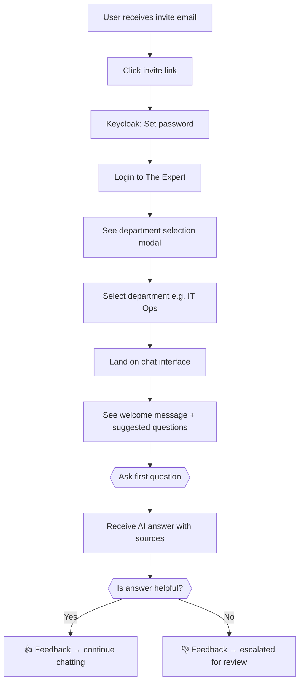
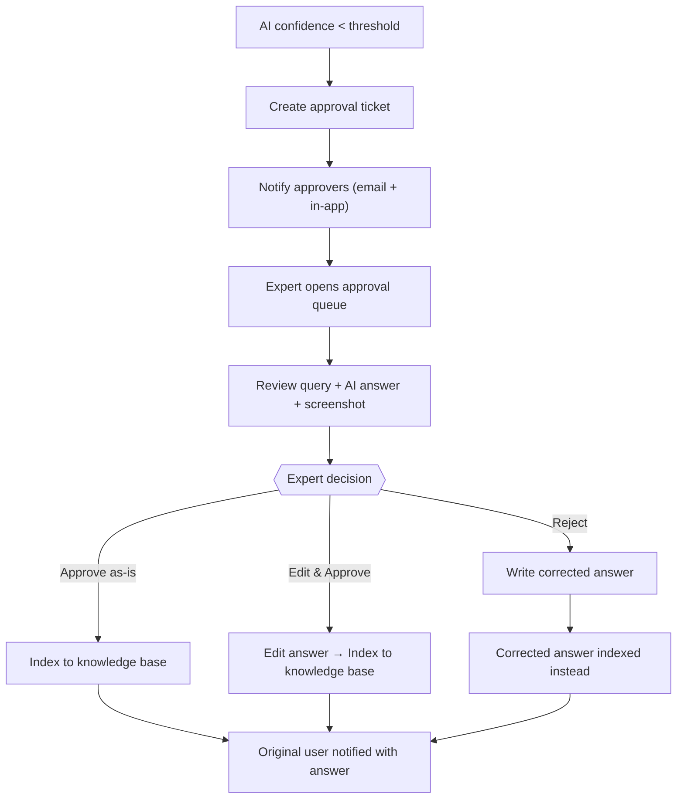
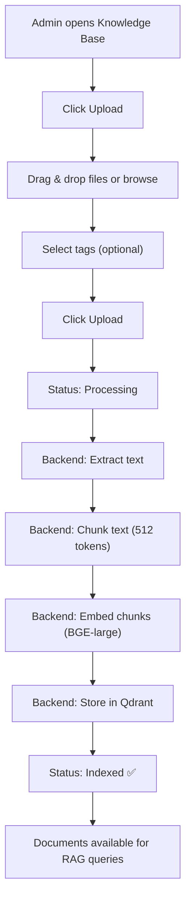

# UI Wireframes & Screen Design

**Project Name**: The Expert — Universal Enterprise AI Platform
**Version**: 1.0
**Date**: 2026-02-12
**Framework**: Next.js 14 + ShadCN/UI + Tailwind CSS
**Design System**: Dark mode primary, Light mode toggle

---

## Table of Contents

1. [Design Principles](#1-design-principles)
2. [Color System & Typography](#2-color-system--typography)
3. [Login & Onboarding](#3-login--onboarding)
4. [Main Layout](#4-main-layout)
5. [Chat Interface](#5-chat-interface)
6. [Department Selector](#6-department-selector)
7. [Knowledge Base Management](#7-knowledge-base-management)
8. [Approval Queue (HITL)](#8-approval-queue-hitl)
9. [Analytics Dashboard](#9-analytics-dashboard)
10. [Settings & Administration](#10-settings--administration)
11. [Billing & Subscription](#11-billing--subscription)
12. [Responsive / Mobile](#12-responsive--mobile)
13. [Component Library](#13-component-library)
14. [User Flow Diagrams](#14-user-flow-diagrams)

---

## 1. Design Principles

| Principle | Description |
| :--- | :--- |
| **Clarity** | Users must know what department they're in and what the AI is doing at all times |
| **Speed** | Chat-first UX — the primary action (ask a question) must be ≤ 2 clicks away |
| **Trust** | Show confidence scores, sources, and approval status to build trust in AI answers |
| **Departmental Identity** | Each department has its own color accent, icon, and personality |
| **Accessibility** | WCAG 2.1 AA compliant, keyboard navigable, screen reader friendly |

---

## 2. Color System & Typography

### Color Palette

```
Primary:
  Brand Blue:    #3B82F6  (buttons, links, active states)
  Brand Dark:    #1E293B  (sidebar, dark mode bg)
  Brand Light:   #F8FAFC  (light mode bg)

Department Accents:
  IT Ops:        #06B6D4  (Cyan)       🖥️
  HR:            #8B5CF6  (Purple)     👥
  Legal:         #F59E0B  (Amber)      ⚖️
  Sales:         #10B981  (Emerald)    📈
  Finance:       #EF4444  (Red)        💰
  Engineering:   #6366F1  (Indigo)     ⚙️

Status Colors:
  Success:       #22C55E
  Warning:       #F59E0B
  Error:         #EF4444
  Info:          #3B82F6
  Pending:       #A855F7

Confidence:
  High (≥0.9):   #22C55E (Green)
  Medium (0.7-0.9): #F59E0B (Amber)
  Low (<0.7):    #EF4444 (Red)
```

### Typography

```
Font Family:
  Primary:    "Inter" (Google Fonts)
  Monospace:  "JetBrains Mono" (code blocks)

Sizes:
  h1: 28px / 700 weight
  h2: 22px / 600 weight
  h3: 18px / 600 weight
  body: 14px / 400 weight
  caption: 12px / 400 weight
  code: 13px / 400 weight
```

---

## 3. Login & Onboarding

### 3.1 Login Page

```
┌──────────────────────────────────────────────────────────────┐
│                                                              │
│      ┌──────────────────────────────────────────────┐        │
│      │                                              │        │
│      │          [Logo: The Expert]                   │        │
│      │     "Your Enterprise AI Knowledge Hub"       │        │
│      │                                              │        │
│      │  ┌──────────────────────────────────────┐    │        │
│      │  │  📧  Email                           │    │        │
│      │  └──────────────────────────────────────┘    │        │
│      │  ┌──────────────────────────────────────┐    │        │
│      │  │  🔒  Password                        │    │        │
│      │  └──────────────────────────────────────┘    │        │
│      │                                              │        │
│      │  [████████ Sign In ████████]                  │        │
│      │                                              │        │
│      │  ────────── or ──────────                    │        │
│      │                                              │        │
│      │  [🏢 Sign in with SSO (SAML)]                │        │
│      │  [G  Sign in with Google]                    │        │
│      │                                              │        │
│      │  Don't have an account? Contact admin        │        │
│      │                                              │        │
│      └──────────────────────────────────────────────┘        │
│                                                              │
│   Background: Animated gradient (dark blue → purple)         │
│   White-label: Logo & colors from tenant branding config     │
│                                                              │
└──────────────────────────────────────────────────────────────┘
```

**Notes:**

- Login page supports **white-label branding** (tenant logo, colors)
- SSO button only appears if tenant has SSO configured
- Failed login shows error toast with retry count

---

## 4. Main Layout

### 4.1 Desktop Layout (1440px+)

```
┌──────────────────────────────────────────────────────────────────────────────┐
│ [≡]  The Expert              Search...           [🔔 3]  [👤 Chanon ▾]     │
├──────────┬───────────────────────────────────────────────────────────────────┤
│          │                                                                  │
│ SIDEBAR  │                    MAIN CONTENT AREA                             │
│  260px   │                    (calc(100% - 260px))                          │
│          │                                                                  │
│ ┌──────┐ │                                                                  │
│ │ Logo │ │                                                                  │
│ └──────┘ │                                                                  │
│          │                                                                  │
│ 💬 Chat  │                                                                  │
│  [Active]│                                                                  │
│          │                                                                  │
│ DEPTS    │                                                                  │
│ ─────── │                                                                  │
│ 🖥️ IT    │                                                                  │
│ 👥 HR    │                                                                  │
│ ⚖️ Legal │                                                                  │
│ 📈 Sales │                                                                  │
│          │                                                                  │
│ ─────── │                                                                  │
│ 📚 Knowledge│                                                               │
│ ✅ Approvals│                                                               │
│    (5)   │                                                                  │
│ 📊 Analytics│                                                               │
│ ⚙️ Settings│                                                                │
│          │                                                                  │
│ ─────── │                                                                  │
│ 💎 Pro Plan│                                                                │
│  85/100 users│                                                              │
│ [Upgrade]│                                                                  │
│          │                                                                  │
├──────────┴───────────────────────────────────────────────────────────────────┤
│ © 2026 The Expert · v1.0                                                    │
└──────────────────────────────────────────────────────────────────────────────┘
```

### Sidebar Behavior

| State | Breakpoint | Behavior |
| :--- | :--- | :--- |
| **Expanded** | ≥1280px | Full sidebar with text labels |
| **Collapsed** | 768-1279px | Icons only, tooltip on hover |
| **Hidden** | <768px | Hamburger menu (slide-in overlay) |

---

## 5. Chat Interface

### 5.1 Main Chat Screen

```
┌──────────────────────────────────────────────────────────────┐
│ 🖥️ IT Operations                    [📋 History] [⚙️ Config]│
├──────────────────────────────────────────────────────────────┤
│                                                              │
│  Today, Feb 12                                               │
│                                                              │
│         ┌─────────────────────────────────────┐  12:30 PM    │
│         │ Server web-prod-03 is showing OOM   │  👤 You      │
│         │ killer messages. Here's a screenshot │              │
│         │ [📷 screenshot.png - click to expand]│              │
│         └─────────────────────────────────────┘              │
│                                                              │
│  ┌───────────────────────────────────────────────┐  12:31 PM │
│  │ 🤖 The Expert  ·  Confidence: ██████░░ 92%   │  IT Ops    │
│  │                                               │           │
│  │ Based on the OOM killer logs, your Java heap   │           │
│  │ is configured at 2GB but the container limit   │           │
│  │ is 1.5GB.                                      │           │
│  │                                               │           │
│  │ **Solution:**                                  │           │
│  │ 1. Increase container memory to 4GB           │           │
│  │ 2. Set JVM: `-Xmx2g -Xms1g`                  │           │
│  │ 3. Add `-XX:+UseContainerSupport`             │           │
│  │                                               │           │
│  │ ┌─ 📄 Sources ──────────────────────────┐     │           │
│  │ │ • JVM Troubleshooting Guide (95%)     │     │           │
│  │ │ • K8s Memory Limits Best Practices    │     │           │
│  │ └──────────────────────────────────────-┘     │           │
│  │                                               │           │
│  │ [👍] [👎] [📋 Copy] [🔄 Regenerate]           │           │
│  └───────────────────────────────────────────────┘           │
│                                                              │
│  ┌────────────────────────────────────────────┐              │
│  │ ⚠️ Pending Expert Review                   │              │
│  │ Your question about Oracle TNS error has   │              │
│  │ been escalated. ETA: ~4 hours              │              │
│  │ [View Status]                              │              │
│  └────────────────────────────────────────────┘              │
│                                                              │
├──────────────────────────────────────────────────────────────┤
│                                                              │
│  ┌────────────────────────────────────────────────────────┐  │
│  │ [📎] [📷]  Ask anything about IT Operations...    [➤] │  │
│  └────────────────────────────────────────────────────────┘  │
│  ⌨️ Enter to send · Shift+Enter for new line · ⌘V for image │
│                                                              │
└──────────────────────────────────────────────────────────────┘
```

### 5.2 Chat Components Detail

#### Message Bubble — AI Response

```
┌─── AI Response Bubble ───────────────────────────────────────┐
│                                                              │
│  🤖 The Expert                                               │
│  Model: llama3-8b-it-ops-v3 · 1.2s                         │
│                                                              │
│  ┌─ Confidence Badge ──────────────┐                        │
│  │ ██████████░░░░ 92% High         │  ← Green for ≥90%     │
│  └─────────────────────────────────┘    Amber for 70-89%    │
│                                         Red for <70%        │
│  [Markdown-rendered answer content]                          │
│  - Supports **bold**, `code`, lists                         │
│  - Syntax highlighted code blocks                           │
│  - Tables and links                                         │
│                                                              │
│  ┌─ Source Citations (Collapsible) ─────────────────┐       │
│  │ ▼ 2 Sources                                      │       │
│  │  🔗 JVM Troubleshooting Guide       95% match    │       │
│  │     "When OOM killer triggers on..."              │       │
│  │  🔗 K8s Memory Limits               87% match    │       │
│  │     "Container memory limits must..."             │       │
│  └──────────────────────────────────────────────────┘       │
│                                                              │
│  ┌─ Action Bar ─────────────────────────────────────┐       │
│  │ [👍 Helpful] [👎 Not Helpful] [📋 Copy] [🔄 Retry] │    │
│  └──────────────────────────────────────────────────┘       │
│                                                              │
└──────────────────────────────────────────────────────────────┘
```

#### Streaming Animation

```
┌─── Typing Indicator ────────────────────────┐
│ 🤖 The Expert is thinking...                │
│ ●●● (animated dots)                         │
│                                              │
│ ▎ Searching knowledge base... (step 1/3)    │  ← Shows progress
│ ▎ Analyzing with llama3-8b... (step 2/3)    │
│ ▎ Generating answer... (step 3/3)           │
└──────────────────────────────────────────────┘
```

---

## 6. Department Selector

### 6.1 Quick Switcher (Top of Chat)

```
┌─── Department Tab Bar (Horizontal Scroll) ──────────────────────────┐
│                                                                     │
│  ┌─────────┐  ┌─────────┐  ┌─────────┐  ┌─────────┐  ┌─────────┐ │
│  │  🖥️     │  │  👥     │  │  ⚖️     │  │  📈     │  │  ➕     │ │
│  │ IT Ops  │  │   HR    │  │  Legal  │  │  Sales  │  │  Add    │ │
│  │[active] │  │         │  │         │  │         │  │         │ │
│  │ ━━━━━━ │  │         │  │         │  │         │  │         │ │
│  │ #06B6D4 │  │         │  │         │  │         │  │         │ │
│  └─────────┘  └─────────┘  └─────────┘  └─────────┘  └─────────┘ │
│                                                                     │
│  Active tab: cyan underline + filled icon                          │
│  Inactive tab: gray text + outline icon                            │
│  Badge: red dot if department has pending approvals                │
│                                                                     │
└─────────────────────────────────────────────────────────────────────┘
```

### 6.2 New Chat — Department Selection Modal

```
┌──────────────────────────────────────────────────────────────┐
│                                                              │
│            💬 Start a New Conversation                       │
│            Choose a department to begin                      │
│                                                              │
│  ┌────────────────────────────────────────────────────────┐  │
│  │  🔍  Search departments...                             │  │
│  └────────────────────────────────────────────────────────┘  │
│                                                              │
│  ┌─────────────────────┐  ┌─────────────────────┐           │
│  │ 🖥️                  │  │ 👥                  │           │
│  │ IT Operations       │  │ HR & People         │           │
│  │ Server, Network,    │  │ Policies, Benefits, │           │
│  │ Code troubleshooting│  │ Onboarding          │           │
│  │ 142 docs · 25 users │  │ 56 docs · 8 users   │           │
│  └─────────────────────┘  └─────────────────────┘           │
│                                                              │
│  ┌─────────────────────┐  ┌─────────────────────┐           │
│  │ ⚖️                  │  │ 📈                  │           │
│  │ Legal               │  │ Sales               │           │
│  │ Contracts,          │  │ Products, Pricing,  │           │
│  │ Compliance, NDA     │  │ Battlecards         │           │
│  │ 89 docs · 5 users   │  │ 34 docs · 12 users  │           │
│  └─────────────────────┘  └─────────────────────┘           │
│                                                              │
│  Each card: dept icon + name + description + stats           │
│  Hover: lift shadow + accent color border                    │
│  Click: navigate to chat with selected department            │
│                                                              │
└──────────────────────────────────────────────────────────────┘
```

---

## 7. Knowledge Base Management

### 7.1 Document List

```
┌──────────────────────────────────────────────────────────────┐
│ 📚 Knowledge Base — 🖥️ IT Operations            [⬆ Upload] │
├──────────────────────────────────────────────────────────────┤
│                                                              │
│ 🔍 Search documents...    [Type ▾] [Status ▾] [Date ▾]     │
│                                                              │
│ ┌────────────────────────────────────────────────────────┐   │
│ │ 📄 Server Runbook v3.pdf                               │   │
│ │    PDF · 2.1 MB · 45 chunks · Indexed ✅               │   │
│ │    Uploaded by Chanon S. · Feb 10, 2026                │   │
│ │    Tags: [server] [linux] [runbook]                    │   │
│ │    [View Chunks] [Re-index] [🗑️ Delete]                │   │
│ ├────────────────────────────────────────────────────────┤   │
│ │ 📄 Networking Guide.docx                               │   │
│ │    DOCX · 890 KB · 28 chunks · Processing ⏳           │   │
│ │    ████████░░░░░░░░ 65%                                │   │
│ │    Uploaded by Admin · Feb 12, 2026                    │   │
│ ├────────────────────────────────────────────────────────┤   │
│ │ 📄 AWS Best Practices.md                               │   │
│ │    Markdown · 45 KB · 12 chunks · Indexed ✅           │   │
│ │    Uploaded by Chanon S. · Feb 8, 2026                 │   │
│ │    Tags: [aws] [cloud] [devops]                        │   │
│ └────────────────────────────────────────────────────────┘   │
│                                                              │
│ Showing 1-20 of 142 documents    [< Prev] [Next >]          │
│                                                              │
└──────────────────────────────────────────────────────────────┘
```

### 7.2 Upload Dialog

```
┌──────────────────────────────────────────────────────────────┐
│ ⬆ Upload Documents to IT Operations                  [✕]    │
├──────────────────────────────────────────────────────────────┤
│                                                              │
│  ┌────────────────────────────────────────────────────────┐  │
│  │                                                        │  │
│  │     ┌──────┐                                          │  │
│  │     │  📁  │                                          │  │
│  │     └──────┘                                          │  │
│  │                                                        │  │
│  │     Drag & drop files here, or click to browse        │  │
│  │     PDF, DOCX, TXT, MD, CSV · Max 50 MB per file     │  │
│  │                                                        │  │
│  └────────────────────────────────────────────────────────┘  │
│                                                              │
│  Selected files:                                             │
│  ┌────────────────────────────────────────────────────────┐  │
│  │ ✅ runbook_v4.pdf        4.2 MB          [✕ Remove]   │  │
│  │ ✅ faq_updated.md        128 KB          [✕ Remove]   │  │
│  │ ❌ photo.jpg             Not supported   [✕ Remove]   │  │
│  └────────────────────────────────────────────────────────┘  │
│                                                              │
│  Tags (optional): [server, linux, runbook           ]        │
│                                                              │
│         [Cancel]     [████ Upload 2 Files ████]              │
│                                                              │
└──────────────────────────────────────────────────────────────┘
```

---

## 8. Approval Queue (HITL)

### 8.1 Approval List

```
┌──────────────────────────────────────────────────────────────┐
│ ✅ Approvals                     [All Depts ▾] [Pending ▾] │
├──────────────────────────────────────────────────────────────┤
│                                                              │
│ 🔴 5 Pending  · 🟢 142 Approved · 🔴 23 Rejected           │
│                                                              │
│ ┌────────────────────────────────────────────────────────┐   │
│ │ ⚠️ PENDING · 🖥️ IT Ops · Priority: Normal             │   │
│ │                                                        │   │
│ │ User asked: "Oracle DB shows ORA-12514 TNS error"     │   │
│ │                                                        │   │
│ │ AI Answer (Confidence: 68%):                           │   │
│ │ "The ORA-12514 error indicates the listener..."        │   │
│ │                                                        │   │
│ │ 📷 [Screenshot attached]                               │   │
│ │                                                        │   │
│ │ Created: 2 hours ago · Expires in: 22 hours            │   │
│ │                                                        │   │
│ │ [✅ Approve]  [✏️ Edit & Approve]  [❌ Reject]         │   │
│ └────────────────────────────────────────────────────────┘   │
│                                                              │
│ ┌────────────────────────────────────────────────────────┐   │
│ │ ⚠️ PENDING · 👥 HR · Priority: High                   │   │
│ │                                                        │   │
│ │ User asked: "What is the maternity leave policy?"      │   │
│ │                                                        │   │
│ │ AI Answer (Confidence: 73%):                           │   │
│ │ "According to our policy document..."                  │   │
│ │                                                        │   │
│ │ Created: 30 min ago · Expires in: 23.5 hours           │   │
│ │                                                        │   │
│ │ [✅ Approve]  [✏️ Edit & Approve]  [❌ Reject]         │   │
│ └────────────────────────────────────────────────────────┘   │
│                                                              │
└──────────────────────────────────────────────────────────────┘
```

### 8.2 Approval Detail / Edit View

```
┌──────────────────────────────────────────────────────────────┐
│ ← Back to Queue          Approval #apr_001            [✕]   │
├──────────────────────────────────────────────────────────────┤
│                                                              │
│ ┌─────────────── Left Panel (50%) ────────────────────────┐  │
│ │ 📝 Original Query                                      │  │
│ │                                                        │  │
│ │ User: Somchai K. (IT Ops)                              │  │
│ │ Time: Feb 12, 2026 15:30                               │  │
│ │                                                        │  │
│ │ "Oracle DB shows ORA-12514 TNS listener error          │  │
│ │  after server restart. Connection refused."             │  │
│ │                                                        │  │
│ │ [📷 screenshot.png]  ← click to expand                 │  │
│ │ ┌──────────────────────┐                               │  │
│ │ │ (ORA-12514 error     │                               │  │
│ │ │  screenshot preview) │                               │  │
│ │ └──────────────────────┘                               │  │
│ └────────────────────────────────────────────────────────┘  │
│                                                              │
│ ┌─────────────── Right Panel (50%) ───────────────────────┐  │
│ │ 🤖 AI's Answer (Editable)           Confidence: 68%    │  │
│ │                                                        │  │
│ │ ┌──────────────────────────────────────────────────┐   │  │
│ │ │ The ORA-12514 error means the listener cannot    │   │  │
│ │ │ find the requested service.                      │   │  │
│ │ │                                                  │   │  │
│ │ │ Fix:                                             │   │  │
│ │ │ 1. Check `lsnrctl status`                       │   │  │
│ │ │ 2. Verify tnsnames.ora matches                  │   │  │
│ │ │ 3. Restart listener: `lsnrctl reload`           │   │  │
│ │ │                                                  │   │  │
│ │ │ [Rich text editor with Markdown support]         │   │  │
│ │ └──────────────────────────────────────────────────┘   │  │
│ │                                                        │  │
│ │ Reviewer Notes (internal):                             │  │
│ │ ┌──────────────────────────────────────────────────┐   │  │
│ │ │ Added specific commands. AI was mostly correct.  │   │  │
│ │ └──────────────────────────────────────────────────┘   │  │
│ └────────────────────────────────────────────────────────┘  │
│                                                              │
│  ┌──────────────────────────────────────────────────────┐   │
│  │  [❌ Reject]                    [✅ Approve & Index] │   │
│  │  (requires reason)              (saves to knowledge) │   │
│  └──────────────────────────────────────────────────────┘   │
│                                                              │
└──────────────────────────────────────────────────────────────┘
```

---

## 9. Analytics Dashboard

### 9.1 Overview Dashboard

```
┌──────────────────────────────────────────────────────────────┐
│ 📊 Analytics                          [This Week ▾] [Export]│
├──────────────────────────────────────────────────────────────┤
│                                                              │
│  ┌──────────┐  ┌──────────┐  ┌──────────┐  ┌──────────┐   │
│  │ 📈 2,450 │  │ 🤖 87%   │  │ ⚡ 1.8s  │  │ 👥 89    │   │
│  │ Queries  │  │ Avg Conf.│  │ Avg Time │  │ Users    │   │
│  │ ▲ +12%   │  │ ▲ +3%    │  │ ▼ -0.5s  │  │ ▲ +5     │   │
│  └──────────┘  └──────────┘  └──────────┘  └──────────┘   │
│                                                              │
│  ┌─── Queries Over Time (Line Chart) ────────────────────┐  │
│  │                                                        │  │
│  │  300 ┤                          ╭─╮                    │  │
│  │  250 ┤              ╭──╮   ╭──╮│ │╭╮                  │  │
│  │  200 ┤         ╭──╮ │  ╰─╮╭╯  ╰╯ ╰╯                  │  │
│  │  150 ┤    ╭──╮╭╯  ╰─╯    ╰╯                           │  │
│  │  100 ┤╭──╮│  ╰╯                                       │  │
│  │      └┴──┴┴──┬──┬──┬──┬──┬──┬──┬──┬──┬──┬──┬──┬──┤   │  │
│  │       Feb 1  3  5  7  9  11                            │  │
│  │                                                        │  │
│  │  ── IT Ops (cyan) ── HR (purple) ── Legal (amber)     │  │
│  └────────────────────────────────────────────────────────┘  │
│                                                              │
│  ┌─── By Department (Bar) ──┐  ┌─── Resolution (Pie) ────┐ │
│  │                          │  │                          │ │
│  │  IT Ops  ████████ 1800   │  │      ╭───╮              │ │
│  │  HR      ████ 450        │  │    ╭─╯   ╰─╮            │ │
│  │  Legal   ██ 200          │  │   │ 80%    │            │ │
│  │  Sales   █ 50            │  │   │ Auto    │            │ │
│  │                          │  │    ╰─╮   ╭─╯  20%       │ │
│  │                          │  │      ╰───╯  Escalated   │ │
│  └──────────────────────────┘  └──────────────────────────┘ │
│                                                              │
│  ┌─── Top Questions This Week ──────────────────────────┐   │
│  │ 1. "How to restart Apache server?" — 45 times        │   │
│  │ 2. "VPN connection failing" — 38 times               │   │
│  │ 3. "Password reset policy" — 32 times                │   │
│  │ 4. "OOM killer on production" — 28 times             │   │
│  │ 5. "NDA template request" — 22 times                 │   │
│  └──────────────────────────────────────────────────────┘   │
│                                                              │
└──────────────────────────────────────────────────────────────┘
```

---

## 10. Settings & Administration

### 10.1 Settings Navigation

```
┌──────────────────────────────────────────────────────────────┐
│ ⚙️ Settings                                                  │
├──────────┬───────────────────────────────────────────────────┤
│          │                                                   │
│ General  │  ┌─── General Settings ─────────────────────────┐│
│ [active] │  │                                              ││
│          │  │  Organization Name                           ││
│ Members  │  │  ┌──────────────────────────────────────┐    ││
│          │  │  │  Acme Corporation                    │    ││
│ Depts    │  │  └──────────────────────────────────────┘    ││
│          │  │                                              ││
│ Security │  │  Timezone                                    ││
│          │  │  ┌──────────────────────────────────────┐    ││
│ SSO      │  │  │  Asia/Bangkok (UTC+7)            ▾  │    ││
│          │  │  └──────────────────────────────────────┘    ││
│ API Keys │  │                                              ││
│          │  │  Default Language                             ││
│ Billing  │  │  ┌──────────────────────────────────────┐    ││
│          │  │  │  Thai (ภาษาไทย)                   ▾  │    ││
│ Branding │  │  └──────────────────────────────────────┘    ││
│          │  │                                              ││
│ Audit Log│  │  [████████ Save Changes ████████]            ││
│          │  │                                              ││
│          │  └──────────────────────────────────────────────┘│
│          │                                                   │
└──────────┴───────────────────────────────────────────────────┘
```

### 10.2 Department Configuration

```
┌──────────── Department Config: IT Operations ────────────────┐
│                                                              │
│ ┌─── Basic Info ──────────────────────────────────────────┐  │
│ │ Name: [IT Operations          ]                         │  │
│ │ Icon: [🖥️ ▾]    Color: [#06B6D4 🎨]                    │  │
│ │ Description: [Server, Network, Code troubleshooting  ]  │  │
│ └────────────────────────────────────────────────────────┘  │
│                                                              │
│ ┌─── AI Configuration ───────────────────────────────────┐  │
│ │ System Prompt:                                         │  │
│ │ ┌──────────────────────────────────────────────────┐   │  │
│ │ │ You are an IT Operations expert. You help with   │   │  │
│ │ │ server issues, networking, and deployment...     │   │  │
│ │ └──────────────────────────────────────────────────┘   │  │
│ │                                                        │  │
│ │ Temperature: [0.3  ] ◀━━━━━━○━━━━━━━━━━▶               │  │
│ │ Max Tokens:  [1024 ]                                   │  │
│ │ Base Model:  [Llama 3 8B Instruct              ▾]      │  │
│ │ Custom Adapter: [it-ops-v3 (production)        ▾]      │  │
│ └────────────────────────────────────────────────────────┘  │
│                                                              │
│ ┌─── Approval Settings ──────────────────────────────────┐  │
│ │ Require approval for:  ○ All answers                   │  │
│ │                        ● New/low-confidence only        │  │
│ │                        ○ Never                          │  │
│ │ Auto-approve threshold: [0.95 ] (confidence score)     │  │
│ │ Approval expires after: [24   ] hours                  │  │
│ └────────────────────────────────────────────────────────┘  │
│                                                              │
│ [████████ Save Configuration ████████]                       │
│                                                              │
└──────────────────────────────────────────────────────────────┘
```

---

## 11. Billing & Subscription

### 11.1 Billing Overview

```
┌──────────────────────────────────────────────────────────────┐
│ 💳 Billing & Subscription                                    │
├──────────────────────────────────────────────────────────────┤
│                                                              │
│  ┌─── Current Plan ──────────────────────────────────────┐  │
│  │                                                        │  │
│  │  💎 Professional Plan          $29/user/month          │  │
│  │  Billing Cycle: Monthly (renews Mar 1, 2026)          │  │
│  │  Users: 85 active                                     │  │
│  │  Monthly Cost: $2,465.00                              │  │
│  │                                                        │  │
│  │  [Upgrade to Enterprise]  [Manage Payment Method]     │  │
│  └────────────────────────────────────────────────────────┘  │
│                                                              │
│  ┌─── Usage This Period ─────────────────────────────────┐  │
│  │                                                        │  │
│  │  Queries:     ████████████░░░░ 387 / 500 per day      │  │
│  │  Departments: ████████░░░░░░░░ 4 / 10                 │  │
│  │  Storage:     ██████░░░░░░░░░░ 12 GB / 50 GB          │  │
│  │                                                        │  │
│  └────────────────────────────────────────────────────────┘  │
│                                                              │
│  ┌─── Plan Comparison ───────────────────────────────────┐  │
│  │                                                        │  │
│  │         Free    Professional   Enterprise   On-Prem   │  │
│  │ Price   $0      $29/user/mo    $79/user/mo  Custom    │  │
│  │ Users   5       100            Unlimited    Unlimited  │  │
│  │ Query   50/day  500/day        Unlimited    Unlimited  │  │
│  │ Depts   1       10             Unlimited    Unlimited  │  │
│  │ Vision  ❌      ✅             ✅           ✅        │  │
│  │ Custom  ❌      ❌             ✅           ✅        │  │
│  │ SSO     ❌      ❌             ✅           ✅        │  │
│  │                                                        │  │
│  │         [Current] [             ] [Contact]  [Contact] │  │
│  └────────────────────────────────────────────────────────┘  │
│                                                              │
│  ┌─── Recent Invoices ───────────────────────────────────┐  │
│  │ INV-2026-0002  Feb 2026  $2,465.00  Paid ✅  [📄 PDF] │  │
│  │ INV-2026-0001  Jan 2026  $2,320.00  Paid ✅  [📄 PDF] │  │
│  └────────────────────────────────────────────────────────┘  │
│                                                              │
└──────────────────────────────────────────────────────────────┘
```

---

## 12. Responsive / Mobile

### 12.1 Mobile Layout (< 768px)

```
┌────────────────────────┐
│ [≡] The Expert  [🔔][👤]│
├────────────────────────┤
│                        │
│ ┌──────────────────┐   │
│ │🖥️ IT │👥 HR│⚖️│📈│  │
│ │[active]          │   │
│ └──────────────────┘   │
│                        │
│ ┌──────────────────┐   │
│ │ OOM killer issue │   │
│ │ on web-prod-03   │   │
│ └────────── 12:30 ┘   │
│                        │
│ ┌──────────────────┐   │
│ │ 🤖 92% ██████░░  │   │
│ │                  │   │
│ │ Based on the OOM │   │
│ │ killer logs...   │   │
│ │                  │   │
│ │ Solution:        │   │
│ │ 1. Increase...   │   │
│ │ 2. Set JVM...    │   │
│ │                  │   │
│ │ [📄 2 Sources ▾] │   │
│ │ [👍][👎][📋][🔄] │   │
│ └──────────────────┘   │
│                        │
│                        │
├────────────────────────┤
│┌──────────────────────┐│
││[📎][📷] Ask...  [➤] ││
│└──────────────────────┘│
└────────────────────────┘
```

### Mobile-specific UX

| Feature | Adaptation |
| :--- | :--- |
| Sidebar | Slide-in overlay with backdrop |
| Department tabs | Horizontal scroll + swipe |
| Chat input | Fixed at bottom, keyboard-aware |
| Image upload | Camera option + gallery + paste |
| Approval review | Full-screen modal |
| Analytics | Single column, swipe between charts |

---

## 13. Component Library

### Reusable Components

| Component | Used In | Props |
| :--- | :--- | :--- |
| `<DepartmentBadge>` | Chat, Sidebar, Approvals | `dept_id`, `size`, `showLabel` |
| `<ConfidenceBadge>` | Chat messages | `score`, `size` |
| `<SourceCitation>` | Chat messages | `sources[]`, `collapsible` |
| `<MessageBubble>` | Chat | `message`, `role`, `streaming` |
| `<FileUploader>` | Knowledge, Chat | `accept`, `maxSize`, `multiple` |
| `<ApprovalCard>` | Approval queue | `approval`, `onApprove`, `onReject` |
| `<UsageMeter>` | Billing, Sidebar | `used`, `limit`, `label` |
| `<DeptSelector>` | Chat, Knowledge | `departments[]`, `selected`, `onChange` |
| `<StatusBadge>` | Documents, Jobs | `status` → color mapping |
| `<MarkdownRenderer>` | Chat, Approval detail | `content`, `theme` |
| `<ChartCard>` | Analytics | `type`, `data`, `title` |
| `<DataTable>` | Knowledge, Users, Invoices | `columns`, `data`, `pagination` |
| `<ConfirmDialog>` | Delete actions | `title`, `message`, `onConfirm` |
| `<Toast>` | Global | `type`, `message`, `duration` |
| `<EmptyState>` | Lists with no data | `icon`, `title`, `action` |

---

## 14. User Flow Diagrams

### 14.1 First-Time User Flow



### 14.2 Expert Approval Flow



### 14.3 Knowledge Upload Flow



---

## Related Documents

- [API Specification](./api_specification.md) — Full endpoint reference
- [Implementation Plan](./implementation_plan.md) — Architecture & tech design
- [Database Design](./database_design.md) — Full schema & ER diagram
- [Deployment Guide](./deployment_guide.md) — Docker, K8s, CI/CD
- [Tasks](./tasks.md) — Sprint-level breakdown
